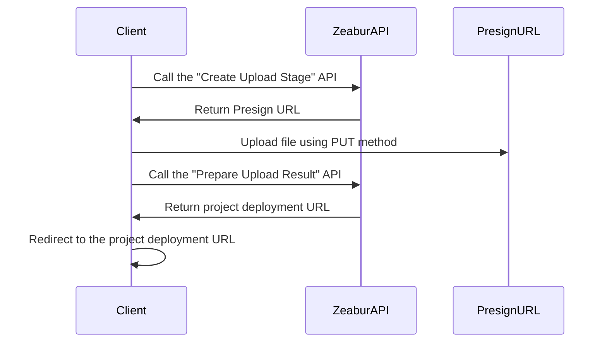

import { Callout } from 'nextra/components';

# Public API

Zeabur's API is primarily built using GraphQL and serves as the foundation for a series of Zeabur products such as Zeabur Dashboard and Zeabur CLI. We provide a public API that allows you to control Zeabur through code.
Additionally, Zeabur has placed some JSON schemas and OpenAPI specifications for non-GraphQL APIs in the [Schema Repository](https://schema.zeabur.app/).

## Authentication

You need to provide your [API key](./use-api-key) in the `Authorization` header to use the Zeabur API with your identity. For instructions on generating an API key, please read [this document](./use-api-key).

Here's an example of how to include it:

```bash
curl --request POST \
  --url https://api.zeabur.com/graphql \
  --header 'Authorization: Bearer {YOUR_API_TOKEN}' \
  --header 'Content-Type: application/json' \
  --data '{"query":"query { me { username } }"}'
```

## GraphQL API

You can visit our [Apollo Explorer](https://studio.apollographql.com/public/zeabur/variant/main/explorer) to view all available Zeabur API GraphQL methods, test them, and copy them as cURL commands.

If you prefer writing GraphQL in an IDE or need type hints, you can download the complete Zeabur API Schema from the Explorer under "Schema" → "SDL".

If you find that the API you need is not in this Schema, please let us know through our [Discord](https://zeabur.com/dc).

## Local Project Upload API

For information about the local project API, please refer to the [Upload API documentation](https://schema.zeabur.app/upload-api/index.html).

The process flow is as follows:



## Template Deployment API

If you have a [template specification YAML file](https://schema.zeabur.app/template.json), you can use this GraphQL mutation to deploy it to a specified project:

```graphql
mutation DeployTemplate($rawSpecYaml: String, $projectId: ObjectID) {
  deployTemplate(rawSpecYaml: $rawSpecYaml, projectID: $projectId) {
    _id  # String!
  }
}
```

This API is suitable for bulk deployments.

## Container Operation API

These APIs allow you to upload files to or download files from a specified Zeabur service, and also send commands to a specified Zeabur service.

### Upload File

<Callout>
Currently, there is a 100MB file size limit for uploads.
</Callout>

```http
POST https://api.zeabur.com/projects/project-id/services/service-id/files
Content-Type: multipart/form-data
Authorization: Bearer <YOUR_API_TOKEN>
```

- Payload (Form Content)
    - file (Blob): File content
    - path (string): File path
    - environment (string): The environment ID, which can be obtained from the `envID` in the Dashboard URL
- Response
    - 200 OK
    - 500 Internal Server Error, such as `{"code": "INTERNAL_SERVER_ERROR", "error": "failed to upload file"}`


### Download File

```http
GET https://api.zeabur.com/projects/project-id/services/service-id/files?path=[PATH]&environment=[ENVIRONMENT]
Authorization: Bearer <YOUR_API_TOKEN>
```

- Query
    - path (string): File path
    - environment (string): The environment ID, which can be obtained from the `envID` in the Dashboard URL
- Response
    - 200 OK, `application/octet-stream`
    - 500 Internal Server Error, such as `{"code": "INTERNAL_SERVER_ERROR", "error": "failed to download file"}`

### List Files

Use the "Execute Single Command" API to run:

```shell
$ ls -A -a -F -1 /
```

### Delete Files

Use the "Execute Single Command" API to run:

```shell
$ rm -r FILENAME
```

### Execute Single Command

Use the GraphQL API to execute:

```graphql
mutation ExecuteCommand($serviceId: ObjectID!, $environmentId: ObjectID!, $command: [String!]!) {
  executeCommand(serviceID: $serviceId, environmentID: $environmentId, command: $command) {
    exitCode  # Int!
    output    # String!
  }
}
```

### Use WebSocket to Access Service Terminal

- WebSocket endpoint: `wss://api.zeabur.com/exec/<service-id>` 
- Writing content to the WebSocket is the actual input
- Resize Control Controls: `[RESIZE_CONTROL, COLS_LSB, COLS_MSB, ROWS_LSB, ROWS_MSB]` 
  ```
  const buffer = new Uint8Array([
    RESIZE_CONTROL,
    dims.cols & 0xFF,
    dims.cols >> 8,
    dims.rows & 0xFF,
    dims.rows >> 8
  ]);
  ```

### Retrieve Build Logs

Use the GraphQL API to execute:

```graphql
query BuildLogs($projectId: ObjectID!, $deploymentId: ObjectID!, $timestampCursor: Time) {
  buildLogs(projectID: $projectId, deploymentID: $deploymentId, timestampCursor: $timestampCursor) {
    message    # String!
    timestamp  # Time!
  }
}
```

### Retrieve Runtime Logs

Use the GraphQL API to execute:

```graphql
query RuntimeLogs($projectId: ObjectID!, $serviceId: ObjectID!, $environmentId: ObjectID!, $timestampCursor: Time) {
  runtimeLogs(projectID: $projectId, serviceID: $serviceId, environmentID: $environmentId, timestampCursor: $timestampCursor) {
    message    # String!
    timestamp  # Time!
  }
}
```

### Subscribe to Build Logs

Use the GraphQL API to execute:

```graphql
subscription BuildLogReceived($projectId: ObjectID!, $deploymentId: ObjectID!) {
  buildLogReceived(projectID: $projectId, deploymentID: $deploymentId) {
    message    # String!
    timestamp  # Time!
  }
}
```

### Subscribe to Runtime Logs

Use the GraphQL API to execute:

```graphql
subscription RuntimeLogReceived($projectId: ObjectID!, $serviceId: ObjectID!, $environmentId: ObjectID!) {
  runtimeLogReceived(projectID: $projectId, serviceID: $serviceId, environmentID: $environmentId) {
    message    # String!
    timestamp  # Time!
  }
}
```