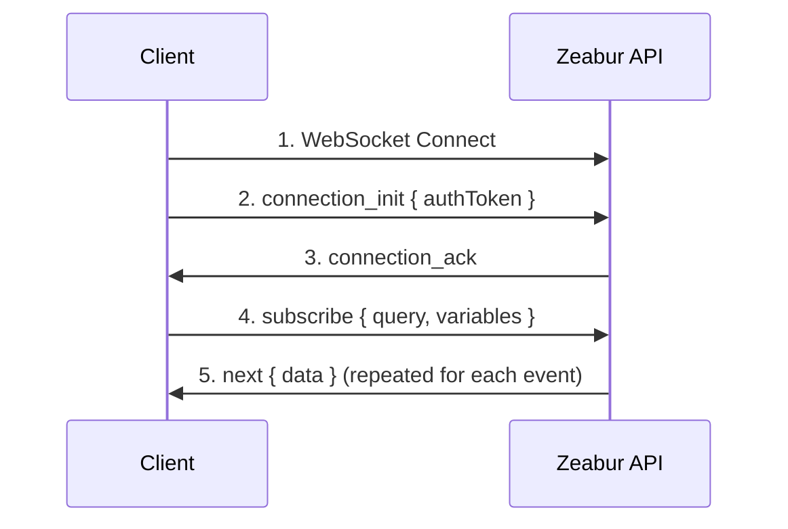

import { Callout } from 'nextra/components';

# WebSocket Connection Guide

This guide explains how to establish authenticated WebSocket connections to the Zeabur GraphQL API for real-time subscriptions (logs, project activity, etc.).

## Overview

Zeabur uses [graphql-ws](https://github.com/enisdenjo/graphql-ws) protocol for GraphQL subscriptions over WebSocket. The connection requires authentication via a token passed in the `connection_init` payload.

## Connection Endpoints

| Environment | WebSocket URL |
|-------------|---------------|
| Global | `wss://api.zeabur.com/graphql` |
| China | `wss://api.zeabur.cn/graphql` |

## Authentication

WebSocket connections are authenticated by passing an `authToken` in the `connectionParams` during the connection initialization phase.

### Token Source

The authentication token can be obtained in two ways:

1. **From Cookie** - When using the Zeabur Dashboard, the token is stored in a cookie named `token`:

```javascript
// Extract token from cookie
const token = document.cookie
  .split('; ')
  .find(row => row.startsWith('token='))
  ?.split('=')[1];
```

2. **Using API Key** - For programmatic access, you can use your [API key](./use-api-key) as the authentication token.

## Connection Flow



## Implementation

### Using Apollo Client (Recommended)

This is the recommended approach for React applications:

```typescript
import { GraphQLWsLink } from '@apollo/client/link/subscriptions';
import { createClient } from 'graphql-ws';

const wsLink = new GraphQLWsLink(createClient({ 
  url: 'wss://api.zeabur.com/graphql',
  connectionParams: () => {
    // Get auth token from cookie
    const token = document.cookie
      .split('; ')
      .find(row => row.startsWith('token='))
      ?.split('=')[1];
    
    return {
      authToken: token,
    };
  },
}));
```

### Using graphql-ws Client Directly

For non-Apollo implementations:

```typescript
import { createClient } from 'graphql-ws';

const client = createClient({
  url: 'wss://api.zeabur.com/graphql',
  connectionParams: {
    authToken: 'YOUR_API_TOKEN',
  },
});

// Subscribe to runtime logs
const unsubscribe = client.subscribe(
  {
    query: `
      subscription SubscribeRuntimeLog(
        $projectID: ObjectID!
        $serviceID: ObjectID!
        $environmentID: ObjectID!
      ) {
        runtimeLogReceived(
          projectID: $projectID
          serviceID: $serviceID
          environmentID: $environmentID
        ) {
          timestamp
          message
        }
      }
    `,
    variables: {
      projectID: 'your-project-id',
      serviceID: 'your-service-id',
      environmentID: 'your-environment-id',
    },
  },
  {
    next: (data) => console.log('Received:', data),
    error: (err) => console.error('Error:', err),
    complete: () => console.log('Completed'),
  }
);
```

### Using Native WebSocket API

For testing or low-level implementations:

```javascript
const API_URL = 'wss://api.zeabur.com/graphql';

// 1. Create WebSocket connection with graphql-ws subprotocol
const ws = new WebSocket(API_URL, 'graphql-transport-ws');

ws.onopen = () => {
  // 2. Send connection_init with auth token
  ws.send(JSON.stringify({
    type: 'connection_init',
    payload: {
      authToken: 'YOUR_AUTH_TOKEN'
    }
  }));
};

ws.onmessage = (event) => {
  const message = JSON.parse(event.data);
  
  switch (message.type) {
    case 'connection_ack':
      // 3. Connection authenticated, now subscribe
      ws.send(JSON.stringify({
        id: '1',
        type: 'subscribe',
        payload: {
          query: `
            subscription SubscribeRuntimeLog(
              $projectID: ObjectID!
              $serviceID: ObjectID!
              $environmentID: ObjectID!
            ) {
              runtimeLogReceived(
                projectID: $projectID
                serviceID: $serviceID
                environmentID: $environmentID
              ) {
                timestamp
                message
              }
            }
          `,
          variables: {
            projectID: 'your-project-id',
            serviceID: 'your-service-id',
            environmentID: 'your-environment-id'
          }
        }
      }));
      break;
      
    case 'next':
      // 4. Received subscription data
      console.log('Data:', message.payload.data);
      break;
      
    case 'error':
      console.error('Subscription error:', message.payload);
      break;
      
    case 'complete':
      console.log('Subscription completed');
      break;
  }
};

ws.onerror = (error) => console.error('WebSocket error:', error);
ws.onclose = (event) => console.log('WebSocket closed:', event.code);
```

## Message Types (graphql-ws protocol)

### Client → Server

| Type | Description |
|------|-------------|
| `connection_init` | Initialize connection with auth payload |
| `subscribe` | Start a subscription |
| `complete` | Stop a subscription |
| `ping` | Keep-alive ping |

### Server → Client

| Type | Description |
|------|-------------|
| `connection_ack` | Connection accepted |
| `next` | Subscription data |
| `error` | Subscription error |
| `complete` | Subscription ended |
| `pong` | Keep-alive response |

## Available Subscriptions

### Runtime Logs

Subscribe to real-time runtime logs from a service:

```graphql
subscription SubscribeRuntimeLog(
  $projectID: ObjectID!
  $serviceID: ObjectID!
  $environmentID: ObjectID!
) {
  runtimeLogReceived(
    projectID: $projectID
    serviceID: $serviceID
    environmentID: $environmentID
  ) {
    timestamp
    message
  }
}
```

### Runtime Logs (with Deployment filter)

Filter logs to a specific deployment:

```graphql
subscription SubscribeRuntimeLogWithDeployment(
  $projectID: ObjectID!
  $serviceID: ObjectID!
  $environmentID: ObjectID!
  $deploymentID: ObjectID
) {
  runtimeLogReceived(
    projectID: $projectID
    serviceID: $serviceID
    environmentID: $environmentID
    deploymentID: $deploymentID
  ) {
    timestamp
    message
  }
}
```

### Build Logs

Subscribe to build logs for a deployment:

```graphql
subscription SubscribeBuildLog(
  $projectID: ObjectID!
  $deploymentID: ObjectID!
) {
  buildLogReceived(
    projectID: $projectID
    deploymentID: $deploymentID
  ) {
    timestamp
    message
  }
}
```

### Project Activity

Subscribe to project-wide events (builds, deployments, service status changes):

```graphql
subscription SubscribeProjectActivity($projectID: ObjectID!) {
  projectActivityReceived(projectID: $projectID) {
    type
    payload
  }
}
```

## Error Handling

### Authentication Errors

If the token is missing or invalid, the server will reject the connection during the `connection_init` phase:

```json
{
  "type": "error",
  "payload": {
    "message": "Please establish websocket connection with a valid token"
  }
}
```

### Permission Errors

If authenticated but lacking access to a resource:

```json
{
  "type": "next",
  "id": "1",
  "payload": {
    "errors": [{
      "message": "Permission denied",
      "path": ["runtimeLogReceived"],
      "extensions": {
        "code": "FORBIDDEN"
      }
    }],
    "data": null
  }
}
```

**Common causes:**

- Incorrect project/service/environment IDs
- User doesn't have access to the project
- IDs don't match (e.g., service doesn't belong to project)

## Testing Connections

### Browser DevTools

1. Open Network tab
2. Filter by "WS"
3. Navigate to a page with subscriptions (e.g., deployment logs)
4. Click on the WebSocket connection to inspect frames

### Standalone Test Page

Save this HTML file and open it in a browser where you're logged into Zeabur:

```html
<!DOCTYPE html>
<html>
<head>
  <title>Zeabur WebSocket Test</title>
  <style>
    body { font-family: system-ui; padding: 20px; }
    input { margin: 5px; padding: 8px; }
    button { padding: 8px 16px; cursor: pointer; }
    pre { background: #f5f5f5; padding: 15px; overflow: auto; max-height: 400px; }
  </style>
</head>
<body>
  <h1>Zeabur WebSocket Connection Test</h1>
  <div>
    <input id="projectId" placeholder="Project ID" />
    <input id="serviceId" placeholder="Service ID" />
    <input id="envId" placeholder="Environment ID" />
    <button onclick="connect()">Connect</button>
  </div>
  <pre id="logs"></pre>
  
  <script>
    function log(msg) {
      const el = document.getElementById('logs');
      el.textContent += new Date().toISOString() + ' | ' + msg + '\n';
      el.scrollTop = el.scrollHeight;
    }
    
    function connect() {
      const token = document.cookie.split('; ')
        .find(r => r.startsWith('token='))?.split('=')[1];
      
      if (!token) {
        log('ERROR: No token found in cookies. Make sure you are logged into Zeabur.');
        return;
      }
      
      log('Token found, connecting...');
      const ws = new WebSocket('wss://api.zeabur.com/graphql', 'graphql-transport-ws');
      
      ws.onopen = () => {
        log('Connected, sending authentication...');
        ws.send(JSON.stringify({
          type: 'connection_init',
          payload: { authToken: token }
        }));
      };
      
      ws.onmessage = (e) => {
        const msg = JSON.parse(e.data);
        log('Received: ' + JSON.stringify(msg, null, 2));
        
        if (msg.type === 'connection_ack') {
          log('Authenticated successfully! Starting subscription...');
          ws.send(JSON.stringify({
            id: '1',
            type: 'subscribe',
            payload: {
              query: `subscription($p:ObjectID!,$s:ObjectID!,$e:ObjectID!){
                runtimeLogReceived(projectID:$p,serviceID:$s,environmentID:$e){
                  timestamp message
                }
              }`,
              variables: {
                p: document.getElementById('projectId').value,
                s: document.getElementById('serviceId').value,
                e: document.getElementById('envId').value
              }
            }
          }));
        }
      };
      
      ws.onerror = (e) => log('WebSocket Error: ' + JSON.stringify(e));
      ws.onclose = (e) => log('Connection Closed: code=' + e.code + ', reason=' + e.reason);
    }
  </script>
</body>
</html>
```

## Security Considerations

<Callout type="warning">
The authentication token accessed via `document.cookie` is stored in a non-HttpOnly cookie. This is a necessary trade-off because WebSockets cannot automatically send HttpOnly cookies.
</Callout>

### Mitigations

1. **Content Security Policy (CSP)** - Prevent XSS attacks that could steal the token
2. **Short token expiration** - Limit damage if token is compromised
3. **SameSite cookie attribute** - Prevent CSRF attacks
4. **Use API Keys for server-side** - For backend applications, use [API keys](./use-api-key) instead of session tokens

## Troubleshooting

| Issue | Solution |
|-------|----------|
| No `connection_ack` received | Check token is valid and not expired |
| `Permission denied` on subscription | Verify IDs are correct and user has access |
| Connection closes immediately | Check WebSocket URL and ensure subprotocol is `graphql-transport-ws` |
| No data received | Verify the service is running and generating logs |
| `WebSocket connection failed` | Check network connectivity and firewall settings |

## Related Resources

- [Public API](./public-api) - Overview of all Zeabur APIs
- [Create and Use API Keys](./use-api-key) - How to generate API tokens
- [graphql-ws Protocol](https://github.com/enisdenjo/graphql-ws/blob/master/PROTOCOL.md) - Official protocol specification
- [Apollo Explorer](https://studio.apollographql.com/public/zeabur/variant/main/explorer) - Explore available GraphQL operations

