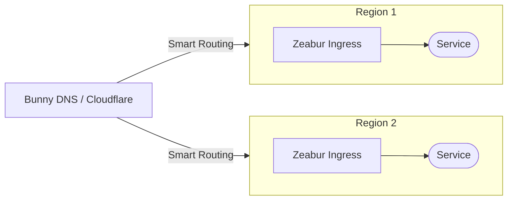
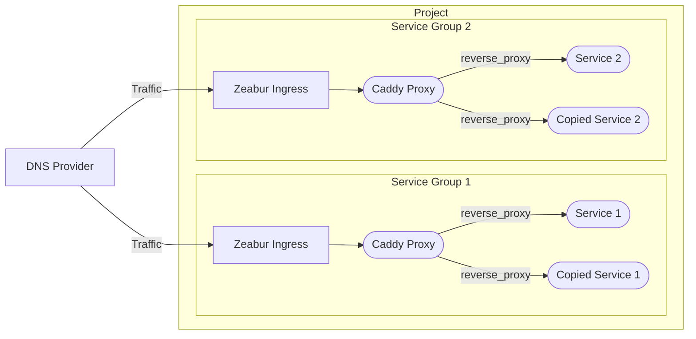
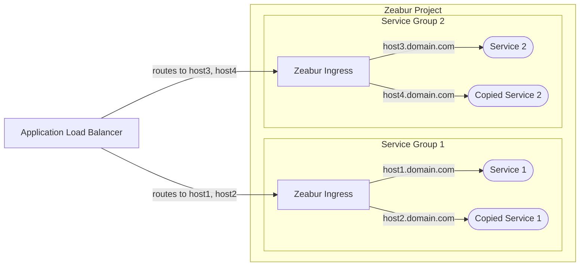

# High Availability Architecture

This document outlines recommended architectures for achieving high availability for your services deployed on Zeabur.

Note that this is an advanced topic. Typically, you don't need high availability (HA) for your startup services. For the simplest solution, place your services in one project and use [private networking](/networking/private) for communication. Expose your service to the Internet using [public networking](/networking/public). We can handle vertical scaling for you. In shared clusters, if a node goes down, we can automatically migrate your service to another node.

## DNS Load Balancer (Recommended)

Our primary recommended approach is to use a [**DNS load balancer**](https://www.cloudflare.com/learning/performance/what-is-dns-load-balancing/). This method is generally more cost-effective and does not interfere with Zeabur's native firewall and rate-limiting functions.

Services like [Cloudflare](https://developers.cloudflare.com/load-balancing/understand-basics/proxy-modes/) and [Bunny DNS](https://support.bunny.net/hc/en-us/articles/7247569381906-Understanding-Bunny-DNS-Load-Balancing) offer robust DNS load balancing features. For detailed setup instructions, please refer to their official documentation.

The basic flow is as follows:

## Configuring Service Replicas

Zeabur does not currently support automatic horizontal scaling. To create redundant instances, you must manually create copies of your service. Once you have your service replicas, you can use one of the following two methods to distribute traffic between them.

### Option 1: Internal Reverse Proxy (Most Recommended)

The first option is to use an internal reverse proxy, such as [Caddy](https://zeabur.com/templates/FFDLWU) or [NGINX](https://zeabur.com/templates/YIUNMF), to forward requests to your service replicas.

In this setup, you configure the reverse proxy to balance traffic between the internal hostnames of your service copies (e.g., `service-1-replica-1.zeabur.internal` and `service-1-replica-2.zeabur.internal`).

A major benefit of this method is that it works seamlessly with Zeabur's ingress controller. You can retrieve the client's real IP address using the standard `X-Forwarded-For` header without modifying your application's logic.

### Option 2: External L7 Proxy

The second option is to use an external Layer 7 proxy, such as a cloud provider's [Application Load Balancer](https://developers.cloudflare.com/load-balancing/understand-basics/proxy-modes/) (ALB).

While this method may seem simpler since you don't need to manage an internal Caddy service, it comes with several limitations:

- **Real IP Headers**: You must configure your ALB to pass the client's real IP in a custom header (e.g., `X-LoadBalancer-IP`) and modify your application to trust and read from this header.
- **Security Risk**: You need to configure Zeabur's firewall to allow traffic only from the ALB's IP address. If you don't, a bad actor could bypass your ALB and send a forged `X-LoadBalancer-IP` header directly to your application.
- **Rate Limiting**: Because all requests originate from the ALB's IP address, Zeabur's rate-limiting may be triggered unexpectedly, potentially blocking legitimate traffic.

We plan to provide better support for the external proxy method to resolve these issues in the future. For now, the **internal reverse proxy (Option 1) is the most reliable and recommended method** for use on Zeabur.
