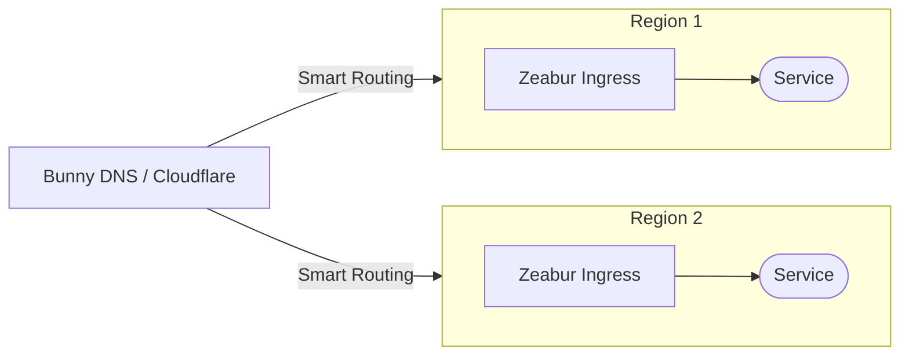
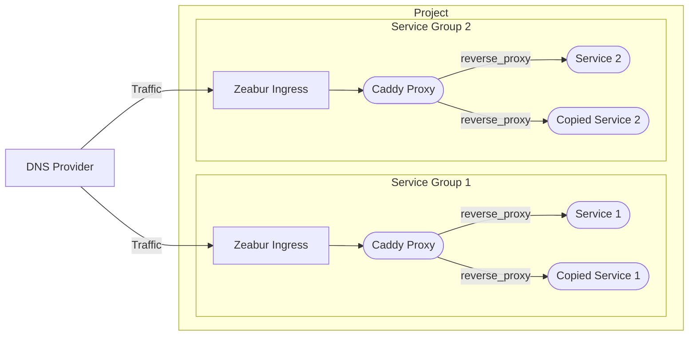
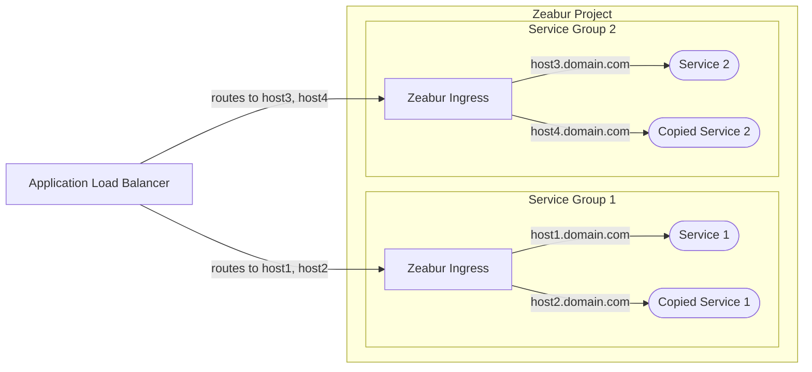

# Arquitectura de Alta Disponibilidad

Este documento describe las arquitecturas recomendadas para lograr alta disponibilidad en tus servicios desplegados en Zeabur.

Ten en cuenta que este es un tema avanzado. Normalmente, no necesitas alta disponibilidad (HA) para los servicios de tu startup. Para la solución más sencilla, coloca tus servicios en un proyecto y usa [red privada](/deploy/private-networking) para la comunicación. Expón tu servicio a Internet usando [red pública](/deploy/public-networking). Nosotros manejamos el escalado vertical por ti. En clústeres compartidos, si un nodo cae, podemos migrar automáticamente tu servicio a otro nodo.

## Balanceador de Carga DNS (Recomendado)

Nuestro enfoque principal recomendado es usar un [**balanceador de carga DNS**](https://www.cloudflare.com/learning/performance/what-is-dns-load-balancing/). Este método es generalmente más rentable y no interfiere con las funciones nativas de firewall y limitación de tasa de Zeabur.

Servicios como [Cloudflare](https://developers.cloudflare.com/load-balancing/understand-basics/proxy-modes/) y [Bunny DNS](https://support.bunny.net/hc/en-us/articles/7247569381906-Understanding-Bunny-DNS-Load-Balancing) ofrecen funciones robustas de balanceo de carga DNS. Para instrucciones detalladas de configuración, consulta su documentación oficial.

El flujo básico es el siguiente:

## Configuración de Réplicas de Servicio

Zeabur actualmente no soporta escalado horizontal automático. Para crear instancias redundantes, debes crear copias de tu servicio manualmente. Una vez que tengas tus réplicas de servicio, puedes usar uno de los siguientes dos métodos para distribuir el tráfico entre ellas.

### Opción 1: Proxy Inverso Interno (Más Recomendado)

La primera opción es usar un proxy inverso interno, como [Caddy](https://zeabur.com/templates/FFDLWU) o [NGINX](https://zeabur.com/templates/YIUNMF), para reenviar solicitudes a tus réplicas de servicio.

En esta configuración, configuras el proxy inverso para balancear el tráfico entre los nombres de host internos de tus copias de servicio (por ejemplo, `service-1-replica-1.zeabur.internal` y `service-1-replica-2.zeabur.internal`).

Un gran beneficio de este método es que funciona perfectamente con el controlador de ingreso de Zeabur. Puedes obtener la dirección IP real del cliente usando el encabezado estándar `X-Forwarded-For` sin modificar la lógica de tu aplicación.

### Opción 2: Proxy L7 Externo

La segunda opción es usar un proxy externo de Capa 7, como el [Application Load Balancer](https://developers.cloudflare.com/load-balancing/understand-basics/proxy-modes/) (ALB) de un proveedor de nube.

Aunque este método puede parecer más simple ya que no necesitas gestionar un servicio interno de Caddy, tiene varias limitaciones:

- **Encabezados de IP Real**: Debes configurar tu ALB para pasar la IP real del cliente en un encabezado personalizado (por ejemplo, `X-LoadBalancer-IP`) y modificar tu aplicación para confiar y leer de este encabezado.
- **Riesgo de Seguridad**: Necesitas configurar el firewall de Zeabur para permitir tráfico solo desde la dirección IP del ALB. Si no lo haces, un actor malicioso podría eludir tu ALB y enviar un encabezado `X-LoadBalancer-IP` falsificado directamente a tu aplicación.
- **Limitación de Tasa**: Debido a que todas las solicitudes se originan desde la dirección IP del ALB, la limitación de tasa de Zeabur puede activarse inesperadamente, bloqueando potencialmente tráfico legítimo.

Planeamos proporcionar mejor soporte para el método de proxy externo para resolver estos problemas en el futuro. Por ahora, **el proxy inverso interno (Opción 1) es el método más confiable y recomendado** para usar en Zeabur.
