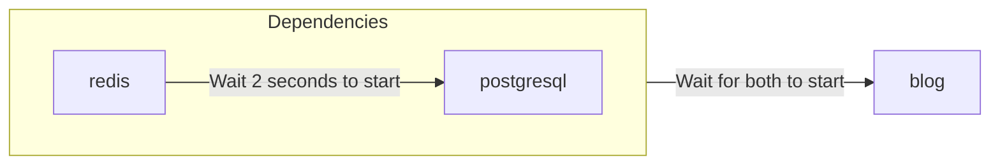

# Formato de Plantilla

Puedes utilizar la CLI de `zeabur` para desplegar, crear y gestionar plantillas en un formato similar a [Docker Compose](https://docs.docker.com/compose/) o [Kubernetes Object](https://kubernetes.io/docs/concepts/overview/working-with-objects/) a partir de YAML.

## Formato YAML (de recursos)

Zeabur utiliza un único archivo YAML para describir los recursos de la plantilla, conocido como **Template Resource**.

```yaml
apiVersion: zeabur.com/v1
kind: Template
metadata:
    name: RSSHub
spec:
    description: Everything is RSSible
    icon: https://docs.rsshub.app/logo.png
    coverImage: https://zeabur.com/docs/_next/image?url=%2Fdocs%2F_next%2Fstatic%2Fmedia%2Fintro.5b73c4f8.png&w=3840&q=75
    variables:
        - key: PUBLIC_DOMAIN
          type: DOMAIN
          name: Domain
          description: What is the domain you want for your RSSHub?
    tags:
        - Tool
    readme: |-
        # RSSHub
        RSSHub is an open source, easy to use, and extensible RSS feed aggregator, it's capable of generating RSS feeds from pretty much everything.

        RSSHub delivers millions of contents aggregated from all kinds of sources, our vibrant open source community is ensuring the deliver of RSSHub's new routes, new features and bug fixes.
    services:
        - name: Redis
          icon: https://raw.githubusercontent.com/zeabur/service-icons/main/marketplace/redis.svg
          template: PREBUILT
          spec:
            source:
                image: redis/redis-stack-server:latest
            ports:
                - id: database
                  port: 6379
                  type: TCP
            volumes:
                - id: data
                  dir: /data
            instructions:
                - type: TEXT
                  title: Command to connect to your Redis
                  content: redis-cli -h ${PORT_FORWARDED_HOSTNAME} -p ${DATABASE_PORT_FORWARDED_PORT} -a ${REDIS_PASSWORD}
                - type: TEXT
                  title: Redis Connection String
                  content: redis://:${REDIS_PASSWORD}@${PORT_FORWARDED_HOSTNAME}:${DATABASE_PORT_FORWARDED_PORT}
                - type: PASSWORD
                  title: Redis password
                  content: ${REDIS_PASSWORD}
                  category: Credentials
                - type: TEXT
                  title: Redis host
                  content: ${PORT_FORWARDED_HOSTNAME}
                  category: Hostname & Port
                - type: TEXT
                  title: Redis port
                  content: ${DATABASE_PORT_FORWARDED_PORT}
                  category: Hostname & Port
            env:
                REDIS_ARGS:
                    default: --requirepass ${REDIS_PASSWORD}
                REDIS_CONNECTION_STRING:
                    default: redis://:${REDIS_PASSWORD}@${REDIS_HOST}:${REDIS_PORT}
                    expose: true
                    readonly: true
                REDIS_HOST:
                    default: ${CONTAINER_HOSTNAME}
                    expose: true
                    readonly: true
                REDIS_PASSWORD:
                    default: ${PASSWORD}
                    expose: true
                REDIS_PORT:
                    default: ${DATABASE_PORT}
                    expose: true
                    readonly: true
                REDIS_URI:
                    default: ${REDIS_CONNECTION_STRING}
                    expose: true
                    readonly: true
        - name: RSSHub
          icon: https://docs.rsshub.app/logo.png
          template: PREBUILT
          domainKey: PUBLIC_DOMAIN
          spec:
            source:
                image: diygod/rsshub
            ports:
                - id: web
                  port: 1200
                  type: HTTP
            env:
                CACHE_TYPE:
                    default: ${REDIS_URI}
                REDIS_URL:
                    default: ${REDIS_URI}

localization:
  zh-TW:
    description: LobeChat 是一個開源的高效能聊天機器人框架。
    variables:
      - key: PUBLIC_DOMAIN
        type: DOMAIN
        name: 網域
        description: 你想將 RSSHub 綁在哪個網域上？
    readme: |-
        # RSSHub
        RSSHub 是一個開源、易於使用且可擴展的 RSS 資訊聚合器，能夠從幾乎所有來源生成 RSS 資訊。

        RSSHub 提供來自各種來源的數百萬內容，我們充滿活力的開源社群確保提供 RSSHub 的新路線、新功能和錯誤修復。
```

Una **plantilla** se puede dividir en tres secciones principales: "Información de la plantilla", "Especificaciones del servicio" y "Localización". El formato completo se puede consultar en el [repositorio de esquemas de Zeabur](https://json-schema.app/view/%23?url=https%3A%2F%2Fschema.zeabur.app%2Ftemplate.json). A continuación, se describe brevemente el propósito de cada campo y cómo se presenta en la página de plantillas de Zeabur.

### Definición de la plantilla


`apiVersion` y `kind` siempre son `zeabur.com/v1` y `Template`.

En `metadata`, `name` es el nombre arbitrario de la plantilla, como `RSSHub`, `Lobe-Chat` o `ChatGPT API`. Esto aparecerá en el bloque `WeWe RSS` de la imagen anterior.

En `spec`, `description` es un breve resumen de la plantilla, que se muestra bajo el título. `icon` es el icono de la plantilla, una URL que apunta a una imagen, mostrado junto al título. `tags` son las etiquetas de la plantilla, con categorías de referencia disponibles en la [sección `Tags` del panel izquierdo de la página de exploración de plantillas](https://zeabur.com/templates). Unas etiquetas correctas no solo ayudan a los usuarios a encontrar plantillas fácilmente, sino que también optimizan el SEO.

`readme` es la documentación de la plantilla, escrita en formato Markdown, que se muestra en la parte inferior de la página de la plantilla. `coverImage` se muestra encima de la documentación y también es una URL que apunta a una imagen; puede dejarse en blanco.

`variables` son las variables que los usuarios pueden configurar durante el despliegue. El `type` puede ser `STRING` (una cadena de variable normal) o `DOMAIN` (Zeabur guía la configuración del dominio); `key` corresponde a las variables de entorno del servicio, y Zeabur creará automáticamente una variable de entorno en todos los servicios según lo especificado. `name` y `description` corresponden al nombre y la descripción de la variable durante el despliegue de la plantilla, como se muestra a continuación.


### Especificaciones del servicio


`services` son las especificaciones de servicio de la plantilla. Zeabur desplegará los servicios indicados en el proyecto durante el despliegue. El `name` del servicio es su nombre, y `icon` es su icono. `template` declara si el servicio es una imagen Docker (`PREBUILT`) o un servicio desplegado desde Git (`GIT`).

`dependencies` declara los servicios de los que depende este servicio. Zeabur puede esperar a que los servicios especificados se inicien antes de arrancar tu servicio, evitando la necesidad de reiniciar servicios repetidamente. Por ejemplo, si tu servicio `blog` depende de `redis` y `postgresql`, puedes especificarlo de la siguiente forma. Ten en cuenta que `redis` y `postgresql` también deben ser servicios definidos en la plantilla.

```yaml
dependencies:
    - redis
    - postgresql
```

La relación de arranque es la siguiente:



El `domainKey` indica a qué servicio debe vincularse la variable de dominio (tipo `DOMAIN`) de la definición de la plantilla. En el ejemplo anterior, `spec.variables` tiene una variable `PUBLIC_DOMAIN` de tipo `DOMAIN`, y la especificación del servicio RSSHub tiene un `domainKey` que apunta a `PUBLIC_DOMAIN`. Al desplegar, el dominio configurado en `PUBLIC_DOMAIN` se vinculará al servicio RSSHub.

`spec` es la especificación del servicio. La información detallada sobre cada campo se puede encontrar en la [documentación de especificaciones de servicio de plantillas](https://json-schema.app/view/%23/%23%2Fproperties%2Fspec/%23%2Fproperties%2Fspec%2Fproperties%2Fservices%2Fitems/%23%2Fproperties%2Fspec%2Fproperties%2Fservices%2Fitems%2Fproperties%2Fspec?url=https%3A%2F%2Fschema.zeabur.app%2Ftemplate.json). A continuación, se describen brevemente los puntos clave de las especificaciones del servicio:

Para servicios `PREBUILT`, necesitas especificar la imagen Docker (`image`) y, opcionalmente, el comando de ejecución y los parámetros (`command` y `args`). Si tu imagen está almacenada en un registro privado, puedes especificar el `username` y `password` para la descarga. Además, puedes indicar el ID de usuario (`runAsUserID`) para ejecutar tu contenedor en modo no root. Para servicios `GIT`, necesitas especificar el tipo de repositorio Git (actualmente solo `GITHUB`), el ID del repositorio (actualmente solo el [`repoID`](https://stackoverflow.com/a/47223479) de GitHub) y, opcionalmente, la rama (`branch`).

`ports` especifica los puertos del servicio que se expondrán al proyecto o incluso al exterior. Los servicios HTTP se pueden conectar mediante un nombre de dominio (p. ej., `https://my-service.zeabur.app`), mientras que los servicios TCP y UDP pueden usar el enlace de reenvío de Zeabur `xxx.clusters.zeabur.com:12345`. Por ejemplo, si `type` es `HTTP` y `port` es `12345`, otros pueden conectarse a tu servicio que escucha en el puerto `12345` a través de `https://my-service.zeabur.app`.

`volumes` especifica las rutas de almacenamiento persistente del servicio. En principio, Zeabur restaura el estado del servicio al estado inicial (Stateless) después de cada Redeploy o Restart, pero si necesitas persistir algunos datos, puedes usar `volumes` para especificar la ruta de almacenamiento persistente. Por ejemplo, si `dir` es `/data`, significa que tu servicio puede persistir datos en la ruta `/data` hasta que el servicio sea eliminado.

`instructions` indican a otros usuarios cómo utilizar tu servicio, como el ejemplo `Redis Connection String`, que muestra cómo otros pueden conectarse a Redis mediante un cliente. `type` puede ser `DOMAIN` (un botón que redirige a la URL especificada al hacer clic), `TEXT` (texto), `PASSWORD` (contraseña, oculta por defecto), y `category` es una clasificación personalizable que actualmente no se muestra en la interfaz.

`env` son las variables de entorno del servicio. `default` es el valor predeterminado de la variable de entorno, `expose` indica si otros proyectos pueden usar directamente esta variable o utilizar la sintaxis `${VARIABLE}` para referenciarla, y `readonly` indica si es de solo lectura (no se puede modificar después de crear el servicio). Por ejemplo, si `expose` de `REDIS_CONNECTION_STRING` es `true`, otros servicios pueden conectarse a Redis a través de la variable de entorno `REDIS_CONNECTION_STRING`, y también pueden referenciar esta cadena de conexión en otras variables de entorno usando `${REDIS_CONNECTION_STRING}`.

`configs` son las configuraciones basadas en archivos del servicio. Puedes usar `path` y `template` para especificar el archivo de configuración predeterminado, facilitando que los usuarios lo modifiquen. Usa `envsubst` para reemplazar las referencias a variables en la plantilla con sus valores correspondientes. Por ejemplo, cuando `envsubst` está habilitado y la variable `MONGO_URI=mongodb://mongo.zeabur.internal:27017` está definida:

```yaml {6}
configs:
    - path: /config.yaml
      template: |
        mongo:
            uri: ${MONGO_URI}
      envsubst: true
```

El archivo `/config.yml` se rellenará con el siguiente contenido en la instancia del servicio:

```yaml filename="/config.yaml"
mongo:
    uri: mongodb://mongo.zeabur.internal:27017
```

También puedes especificar el `permission` de tu archivo de configuración. Ten en cuenta que `permission` debe ser un número decimal, convertido a partir de los [permisos de archivos UNIX](https://mason.gmu.edu/~montecin/UNIXpermiss.htm) en octal. A continuación, se muestran algunas correspondencias de permisos comunes:

| Valor de `permission` | Valor octal original | Lectura | Escritura | Ejecución | Adecuado para |
| --------------------- | -------------------- | ------- | --------- | --------- | ------------- |
| 256                   | 0400                 | O       | X         | X         | Archivos confidenciales (p. ej., contraseñas) |
| 420                   | 0644                 | O       | O         | X         | Archivos normales de lectura y escritura. Permiso predeterminado |
| 493                   | 0755                 | O       | O         | O         | Archivos ejecutables (p. ej., scripts bash) |

"Lectura", "Escritura" y "Ejecución" aquí se refieren a los permisos del usuario del contenedor. Para más detalles (grupos, todos, etc.), consulta la URL anterior.

`gpu` especifica los recursos de GPU necesarios para el servicio. Actualmente, solo puedes habilitar o deshabilitar estos recursos. Para usar recursos de GPU, establece `gpu.enabled` en `true`:

```yaml
gpu:
    enabled: true
```

### Localización

Puedes localizar la `description`, `coverImage`, los títulos y descripciones de `variables`, y el `readme` en la definición de la plantilla. Zeabur mostrará el contenido localizado correspondiente según el idioma del visitante.


Puedes localizar tu contenido a `zh-TW`, `zh-CN`, `ja-JP` y `es-ES`. Ten en cuenta que `en-US` es el idioma predeterminado de la plantilla, y debes escribir directamente en la definición de la plantilla. El formato de `description`, `readme` y `coverImage` es el mismo que en la definición de la plantilla. Puedes traducir los campos `name` y `description` en `variables`; sin embargo, las demás partes (`type` y `key`) deben permanecer iguales que en los campos de la definición de la plantilla.

Dejar campos en blanco (u omitirlos) utilizará automáticamente el contenido predeterminado de la definición de la plantilla. En el ejemplo anterior, se omite `coverImage`, por lo que Zeabur toma el `coverImage` de la definición de la plantilla.

## Próximos pasos

- **Prueba y despliega** tu plantilla con la CLI — consulta [Mantener y Actualizar Plantillas](/es-ES/template/maintain-template) para el uso de la CLI.
- **Publica** tu plantilla en el marketplace para que otros la utilicen.
