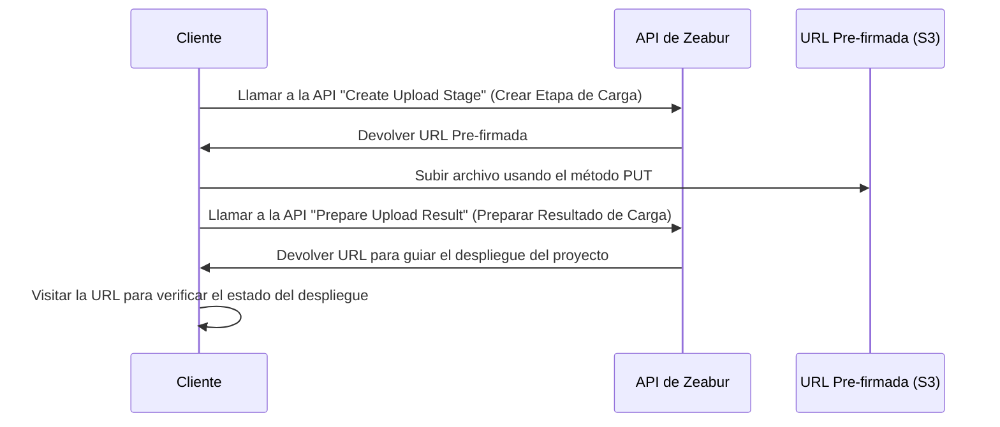

import { Callout } from 'nextra/components';

# API Pública

La API de Zeabur está construida principalmente utilizando GraphQL y sirve como base para una serie de productos de Zeabur, como el Panel de Control de Zeabur y Zeabur CLI. Proporcionamos una API pública que te permite controlar Zeabur a través de código.
Además, Zeabur ha colocado algunos esquemas JSON y especificaciones OpenAPI para APIs que no son GraphQL en el [Repositorio de Esquemas](https://schema.zeabur.app/).

## Autenticación

Necesitas proporcionar tu [clave de API](./use-api-key) en el encabezado `Authorization` para usar la API de Zeabur con tu identidad. Para instrucciones sobre cómo generar una clave de API, por favor lee [este documento](./use-api-key).

Aquí hay un ejemplo de cómo incluirla:

```bash
curl --request POST \
  --url https://api.zeabur.com/graphql \
  --header 'Authorization: Bearer {TU_TOKEN_API}' \
  --header 'Content-Type: application/json' \
  --data '{"query":"query { me { username } }"}'
```

## API GraphQL

Puedes visitar nuestro [Explorador Apollo](https://studio.apollographql.com/public/zeabur/variant/main/explorer) para ver todos los métodos GraphQL disponibles de la API de Zeabur, probarlos y copiarlos como comandos cURL.

Si prefieres escribir GraphQL en un IDE o necesitas sugerencias de tipos, puedes descargar el Esquema completo de la API de Zeabur desde el Explorador en "Schema" → "SDL".

Si encuentras que la API que necesitas no está en este Esquema, por favor háganoslo saber a través de nuestro [Discord](https://zeabur.com/dc).

## API de Carga de Proyectos Locales

Aunque desplegar desde un Repositorio Git es el método principal, hay ocasiones en las que necesitas desplegar directamente una aplicación ya empaquetada. Los escenarios comunes incluyen:

- Tu proceso CI/CD produce un artefacto construido, como un archivo .zip.
- Quieres subir un proyecto manualmente pero no deseas asociarlo con un Repositorio Git.

La API de Carga de Zeabur proporciona una API que te permite subir directamente un archivo ZIP, el cual Zeabur extraerá y desplegará automáticamente en tu proyecto.

### Concepto Principal: Carga Segura Usando una URL Pre-firmada

La API de Carga de Zeabur te emite una URL Pre-firmada, que es un enlace temporal y seguro que te otorga permiso por una sola vez para subir archivos directamente al área de preparación de código de Zeabur.

El flujo de trabajo completo se puede representar mediante el siguiente diagrama de secuencia:



### Proceso de Carga

Antes de iniciar la carga, necesitas obtener dos datos sobre el archivo:

- `content_length`: El tamaño del archivo en bytes.
- `content_hash`: El hash SHA256 del contenido del archivo, codificado en Base64.

Luego puedes crear una etapa de carga. Primero, debes informar a Zeabur que estás listo para subir un archivo.

```http
POST /v2/upload
Content-Type: application/json

{
  "content_hash": "Tu hash SHA256 calculado codificado en BASE64",
  "content_hash_algorithm": "sha256",
  "content_length": 12345678
}
```

Si tiene éxito (201 Created), Zeabur devolverá los detalles de la URL Pre-firmada y un `upload_id` para rastrear esta etapa de carga.

```json
{
    "presign_header": { "Content-Type": "application/zip" },
    "presign_method": "PUT",
    "presign_url": "https://zeabur-uploads.s3.ap-east-1.amazonaws.com/...",
    "upload_id": "Un UPLOAD_ID único"
}
```

A continuación, utiliza la información obtenida en el paso anterior para subir tu archivo. Ten en cuenta que esta solicitud se envía a la `presign_url`, no a la API de Zeabur.

- Método: PUT (o el método devuelto por `presign_method` en el paso anterior)
- URL: La `presign_url` de la respuesta anterior.
- Cabeceras: Debes incluir las cabeceras devueltas en `presign_header` (por ejemplo, `Content-Type: application/zip`).
- Cuerpo: Los datos binarios brutos de tu archivo zip.

Cuando esta solicitud recibe una respuesta 200 OK, significa que tu archivo se ha almacenado de forma segura. Finalmente, debes informar a Zeabur que el archivo está listo y cómo procesarlo. Utiliza el `upload_id` obtenido anteriormente para llamar al endpoint `POST /v2/upload/{upload_id}/prepare`.

```http
POST /v2/upload/{upload_id}/prepare
Content-Type: application/json
Authorization: Bearer {TU_TOKEN_API}
```

Dependiendo de tu objetivo, hay dos opciones para el Cuerpo de la Solicitud. Si quieres subir a un proyecto existente, necesitas proporcionar `service_id` y `environment_id`. Este tipo devolverá una `url` que apunta al despliegue en curso, a la que puedes redirigir a los usuarios para que vean el estado del despliegue.

```json
{
  "upload_type": "existing_service",
  "service_id": "El ID de tu servicio existente",
  "environment_id": "El ID del entorno de tu servicio"
}
```

Si quieres guiar a los usuarios a crear un proyecto, solo necesitas pasar `new_project` como el `upload_type`. Este tipo devolverá una `url` que puede guiar a los usuarios a crear un proyecto, a la que puedes redirigirlos.

```json
{
  "upload_type": "new_project"
}
```

### Documentación y Esquema

Para obtener la documentación completa y el esquema OpenAPI, consulta la [Documentación de la API de Carga](https://schema.zeabur.app/upload-api/index.html).

## API de Despliegue de Plantillas

Si tienes un [archivo YAML de especificación de plantilla](https://schema.zeabur.app/template.json), puedes usar esta mutación GraphQL para desplegarlo en un proyecto específico:

```graphql
mutation DeployTemplate($rawSpecYaml: String, $projectId: ObjectID) {
  deployTemplate(rawSpecYaml: $rawSpecYaml, projectID: $projectId) {
    _id  # String!
  }
}
```

Esta API es adecuada para despliegues masivos.

## API de Operación de Contenedores

Estas APIs te permiten cargar archivos a o descargar archivos desde un servicio específico de Zeabur, y también enviar comandos a un servicio específico de Zeabur.

### Cargar Archivo

<Callout>
Actualmente, hay un límite de tamaño de archivo de 100MB para cargas.
</Callout>

```http
POST https://api.zeabur.com/projects/project-id/services/service-id/files
Content-Type: multipart/form-data
Authorization: Bearer <TU_TOKEN_API>
```

- Payload (Contenido del Formulario)
    - file (Blob): Contenido del archivo
    - path (string): Ruta del archivo
    - environment (string): El ID del entorno, que se puede obtener del `envID` en la URL del Panel de Control
- Respuesta
    - 200 OK
    - 500 Error Interno del Servidor, como `{"code": "INTERNAL_SERVER_ERROR", "error": "failed to upload file"}`


### Descargar Archivo

```http
GET https://api.zeabur.com/projects/project-id/services/service-id/files?path=[RUTA]&environment=[ENTORNO]
Authorization: Bearer <TU_TOKEN_API>
```

- Consulta
    - path (string): Ruta del archivo
    - environment (string): El ID del entorno, que se puede obtener del `envID` en la URL del Panel de Control
- Respuesta
    - 200 OK, `application/octet-stream`
    - 500 Error Interno del Servidor, como `{"code": "INTERNAL_SERVER_ERROR", "error": "failed to download file"}`

### Listar Archivos

Usa la API de "Ejecutar Comando Único" para ejecutar:

```shell
$ ls -A -a -F -1 /
```

### Eliminar Archivos

Usa la API de "Ejecutar Comando Único" para ejecutar:

```shell
$ rm -r NOMBRE_ARCHIVO
```

### Ejecutar Comando Único

Usa la API GraphQL para ejecutar:

```graphql
mutation ExecuteCommand($serviceId: ObjectID!, $environmentId: ObjectID!, $command: [String!]!) {
  executeCommand(serviceID: $serviceId, environmentID: $environmentId, command: $command) {
    exitCode  # Int!
    output    # String!
  }
}
```

### Usar WebSocket para Acceder al Terminal del Servicio

- Punto final de WebSocket: `wss://api.zeabur.com/exec/<service-id>` 
- Escribir contenido en el WebSocket es la entrada real
- Controles de Control de Redimensionamiento: `[RESIZE_CONTROL, COLS_LSB, COLS_MSB, ROWS_LSB, ROWS_MSB]` 
  ```
  const buffer = new Uint8Array([
    RESIZE_CONTROL,
    dims.cols & 0xFF,
    dims.cols >> 8,
    dims.rows & 0xFF,
    dims.rows >> 8
  ]);
  ```

<Callout>
Para suscripciones GraphQL en tiempo real (registros, actividad del proyecto, etc.) a través de WebSocket, consulta la [Guía de Conexión WebSocket](./websocket-guide) completa.
</Callout>

### Recuperar Registros de Compilación

Usa la API GraphQL para ejecutar:

```graphql
query BuildLogs($projectId: ObjectID!, $deploymentId: ObjectID!, $timestampCursor: Time) {
  buildLogs(projectID: $projectId, deploymentID: $deploymentId, timestampCursor: $timestampCursor) {
    message    # String!
    timestamp  # Time!
  }
}
```

### Recuperar Registros de Tiempo de Ejecución

Usa la API GraphQL para ejecutar:

```graphql
query RuntimeLogs($projectId: ObjectID!, $serviceId: ObjectID!, $environmentId: ObjectID!, $timestampCursor: Time) {
  runtimeLogs(projectID: $projectId, serviceID: $serviceId, environmentID: $environmentId, timestampCursor: $timestampCursor) {
    message    # String!
    timestamp  # Time!
  }
}
```

### Suscribirse a Registros de Compilación

Usa la API GraphQL para ejecutar:

```graphql
subscription BuildLogReceived($projectId: ObjectID!, $deploymentId: ObjectID!) {
  buildLogReceived(projectID: $projectId, deploymentID: $deploymentId) {
    message    # String!
    timestamp  # Time!
  }
}
```

### Suscribirse a Registros de Tiempo de Ejecución

Usa la API GraphQL para ejecutar:

```graphql
subscription RuntimeLogReceived($projectId: ObjectID!, $serviceId: ObjectID!, $environmentId: ObjectID!) {
  runtimeLogReceived(projectID: $projectId, serviceID: $serviceId, environmentID: $environmentId) {
    message    # String!
    timestamp  # Time!
  }
}
```