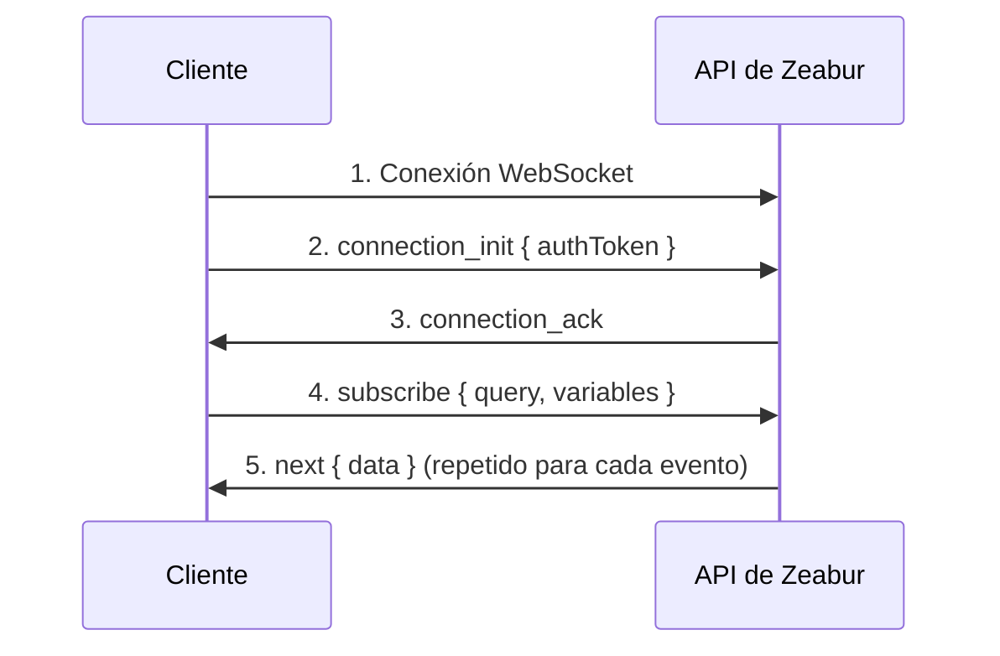

import { Callout } from 'nextra/components';

# Guía de Conexión WebSocket

Esta guía explica cómo establecer conexiones WebSocket autenticadas a la API GraphQL de Zeabur para suscripciones en tiempo real (registros, actividad del proyecto, etc.).

## Descripción General

Zeabur utiliza el protocolo [graphql-ws](https://github.com/enisdenjo/graphql-ws) para suscripciones GraphQL a través de WebSocket. La conexión requiere autenticación mediante un token pasado en el payload `connection_init`.

## Puntos de Conexión

| Entorno | URL WebSocket |
|---------|---------------|
| Global | `wss://api.zeabur.com/graphql` |
| China | `wss://api.zeabur.cn/graphql` |

## Autenticación

Las conexiones WebSocket se autentican pasando un `authToken` en los `connectionParams` durante la fase de inicialización de la conexión.

### Fuente del Token

El token de autenticación se puede obtener de dos maneras:

1. **Desde Cookie** - Al usar el Panel de Zeabur, el token se almacena en una cookie llamada `token`:

```javascript
// Extraer token de la cookie
const token = document.cookie
  .split('; ')
  .find(row => row.startsWith('token='))
  ?.split('=')[1];
```

2. **Usando Clave API** - Para acceso programático, puedes usar tu [clave API](./use-api-key) como token de autenticación.

## Flujo de Conexión



## Implementación

### Usando Apollo Client (Recomendado)

Este es el enfoque recomendado para aplicaciones React:

```typescript
import { GraphQLWsLink } from '@apollo/client/link/subscriptions';
import { createClient } from 'graphql-ws';

const wsLink = new GraphQLWsLink(createClient({ 
  url: 'wss://api.zeabur.com/graphql',
  connectionParams: () => {
    // Obtener token de autenticación de la cookie
    const token = document.cookie
      .split('; ')
      .find(row => row.startsWith('token='))
      ?.split('=')[1];
    
    return {
      authToken: token,
    };
  },
}));
```

### Usando el Cliente graphql-ws Directamente

Para implementaciones sin Apollo:

```typescript
import { createClient } from 'graphql-ws';

const client = createClient({
  url: 'wss://api.zeabur.com/graphql',
  connectionParams: {
    authToken: 'YOUR_API_TOKEN',
  },
});

// Suscribirse a registros de tiempo de ejecución
const unsubscribe = client.subscribe(
  {
    query: `
      subscription SubscribeRuntimeLog(
        $projectID: ObjectID!
        $serviceID: ObjectID!
        $environmentID: ObjectID!
      ) {
        runtimeLogReceived(
          projectID: $projectID
          serviceID: $serviceID
          environmentID: $environmentID
        ) {
          timestamp
          message
        }
      }
    `,
    variables: {
      projectID: 'your-project-id',
      serviceID: 'your-service-id',
      environmentID: 'your-environment-id',
    },
  },
  {
    next: (data) => console.log('Recibido:', data),
    error: (err) => console.error('Error:', err),
    complete: () => console.log('Completado'),
  }
);
```

### Usando la API WebSocket Nativa

Para pruebas o implementaciones de bajo nivel:

```javascript
const API_URL = 'wss://api.zeabur.com/graphql';

// 1. Crear conexión WebSocket con subprotocolo graphql-ws
const ws = new WebSocket(API_URL, 'graphql-transport-ws');

ws.onopen = () => {
  // 2. Enviar connection_init con token de autenticación
  ws.send(JSON.stringify({
    type: 'connection_init',
    payload: {
      authToken: 'YOUR_AUTH_TOKEN'
    }
  }));
};

ws.onmessage = (event) => {
  const message = JSON.parse(event.data);
  
  switch (message.type) {
    case 'connection_ack':
      // 3. Conexión autenticada, ahora suscribirse
      ws.send(JSON.stringify({
        id: '1',
        type: 'subscribe',
        payload: {
          query: `
            subscription SubscribeRuntimeLog(
              $projectID: ObjectID!
              $serviceID: ObjectID!
              $environmentID: ObjectID!
            ) {
              runtimeLogReceived(
                projectID: $projectID
                serviceID: $serviceID
                environmentID: $environmentID
              ) {
                timestamp
                message
              }
            }
          `,
          variables: {
            projectID: 'your-project-id',
            serviceID: 'your-service-id',
            environmentID: 'your-environment-id'
          }
        }
      }));
      break;
      
    case 'next':
      // 4. Datos de suscripción recibidos
      console.log('Datos:', message.payload.data);
      break;
      
    case 'error':
      console.error('Error de suscripción:', message.payload);
      break;
      
    case 'complete':
      console.log('Suscripción completada');
      break;
  }
};

ws.onerror = (error) => console.error('Error de WebSocket:', error);
ws.onclose = (event) => console.log('WebSocket cerrado:', event.code);
```

## Tipos de Mensaje (protocolo graphql-ws)

### Cliente → Servidor

| Tipo | Descripción |
|------|-------------|
| `connection_init` | Inicializar conexión con payload de autenticación |
| `subscribe` | Iniciar una suscripción |
| `complete` | Detener una suscripción |
| `ping` | Ping de keep-alive |

### Servidor → Cliente

| Tipo | Descripción |
|------|-------------|
| `connection_ack` | Conexión aceptada |
| `next` | Datos de suscripción |
| `error` | Error de suscripción |
| `complete` | Suscripción finalizada |
| `pong` | Respuesta de keep-alive |

## Suscripciones Disponibles

### Registros de Tiempo de Ejecución

Suscribirse a registros de tiempo de ejecución en tiempo real de un servicio:

```graphql
subscription SubscribeRuntimeLog(
  $projectID: ObjectID!
  $serviceID: ObjectID!
  $environmentID: ObjectID!
) {
  runtimeLogReceived(
    projectID: $projectID
    serviceID: $serviceID
    environmentID: $environmentID
  ) {
    timestamp
    message
  }
}
```

### Registros de Tiempo de Ejecución (con filtro de Despliegue)

Filtrar registros de un despliegue específico:

```graphql
subscription SubscribeRuntimeLogWithDeployment(
  $projectID: ObjectID!
  $serviceID: ObjectID!
  $environmentID: ObjectID!
  $deploymentID: ObjectID
) {
  runtimeLogReceived(
    projectID: $projectID
    serviceID: $serviceID
    environmentID: $environmentID
    deploymentID: $deploymentID
  ) {
    timestamp
    message
  }
}
```

### Registros de Compilación

Suscribirse a registros de compilación de un despliegue:

```graphql
subscription SubscribeBuildLog(
  $projectID: ObjectID!
  $deploymentID: ObjectID!
) {
  buildLogReceived(
    projectID: $projectID
    deploymentID: $deploymentID
  ) {
    timestamp
    message
  }
}
```

### Actividad del Proyecto

Suscribirse a eventos a nivel de proyecto (compilaciones, despliegues, cambios de estado del servicio):

```graphql
subscription SubscribeProjectActivity($projectID: ObjectID!) {
  projectActivityReceived(projectID: $projectID) {
    type
    payload
  }
}
```

## Manejo de Errores

### Errores de Autenticación

Si el token falta o es inválido, el servidor rechazará la conexión durante la fase `connection_init`:

```json
{
  "type": "error",
  "payload": {
    "message": "Please establish websocket connection with a valid token"
  }
}
```

### Errores de Permisos

Si está autenticado pero carece de acceso a un recurso:

```json
{
  "type": "next",
  "id": "1",
  "payload": {
    "errors": [{
      "message": "Permission denied",
      "path": ["runtimeLogReceived"],
      "extensions": {
        "code": "FORBIDDEN"
      }
    }],
    "data": null
  }
}
```

**Causas comunes:**

- IDs de proyecto/servicio/entorno incorrectos
- El usuario no tiene acceso al proyecto
- Los IDs no coinciden (por ejemplo, el servicio no pertenece al proyecto)

## Prueba de Conexiones

### Herramientas de Desarrollador del Navegador

1. Abre la pestaña Red
2. Filtra por "WS"
3. Navega a una página con suscripciones (por ejemplo, registros de despliegue)
4. Haz clic en la conexión WebSocket para inspeccionar los frames

### Página de Prueba Independiente

Guarda este archivo HTML y ábrelo en un navegador donde hayas iniciado sesión en Zeabur:

```html
<!DOCTYPE html>
<html>
<head>
  <title>Prueba WebSocket de Zeabur</title>
  <style>
    body { font-family: system-ui; padding: 20px; }
    input { margin: 5px; padding: 8px; }
    button { padding: 8px 16px; cursor: pointer; }
    pre { background: #f5f5f5; padding: 15px; overflow: auto; max-height: 400px; }
  </style>
</head>
<body>
  <h1>Prueba de Conexión WebSocket de Zeabur</h1>
  <div>
    <input id="projectId" placeholder="ID del Proyecto" />
    <input id="serviceId" placeholder="ID del Servicio" />
    <input id="envId" placeholder="ID del Entorno" />
    <button onclick="connect()">Conectar</button>
  </div>
  <pre id="logs"></pre>
  
  <script>
    function log(msg) {
      const el = document.getElementById('logs');
      el.textContent += new Date().toISOString() + ' | ' + msg + '\n';
      el.scrollTop = el.scrollHeight;
    }
    
    function connect() {
      const token = document.cookie.split('; ')
        .find(r => r.startsWith('token='))?.split('=')[1];
      
      if (!token) {
        log('ERROR: No se encontró token en las cookies. Asegúrate de haber iniciado sesión en Zeabur.');
        return;
      }
      
      log('Token encontrado, conectando...');
      const ws = new WebSocket('wss://api.zeabur.com/graphql', 'graphql-transport-ws');
      
      ws.onopen = () => {
        log('Conectado, enviando autenticación...');
        ws.send(JSON.stringify({
          type: 'connection_init',
          payload: { authToken: token }
        }));
      };
      
      ws.onmessage = (e) => {
        const msg = JSON.parse(e.data);
        log('Recibido: ' + JSON.stringify(msg, null, 2));
        
        if (msg.type === 'connection_ack') {
          log('¡Autenticado exitosamente! Iniciando suscripción...');
          ws.send(JSON.stringify({
            id: '1',
            type: 'subscribe',
            payload: {
              query: `subscription($p:ObjectID!,$s:ObjectID!,$e:ObjectID!){
                runtimeLogReceived(projectID:$p,serviceID:$s,environmentID:$e){
                  timestamp message
                }
              }`,
              variables: {
                p: document.getElementById('projectId').value,
                s: document.getElementById('serviceId').value,
                e: document.getElementById('envId').value
              }
            }
          }));
        }
      };
      
      ws.onerror = (e) => log('Error de WebSocket: ' + JSON.stringify(e));
      ws.onclose = (e) => log('Conexión Cerrada: code=' + e.code + ', reason=' + e.reason);
    }
  </script>
</body>
</html>
```

## Consideraciones de Seguridad

<Callout type="warning">
El token de autenticación accedido a través de `document.cookie` se almacena en una cookie no HttpOnly. Esta es una compensación necesaria porque WebSockets no puede enviar automáticamente cookies HttpOnly.
</Callout>

### Mitigaciones

1. **Política de Seguridad de Contenido (CSP)** - Prevenir ataques XSS que podrían robar el token
2. **Expiración corta del token** - Limitar el daño si el token se ve comprometido
3. **Atributo SameSite de cookie** - Prevenir ataques CSRF
4. **Usar Claves API del lado del servidor** - Para aplicaciones backend, usa [claves API](./use-api-key) en lugar de tokens de sesión

## Solución de Problemas

| Problema | Solución |
|----------|----------|
| No se recibe `connection_ack` | Verifica que el token sea válido y no haya expirado |
| `Permission denied` en la suscripción | Verifica que los IDs sean correctos y el usuario tenga acceso |
| La conexión se cierra inmediatamente | Verifica la URL de WebSocket y asegúrate de que el subprotocolo sea `graphql-transport-ws` |
| No se reciben datos | Verifica que el servicio esté funcionando y generando registros |
| `WebSocket connection failed` | Verifica la conectividad de red y la configuración del firewall |

## Recursos Relacionados

- [API Pública](./public-api) - Descripción general de todas las APIs de Zeabur
- [Crear y Usar Claves de API](./use-api-key) - Cómo generar tokens de API
- [Protocolo graphql-ws](https://github.com/enisdenjo/graphql-ws/blob/master/PROTOCOL.md) - Especificación oficial del protocolo
- [Apollo Explorer](https://studio.apollographql.com/public/zeabur/variant/main/explorer) - Explorar operaciones GraphQL disponibles

