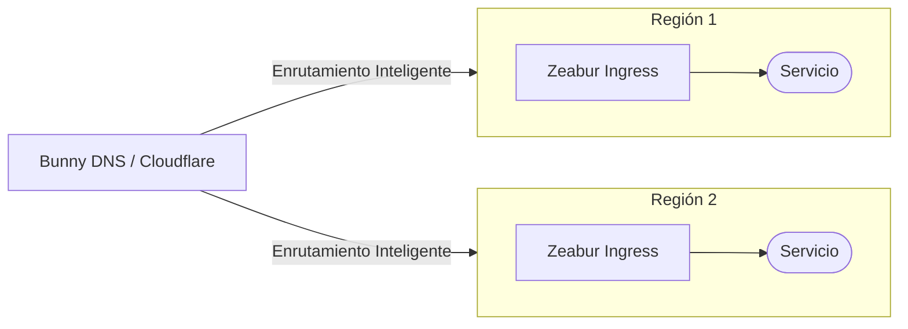
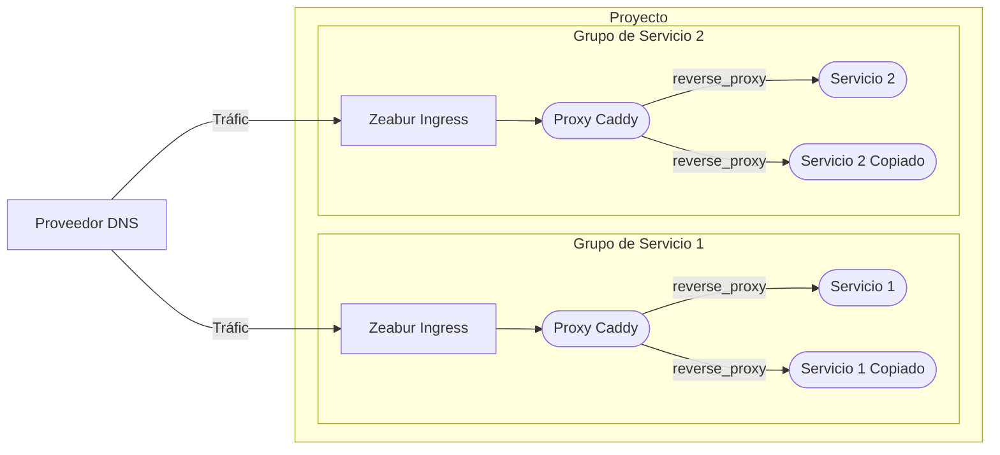
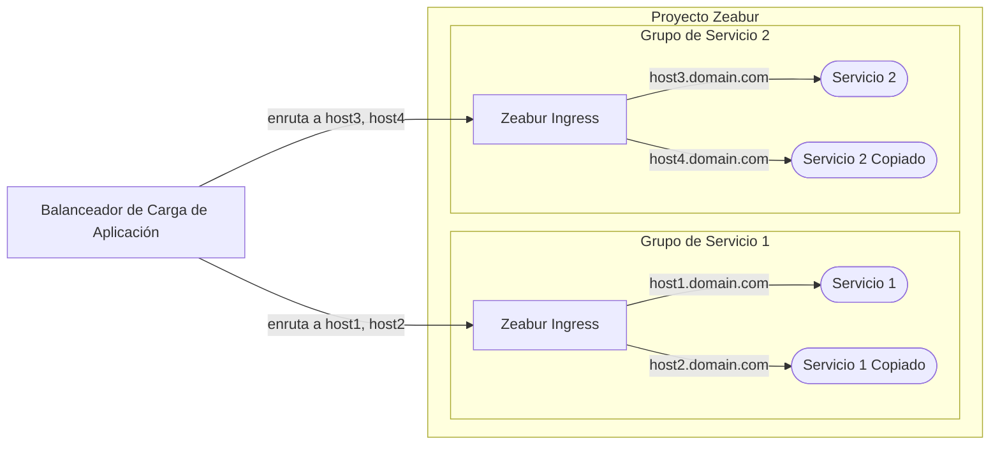

# Arquitectura de Alta Disponibilidad

Este documento describe las arquitecturas recomendadas para lograr alta disponibilidad para sus servicios desplegados en Zeabur.

Tenga en cuenta que este es un tema avanzado. Típicamente, no necesita alta disponibilidad (HA) para los servicios de su startup. Para la solución más sencilla, coloque sus servicios en un solo proyecto y use [redes privadas](/networking/private) para la comunicación. Exponga su servicio a Internet utilizando [redes públicas](/networking/public). Nosotros podemos encargarnos del escalado vertical por usted. En clústeres compartidos, si un nodo falla, podemos migrar automáticamente su servicio a otro nodo.

## Balanceador de Carga DNS (Recomendado)

Nuestro enfoque principal recomendado es utilizar un [**balanceador de carga DNS**](https://www.cloudflare.com/learning/performance/what-is-dns-load-balancing/). Este método es generalmente más rentable y no interfiere con el firewall nativo de Zeabur y las funciones de limitación de tasa.

Servicios como [Cloudflare](https://developers.cloudflare.com/load-balancing/understand-basics/proxy-modes/) y [Bunny DNS](https://support.bunny.net/hc/en-us/articles/7247569381906-Understanding-Bunny-DNS-Load-Balancing) ofrecen robustas características de balanceo de carga DNS. Para obtener instrucciones detalladas de configuración, consulte su documentación oficial.

El flujo básico es el siguiente:

## Configuración de Réplicas de Servicio

Actualmente, Zeabur no soporta el escalado horizontal automático. Para crear instancias redundantes, debe crear manualmente copias de su servicio. Una vez que tenga sus réplicas de servicio, puede usar uno de los dos métodos siguientes para distribuir el tráfico entre ellas.

### Opción 1: Proxy Inverso Interno (Más Recomendado)

La primera opción es usar un proxy inverso interno, como [Caddy](https://zeabur.com/templates/FFDLWU) o [NGINX](https://zeabur.com/templates/YIUNMF), para reenviar las solicitudes a sus réplicas de servicio.

En esta configuración, usted configura el proxy inverso para equilibrar el tráfico entre los nombres de host internos de sus copias de servicio (por ejemplo, `service-1-replica-1.zeabur.internal` y `service-1-replica-2.zeabur.internal`).

Un beneficio importante de este método es que funciona sin problemas con el controlador de entrada de Zeabur. Puede recuperar la dirección IP real del cliente utilizando el encabezado estándar `X-Forwarded-For` sin modificar la lógica de su aplicación.

### Opción 2: Proxy Externo L7

La segunda opción es usar un proxy externo de Capa 7, como un [Balanceador de Carga de Aplicación](https://developers.cloudflare.com/load-balancing/understand-basics/proxy-modes/) (ALB) de un proveedor de la nube.

Si bien este método puede parecer más simple ya que no necesita administrar un servicio Caddy interno, presenta varias limitaciones:

- **Encabezados de IP Real**: Debe configurar su ALB para que pase la IP real del cliente en un encabezado personalizado (por ejemplo, `X-LoadBalancer-IP`) y modificar su aplicación para que confíe en este encabezado y lo lea.
- **Riesgo de Seguridad**: Debe configurar el firewall de Zeabur para permitir el tráfico solo desde la dirección IP del ALB. Si no lo hace, un actor malintencionado podría omitir su ALB y enviar un encabezado `X-LoadBalancer-IP` falsificado directamente a su aplicación.
- **Limitación de Tasa**: Debido a que todas las solicitudes se originan desde la dirección IP del ALB, la limitación de tasa de Zeabur puede activarse inesperadamente, bloqueando potencialmente el tráfico legítimo.

Planeamos proporcionar un mejor soporte para el método de proxy externo para resolver estos problemas en el futuro. Por ahora, el **proxy inverso interno (Opción 1) es el método más confiable y recomendado** para usar en Zeabur.
