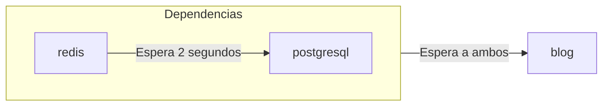

# Creación de Plantillas desde YAML

Puedes usar la CLI `zeabur` para desplegar, crear y gestionar plantillas en un formato similar a [Docker Compose](https://docs.docker.com/compose/) o [Kubernetes Object](https://kubernetes.io/docs/concepts/overview/working-with-objects/) a partir de YAML.

## Formato YAML (Resource)

Zeabur utiliza un único archivo YAML para describir los recursos de la plantilla, denominado **Template Resource**.

```yaml
apiVersion: zeabur.com/v1
kind: Template
metadata:
    name: RSSHub
spec:
    description: Everything is RSSible
    icon: https://docs.rsshub.app/logo.png
    coverImage: https://zeabur.com/docs/_next/image?url=%2Fdocs%2F_next%2Fstatic%2Fmedia%2Fintro.5b73c4f8.png&w=3840&q=75
    variables:
        - key: PUBLIC_DOMAIN
          type: DOMAIN
          name: Dominio
          description: ¿Qué dominio deseas para tu RSSHub?
    tags:
        - Tool
    readme: |-
        # RSSHub
        RSSHub es un agregador de feeds RSS de código abierto, fácil de usar y extensible, capaz de generar feeds RSS prácticamente de cualquier cosa.

        RSSHub entrega millones de contenidos agregados de todo tipo de fuentes, nuestra vibrante comunidad de código abierto asegura la entrega de nuevas rutas, nuevas funciones y correcciones de errores de RSSHub.
    services:
        - name: Redis
          icon: https://raw.githubusercontent.com/zeabur/service-icons/main/marketplace/redis.svg
          template: PREBUILT
          spec:
            source:
                image: redis/redis-stack-server:latest
            ports:
                - id: database
                  port: 6379
                  type: TCP
            volumes:
                - id: data
                  dir: /data
            instructions:
                - type: TEXT
                  title: Comando para conectar a tu Redis
                  content: redis-cli -h ${PORT_FORWARDED_HOSTNAME} -p ${DATABASE_PORT_FORWARDED_PORT} -a ${REDIS_PASSWORD}
                - type: TEXT
                  title: Cadena de conexión Redis
                  content: redis://:${REDIS_PASSWORD}@${PORT_FORWARDED_HOSTNAME}:${DATABASE_PORT_FORWARDED_PORT}
                - type: PASSWORD
                  title: Contraseña de Redis
                  content: ${REDIS_PASSWORD}
                  category: Credenciales
                - type: TEXT
                  title: Host de Redis
                  content: ${PORT_FORWARDED_HOSTNAME}
                  category: Hostname & Puerto
                - type: TEXT
                  title: Puerto de Redis
                  content: ${DATABASE_PORT_FORWARDED_PORT}
                  category: Hostname & Puerto
            env:
                REDIS_ARGS:
                    default: --requirepass ${REDIS_PASSWORD}
                REDIS_CONNECTION_STRING:
                    default: redis://:${REDIS_PASSWORD}@${REDIS_HOST}:${REDIS_PORT}
                    expose: true
                    readonly: true
                REDIS_HOST:
                    default: ${CONTAINER_HOSTNAME}
                    expose: true
                    readonly: true
                REDIS_PASSWORD:
                    default: ${PASSWORD}
                    expose: true
                REDIS_PORT:
                    default: ${DATABASE_PORT}
                    expose: true
                    readonly: true
                REDIS_URI:
                    default: ${REDIS_CONNECTION_STRING}
                    expose: true
                    readonly: true
        - name: RSSHub
          icon: https://docs.rsshub.app/logo.png
          template: PREBUILT
          domainKey: PUBLIC_DOMAIN
          spec:
            source:
                image: diygod/rsshub
            ports:
                - id: web
                  port: 1200
                  type: HTTP
            env:
                CACHE_TYPE:
                    default: ${REDIS_URI}
                REDIS_URL:
                    default: ${REDIS_URI}

localization:
  zh-TW:
    description: LobeChat 是一個開源的高效能聊天機器人框架。
    variables:
      - key: PUBLIC_DOMAIN
        type: DOMAIN
        name: 網域
        description: 你想將 RSSHub 綁在哪個網域上？
    readme: |-
        # RSSHub
        RSSHub 是一個開源、易於使用且可擴展的 RSS 資訊聚合器，能夠從幾乎所有來源生成 RSS 資訊。

        RSSHub 提供來自各種來源的數百萬內容，我們充滿活力的開源社群確保提供 RSSHub 的新路線、新功能和錯誤修復。
```

Un **Template** se divide en tres secciones principales: "Información de la Plantilla", "Especificaciones del Servicio" y "Localización". El formato completo puede verse en el [Repositorio de Esquema de Zeabur](https://json-schema.app/view/%23?url=https%3A%2F%2Fschema.zeabur.app%2Ftemplate.json). A continuación se describe brevemente el propósito de cada campo y cómo se presenta en la página de plantilla de Zeabur.

### Definición de la Plantilla


`apiVersion` y `kind` siempre son `zeabur.com/v1` y `Template`.

En `metadata`, `name` es el nombre arbitrario de la plantilla, como `RSSHub`, `Lobe-Chat` o `ChatGPT API`. Aparecerá en el bloque `WeWe RSS` de la imagen anterior.

En `spec`, `description` es un resumen breve de la plantilla, mostrado debajo del título. `icon` es el icono (URL de imagen), mostrado junto al título. `tags` son etiquetas; las categorías de referencia están en la sección izquierda `Tags` de la página de exploración de plantillas. Las etiquetas correctas ayudan a los usuarios a encontrar plantillas y mejoran el SEO.

`readme` es la documentación en Markdown, mostrada al final de la página. `coverImage` aparece encima de la documentación (URL de imagen; opcional).

`variables` son variables configurables por el usuario al desplegar. `type` puede ser `STRING` o `DOMAIN`; `key` corresponde a variables de entorno (Zeabur las crea automáticamente en los servicios). `name` y `description` se muestran en el formulario de despliegue.


### Especificaciones de Servicios


`services` define los servicios que se crearán en el proyecto al desplegar. `name` y `icon` son nombre e icono. `template` indica `PREBUILT` (imagen Docker) o `GIT` (repositorio GitHub).

`dependencies` indica servicios de los que depende este. Zeabur espera a que inicien antes de iniciar el tuyo.

```yaml
dependencies:
    - redis
    - postgresql
```



`domainKey` vincula una variable `DOMAIN` al servicio (dominio se asigna al desplegar).

`spec` es la especificación del servicio. Detalles completos en la [documentación de Especificaciones de Servicio](https://json-schema.app/view/%23/%23%2Fproperties%2Fspec/%23%2Fproperties%2Fspec%2Fproperties%2Fservices%2Fitems/%23%2Fproperties%2Fspec%2Fproperties%2Fservices%2Fitems%2Fproperties%2Fspec?url=https%3A%2F%2Fschema.zeabur.app%2Ftemplate.json).

Puntos clave:

- `PREBUILT`: `image`, opcionalmente `command`/`args`, credenciales de registro privado, `runAsUserID` (no-root).
- `GIT`: tipo (`GITHUB`), `repoID`, rama opcional.
- `ports`: puertos expuestos (`HTTP` → dominio, `TCP`/`UDP` → reenvío Zeabur).
- `volumes`: rutas de almacenamiento persistente.
- `instructions`: instrucciones de uso (`TEXT`, `PASSWORD`, `DOMAIN`).
- `env`: variables de entorno (`default`, `expose`, `readonly`).
- `configs`: archivos de configuración (`path`, `template`, `envsubst`, `permission` decimal).
- `gpu`: `enabled: true` para solicitar GPU.

### Localización

Puedes localizar `description`, `coverImage`, títulos/descripciones de `variables` y `readme`. Zeabur muestra el idioma correspondiente según el visitante.


Idiomas soportados: `zh-TW`, `zh-CN`, `ja-JP`, `es-ES`. `en-US` es el predeterminado (escribe directamente en `spec`). Campos omitidos usan el valor por defecto.

## Desplegar Plantillas con la CLI `zeabur`

```bash
$ cat wp.yaml | head -n 10
apiVersion: zeabur.com/v1
kind: Template
metadata:
    name: WordPress
spec:
    description: A content management system (CMS) that allows you to host and build websites.
    coverImage: https://kinsta.com/wp-content/uploads/2018/02/what-is-wordpress.png
    icon: https://raw.githubusercontent.com/zeabur/service-icons/main/marketplace/wordpress.png
    variables:
        - key: WORDPRESS_DOMAIN

$ npx zeabur@latest template deploy -f wp.yaml
```

La CLI te pedirá seleccionar/crear proyecto, región y completar variables.

## Publicar Plantillas

```bash
$ npx zeabur@latest template create -f wp.yaml
INFO	Template "WordPress" (https://zeabur.com/templates/71HORL) created
```

Ver YAML crudo: `https://zeabur.com/templates/71HORL.yaml`

## Actualizar Plantillas

```bash
$ npx zeabur@latest template update -c 71HORL -f wp.yaml
INFO	Template updated.
```

## Eliminar Plantillas

```bash
$ npx zeabur@latest template delete
? Enter template code: 71HORL
INFO	Template deleted successfully.
```

La plantilla se elimina permanentemente.

