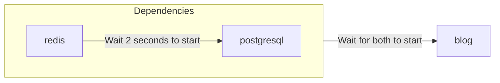

# Creating Templates from YAML

<WorkingInProgress />

You can use the `zeabur` CLI to deploy, create, and manage templates in a format similar to [Docker Compose](https://docs.docker.com/compose/) or [Kubernetes Object](https://kubernetes.io/docs/concepts/overview/working-with-objects/) from YAML.

## YAML (Resource) Format

Zeabur uses a single YAML file to describe the template resources referred to as **Template Resource**.

```yaml
apiVersion: zeabur.com/v1
kind: Template
metadata:
    name: RSSHub
spec:
    description: Everything is RSSible
    icon: https://docs.rsshub.app/logo.png
    coverImage: https://zeabur.com/docs/_next/image?url=%2Fdocs%2F_next%2Fstatic%2Fmedia%2Fintro.5b73c4f8.png&w=3840&q=75
    variables:
        - key: PUBLIC_DOMAIN
          type: DOMAIN
          name: Domain
          description: What is the domain you want for your RSSHub?
    tags:
        - Tool
    readme: |-
        # RSSHub
        RSSHub is an open source, easy to use, and extensible RSS feed aggregator, it's capable of generating RSS feeds from pretty much everything.

        RSSHub delivers millions of contents aggregated from all kinds of sources, our vibrant open source community is ensuring the deliver of RSSHub's new routes, new features and bug fixes.
    services:
        - name: Redis
          icon: https://raw.githubusercontent.com/zeabur/service-icons/main/marketplace/redis.svg
          template: PREBUILT
          spec:
            source:
                image: redis/redis-stack-server:latest
            ports:
                - id: database
                  port: 6379
                  type: TCP
            volumes:
                - id: data
                  dir: /data
            instructions:
                - type: TEXT
                  title: Command to connect to your Redis
                  content: redis-cli -h ${PORT_FORWARDED_HOSTNAME} -p ${DATABASE_PORT_FORWARDED_PORT} -a ${REDIS_PASSWORD}
                - type: TEXT
                  title: Redis Connection String
                  content: redis://:${REDIS_PASSWORD}@${PORT_FORWARDED_HOSTNAME}:${DATABASE_PORT_FORWARDED_PORT}
                - type: PASSWORD
                  title: Redis password
                  content: ${REDIS_PASSWORD}
                  category: Credentials
                - type: TEXT
                  title: Redis host
                  content: ${PORT_FORWARDED_HOSTNAME}
                  category: Hostname & Port
                - type: TEXT
                  title: Redis port
                  content: ${DATABASE_PORT_FORWARDED_PORT}
                  category: Hostname & Port
            env:
                REDIS_ARGS:
                    default: --requirepass ${REDIS_PASSWORD}
                REDIS_CONNECTION_STRING:
                    default: redis://:${REDIS_PASSWORD}@${REDIS_HOST}:${REDIS_PORT}
                    expose: true
                    readonly: true
                REDIS_HOST:
                    default: ${CONTAINER_HOSTNAME}
                    expose: true
                    readonly: true
                REDIS_PASSWORD:
                    default: ${PASSWORD}
                    expose: true
                REDIS_PORT:
                    default: ${DATABASE_PORT}
                    expose: true
                    readonly: true
                REDIS_URI:
                    default: ${REDIS_CONNECTION_STRING}
                    expose: true
                    readonly: true
        - name: RSSHub
          icon: https://docs.rsshub.app/logo.png
          template: PREBUILT
          domainKey: PUBLIC_DOMAIN
          spec:
            source:
                image: diygod/rsshub
            ports:
                - id: web
                  port: 1200
                  type: HTTP
            env:
                CACHE_TYPE:
                    default: ${REDIS_URI}
                REDIS_URL:
                    default: ${REDIS_URI}

localization:
  zh-TW:
    description: LobeChat 是一個開源的高效能聊天機器人框架。
    variables:
      - key: PUBLIC_DOMAIN
        type: DOMAIN
        name: 網域
        description: 你想將 RSSHub 綁在哪個網域上？
    readme: |-
        # RSSHub
        RSSHub 是一個開源、易於使用且可擴展的 RSS 資訊聚合器，能夠從幾乎所有來源生成 RSS 資訊。

        RSSHub 提供來自各種來源的數百萬內容，我們充滿活力的開源社群確保提供 RSSHub 的新路線、新功能和錯誤修復。
```

A **Template** can be divided into three main sections: "Template Information", "Service Specifications", and "Localization". The complete format can be viewed in the [Zeabur Schema Repository](https://json-schema.app/view/%23?url=https%3A%2F%2Fschema.zeabur.app%2Ftemplate.json). Below, each field's purpose and how it is presented on the Zeabur template page will be briefly described.

### Template Definition


`apiVersion` and `kind` are always `zeabur.com/v1` and `Template`.

In `metadata`, `name` is the arbitrary template name, such as `RSSHub`, `Lobe-Chat`, and `ChatGPT API`. This will appear in the `WeWe RSS` block in the image above.

In `spec`, `description` is a brief summary of the template, displayed under the template title. `icon` is the template's icon, a URL pointing to an image, shown next to the template title. `tags` are the template's labels, with reference categories available on the [template browsing page's left `Tags` section](https://zeabur.com/templates). Correct tags not only help users find templates easily but also optimize SEO.

`readme` is the template's documentation, written in Markdown format, displayed at the bottom of the template page. `coverImage` is shown above the documentation and is also a URL pointing to an image; it can be left blank.

`variables` are the variables users can set during deployment. The `type` can be `STRING` (a normal variable string) or `DOMAIN` (Zeabur guides domain setup); `key` corresponds to the service's environment variables, with Zeabur automatically creating an environment variable in all services as specified. `name` and `description` correspond to the variable name and description during template deployment, as shown below.


### Service Specifications


`services` are the template's service specifications. Zeabur will deploy the specified services into the project during deployment. The service's `name` is its name, and `icon` is its icon. `template` declares whether the service is a Docker image (`PREBUILT`) or a service deployed from Git (`GIT`).

`dependencies` declare the services this service depends on. Zeabur can wait for the specified services to start before starting your service, avoiding the trouble of repeatedly restarting services. For example, if your service `blog` depends on `redis` and `postgresql`, you can specify as below. Note that `redis` and `postgresql` must also be services defined in the template.

```yaml
dependencies:
    - redis
    - postgresql
```

The startup relationship is as follows:



The `domainKey` indicates which service the domain (type `DOMAIN`) variable in the template definition should be bound to. In the example above, `spec.variables` has a variable `PUBLIC_DOMAIN` of type `DOMAIN`, and the RSSHub service specification has a `domainKey` pointing to `PUBLIC_DOMAIN`. When deploying, the domain set in `PUBLIC_DOMAIN` will be bound to the RSSHub service.

`spec` is the Service Specification. Detailed information on each field can be found in the [Template Service Specifications documentation](https://json-schema.app/view/%23/%23%2Fproperties%2Fspec/%23%2Fproperties%2Fspec%2Fproperties%2Fservices%2Fitems/%23%2Fproperties%2Fspec%2Fproperties%2Fservices%2Fitems%2Fproperties%2Fspec?url=https%3A%2F%2Fschema.zeabur.app%2Ftemplate.json). Below is a brief description of key points in the service specifications:

For `PREBUILT` services, you need to specify the Docker image (`image`), and optionally the execution command and parameters (`command` and `args`). If your image is stored in a private registry, you may want to specify the `username` and `password` to pull. Additionally, you can specify the user ID (`runAsUserID`) to run your container in the non-root mode. For `GIT` services, you need to specify the Git repository type (currently only `GITHUB`), repository ID (currently only GitHub's [`repoID`](https://stackoverflow.com/a/47223479)), and optionally the branch (`branch`).

`ports` specifies the service Ports to be exposed to the project or even externally. HTTP services can be connected using a domain name (e.g., `https://my-service.zeabur.app`), while TCP and UDP services can use Zeabur's forwarding link `xxx.clusters.zeabur.com:12345`. For example, if `type` is `HTTP` and `port` is `12345`, others can connect to your service listening on `12345` port via `https://my-service.zeabur.app`.

`volumes` specifies the persistent storage paths for the service. In principle, Zeabur restores the service's state to the initial state (Stateless) after each Redeploy or Restart, but if you need to persist some data, you can use `volumes` to specify the persistent storage path. For example, if `dir` is `/data`, it means your service can persist data under the `/data` path until the service is deleted.

`instructions` tell other users how to use your service, such as the example `Redis Connection String`, which provides how others can connect to Redis using a Client. `type` can be `DOMAIN` (a button that directs to the specified URL when clicked), `TEXT` (text), `PASSWORD` (password, hidden by default), and `category` is a customizable classification, not currently displayed on the frontend.

`env` is the service's environment variables. `default` is the default value of the environment variable, `expose` indicates whether other projects can directly use this variable or use the `${VARIABLE}` syntax to reference this variable, and `readonly` indicates whether it is read-only (cannot be modified after the service is created). For example, if `REDIS_CONNECTION_STRING`'s `expose` is `true`, other services can connect to Redis through the `REDIS_CONNECTION_STRING` environment variable, and can also reference this connection string in other environment variables using `${REDIS_CONNECTION_STRING}`.

`configs` are the file-based settings for the service. You can use `path` and `template` to specify the default configuration file, making it easier for users to modify it. Use `envsubst` to replace variable references in the template with their corresponding values. For example, when `envsubst` is enabled and the variable `MONGO_URI=mongodb://mongo.zeabur.internal:27017` is set:

```yaml {6}
configs:
    - path: /config.yaml
      template: |
        mongo:
            uri: ${MONGO_URI}
      envsubst: true
```

The `/config.yml` file will be populated with the following content in the service instance:

```yaml filename="/config.yaml"
mongo:
    uri: mongodb://mongo.zeabur.internal:27017
```

You can also specify the `permission` of your configuration file. Note that `permission` must be a decimal number, converted from the octal [UNIX file permissions](https://mason.gmu.edu/~montecin/UNIXpermiss.htm). Here are some common permission mappings:

| `permission` value | Raw octal value | Read | Write | Execute | Suitable for |
| ------------------ | --------------- | ---- | ----- | ------- | ------------ |
| 256                | 0400            | O    | X     | X       | Confidential files (e.g., passwords) |
| 420                | 0644            | O    | O     | X       | Normal readable and writable files. Default permission |
| 493                | 0755            | O    | O     | O       | Executable files (e.g., bash scripts) |

"Read", "Write", and "Execute" here refer to the permissions of the container user. For details (groups, everyone, etc.), please refer to the above URL.

`gpu` specifies the GPU resources required by the service. Currently, you can only enable or disable these resources. To use GPU resources, set `gpu.enabled` to `true`:

```yaml
gpu:
    enabled: true
```

### Localization

You can localize the `description`, `coverImage`, `variables` titles and descriptions, and `readme` in the template definition. Zeabur will display the corresponding localized content based on the visitor's language.


You can localize your contents to `zh-TW`, `zh-CN`, `ja-JP`, and `es-ES`. Note that `en-US` is the default language of the template, and you should write directly in the template definition. The format of `description`, `readme`, and `coverImage` is the same as in the template definition. You can translate the field `name` and `description` in `variables`; however, other parts (`type` and `key`) must remain the same as in the template definition fields.

Leaving fields blank (or omitting them) will automatically use the default content from the template definition. In the above example, the `coverImage` is omitted, so Zeabur picks the `coverImage` from the template definition.

## Deploying Templates with the `zeabur` CLI

If you have finished writing the Template Resource YAML and want to test the deployment, you can use the `zeabur` CLI to deploy the template.

```
$ cat wp.yaml | head -n 10
apiVersion: zeabur.com/v1
kind: Template
metadata:
    name: WordPress
spec:
    description: A content management system (CMS) that allows you to host and build websites.
    coverImage: https://kinsta.com/wp-content/uploads/2018/02/what-is-wordpress.png
    icon: https://raw.githubusercontent.com/zeabur/service-icons/main/marketplace/wordpress.png
    variables:
        - key: WORDPRESS_DOMAIN

$ npx zeabur@latest template deploy -f wp.yaml
```

First, the `zeabur` CLI will ask you which project you want to deploy to, then it will ask you to fill in the variables specified in the services' `variables`, and finally, it will deploy the template to the project you specified.

```
$ npx zeabur@latest template deploy -f wp.yaml
? Select project  [Use arrows to move, type to filter]
  your-project
> Create a new project
? Select project region  [Use arrows to move, type to filter]
 DigitalOcean - sgp1 (Singapore)
  HuaWei Cloud - cn-east-3 (Shanghai, China)
  Vultr - ewr1 (New Jersey, United States)
  Google Cloud Platform - asia-east1 (Taipei, Taiwan)
> Amazon Web Services - ap-east-1 (Hong Kong)
  Amazon Web Services - ap-northeast-1 (Tokyo, Japan)
  Amazon Web Services - us-west-1 (California, United States)
? What is the domain of your WordPress website? (For example, if you enter "myapp", the domain will be "myapp.zeabur.app") mywordpressdemo7c918e14
INFO	Domain mywordpressdemo7c918e14.zeabur.app is available!
m
INFO	Template successfully deployed into project "aphylac" (https://dash.zeabur.com/projects/your-project-id).
```

## Publishing Templates Using the `zeabur` CLI

If testing is successful, you can use the `npx zeabur@latest template create` command to publish the template for others to use. For example, using the `wp.yaml` from above:

```
$ npx zeabur@latest template create -f wp.yaml
INFO	Template "WordPress" (https://zeabur.com/templates/71HORL) created
```

It is a one-click command. You can click the link to view the deployed template:


You can also add `.yaml` to the end of link to view the Template's Resource YAML format: `https://zeabur.com/templates/71HORL.yaml`.

## Updating Templates Using the `zeabur` CLI

If you need to modify the template's content, such as renaming the template or updating the Image version, you can update it after modifying the Resource YAML by using the `npx zeabur@latest template update` command:

```
$ npx zeabur@latest template update -c 71HORL -f wp.yaml
INFO	Template updated.
```
