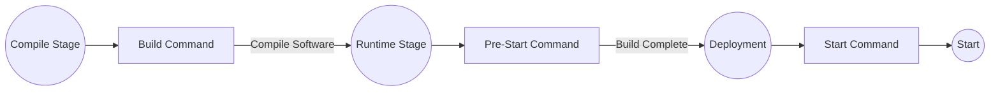

# Deploying Rust Applications

Zeabur supports all types of Rust applications in principle—it will automatically look for executables by default. If your project has multiple executables, you can specify the executable file name in the "Service Name" field (or use `ZBPACK_RUST_ENTRY`).

If you don't have a project on hand, you can fork the [zeabur/axum-template](https://github.com/zeabur/axum-template) repository to your GitHub account and try deploying it on Zeabur.

## Supported Project Types

- Single Executable Project: A Rust project with only `src/main.rs` as the entry point. Zeabur will automatically find the first executable produced after `cargo install`.
- Multiple Executables Project: If your project has other executables in `src/bin` besides `src/main.rs`, specify the name of the final artifact you want to run in the "Service Name" field or configure it in `zbpack.json`:
  ```json
  {
    "rust": {
      "entry": "your-entry"
    }
  }
  ```
  You can also use the environment variable `ZBPACK_RUST_ENTRY` to achieve the same effect.
- Cargo Workspace Monorepo: If your project consists of multiple crates, specify the name of the final artifact you want to run in the "Service Name" field. By default, `cargo install` will install **all projects** under the workspace. Besides using the above `ZBPACK_RUST_ENTRY` method to specify the executable name, you can also directly specify the location of this application workspace in `zbpack.json`. If your application is in the `rest-api` folder at the repository root directory, you can configure it as follows:
  ```json
  {
    "rust": {
      "app_dir": "rest-api"
    }
  }
  ```
  You can also use the environment variable `ZBPACK_RUST_APP_DIR` to achieve the same effect.

If the specified executable does not exist, it will default to auto-detection mode. "Auto-detection" will look for all compiled executables and run the first found file. Because this mode can easily guess wrong in multi-project scenarios, it's recommended to specify the correct "Service Name" for more complex project scenarios. Check the following section for how to find and specify it.

## Finding the Final Artifact Name

The final artifact can be found in `target/release` of your project. To find the filename:

1. You need the Rust toolchain to compile the project. Download it from the [official Rust website](https://www.rust-lang.org).
2. Clone the project you want to deploy and navigate to the project directory.
3. Run `cargo build --release` to compile the project.

    ```bash
    $ cargo run --release
    Compiling zeabur v0.1.0 (/project)
      Finished release [optimized] target(s) in 0.65s
      Running `target/release/zeabur`
    ```

4. Find the line Running `target/release/zeabur`, extract the final executable name (zeabur).
5. Fill in `zeabur` in the Service Name or `ZBPACK_RUST_ENTRY`.

## Copying Other Files

If your project relies on other files in the codebase besides the executable. For example:

```plain
*
|`-- public  <-- Your program depends on this folder
|`-- src
|  `-- main.rs
|`-- Cargo.toml
|`-- Cargo.lock
`--- config.toml   <-- Your program depends on this file
```

You can specify `rust.assets` in `zbpack.json`, listing the folders or files you want to keep. Folders should end with `/`. Example:

```json
{
  "rust": {
    "assets": [
      "public/",
      "config.toml"
    ]
  }
}
```

## Custom Build and Start Commands

Zeabur provides "build command", "start command", and "pre-start command" in Rust, allowing you to insert necessary dependencies or write necessary files at various stages of your Rust project's build process.



### Build Command

You can use `ZBPACK_BUILD_COMMAND` to specify **commands to run before compiling**, for example:

```
ZBPACK_BUILD_COMMAND=sudo apt install sqlite3
```

You can also specify this in `zbpack.json`:

```json
{
  "build_command": "sudo apt install sqlite3"
}
```

### Start Command

You can use `ZBPACK_START_COMMAND` to override the default start command specified by Zeabur, for example:

```
ZBPACK_START_COMMAND="/app/server --debug"
```

You can also specify this in `zbpack.json`:

```json
{
  "start_command": "/app/server --debug"
}
```

### Pre-Start Command

If you need to install some dependencies before starting, you can use `ZBPACK_PRE_START_COMMAND` to specify the command to run before execution:

```
ZBPACK_PRE_START_COMMAND="sudo apt install sqlite3"
```

You can also specify this in `zbpack.json`:

```json
{
  "pre_start_command": "sudo apt install sqlite3"
}
```

Compared to `ZBPACK_START_COMMAND`, the content will persist and won't be re-executed each time the system restarts, resulting in faster startup.

### Automatic Dependency Installation

If your project depends on OpenSSL and explicitly specifies it in `Cargo.toml` (or indirectly depends on it via `Cargo.lock`), Zeabur will automatically install the `openssl` runtime library.

## Runtime Environment

Zeabur currently uses [`rust:1-silm`](https://hub.docker.com/_/rust) as the runtime image. Your executable will be placed in the `/app` directory, with `/` (root directory) as the working directory.

Files in `rust.assets` will be placed in the `/app` directory, which is the same directory as the executable file. If you need to read assets, in practice, you usually read files from a **path relative to the executable**. The following example will get the location of your `images` asset.

```rust
use std::env;
use std::path::Path;

fn main() {
    let exe_path = env::current_exe().expect("Failed to get current executable path");
    let exe_dir = exe_path.parent().expect("Failed to get executable directory");
    let relative_path = exe_dir.join("images");

    println!("config.toml path: {:?}", relative_path);
}
```

Note that for configuration files, **it is usually retrieved from the working directory**. Since the working directory is the root directory, you should place your config in `/config.toml` (instad of `/app/config.toml`) when adding a configuration file using Config Editor. After that, read the file from the working directory:

```rust
use std::env;
use std::fs::File;
use std::io::{self, Read};
use std::path::PathBuf;

fn main() -> io::Result<()> {
    let current_dir = env::current_dir()?;
    let config_path: PathBuf = current_dir.join("config.toml");

    // It is recommended to use serde for deserialization. This is just a demo, so read_to_string is used here.
    let mut file = File::open(config_path)?;
    let mut contents = String::new();
    file.read_to_string(&mut contents)?;

    println!("Config file contents:\n{}", contents);

    Ok(())
}
```

## Serverless Deployment

Unlike other PaaS platforms that run your Rust application inside a Docker container directly, Zeabur also supports deploying Rust applications using the [Serverless deployment](/deploy/serverless) method. This allows your Rust application to start only when it receives a request, instead of running continuously like a container, saving resources.

To deploy a Rust application using Serverless, add `ZBPACK_SERVERLESS=1` to the environment variables.
