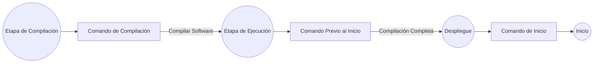

# Desplegar aplicaciones de Rust

Zeabur admite todos los tipos de aplicaciones Rust en principio: buscará automáticamente los ejecutables por defecto. Si tu proyecto tiene múltiples ejecutables, puedes especificar el nombre del archivo ejecutable en el campo "Nombre del Servicio" (o usar `ZBPACK_RUST_ENTRY`).

Si no tienes un proyecto a mano, puedes bifurcar el repositorio [zeabur/axum-template](https://github.com/zeabur/axum-template) a tu cuenta de GitHub e intentar desplegarlo en Zeabur.

## Tipos de proyectos admitidos

- Proyecto de un solo ejecutable: Un proyecto Rust con solo `src/main.rs` como punto de entrada. Zeabur buscará automáticamente el primer ejecutable producido después de `cargo install`.
- Proyecto de múltiples ejecutables: Si tu proyecto tiene otros ejecutables en `src/bin` además de `src/main.rs`, especifica el nombre del artefacto final que deseas ejecutar en el campo "Nombre del Servicio" o configúralo en `zbpack.json`:
  ```json
  {
    "rust": {
      "entry": "your-entry"
    }
  }
  ```
  También puedes usar la variable de entorno `ZBPACK_RUST_ENTRY` para lograr el mismo efecto.
- Monorepo de Cargo Workspace: Si tu proyecto consiste en múltiples crates, especifica el nombre del artefacto final que deseas ejecutar en el campo "Nombre del Servicio". Por defecto, `cargo install` instalará **todos los proyectos** bajo el workspace. Además de usar el método `ZBPACK_RUST_ENTRY` mencionado anteriormente para especificar el nombre del ejecutable, también puedes especificar directamente la ubicación de este workspace de la aplicación en `zbpack.json`. Si tu aplicación está en la carpeta `rest-api` en el directorio raíz del repositorio, configúralo de la siguiente manera:
  ```json
  {
    "rust": {
      "app_dir": "rest-api"
    }
  }
  ```
  También puedes usar la variable de entorno `ZBPACK_RUST_APP_DIR` para lograr el mismo efecto.

Si el ejecutable especificado no existe, se cambiará al modo de detección automática. La "detección automática" buscará todos los ejecutables compilados y ejecutará el primer archivo encontrado. Debido a que este modo puede equivocarse fácilmente en escenarios de múltiples proyectos, se recomienda especificar el "Nombre del Servicio" correcto como se describe en las secciones para escenarios de proyectos más complejos (como los puntos segundo y tercero).

## Encontrar el nombre del artefacto final

El artefacto final se puede encontrar en `target/release` de tu proyecto. Los pasos específicos para encontrarlo:

1. Necesitas la herramienta Rust para compilar el proyecto. Descárgala desde el [sitio web oficial de Rust](https://www.rust-lang.org).
2. Clona el proyecto que deseas desplegar y navega al directorio del proyecto.
3. Ejecuta `cargo build --release` para compilar el proyecto.

    ```bash
    $ cargo run --release
    Compiling zeabur v0.1.0 (/project)
      Finished release [optimized] target(s) in 0.65s
      Running `target/release/zeabur`
    ```

4. Encuentra la línea Running `target/release/zeabur`, extrae el nombre del ejecutable final (zeabur).
5. Rellena `zeabur` en el campo Nombre del Servicio o `ZBPACK_RUST_ENTRY`.

## Copiar otros archivos

Si tu proyecto depende de otros archivos en la base de código además del ejecutable. Por ejemplo:

```plain
*
|`-- public  <-- Tu programa depende de esta carpeta
|`-- src
|  `-- main.rs
|`-- Cargo.toml
|`-- Cargo.lock
`--- config.toml   <-- Tu programa depende de este archivo
```

Puedes especificar `rust.assets` en `zbpack.json`, enumerando las carpetas o archivos que deseas conservar. Las carpetas deben terminar con `/`. Ejemplo:

```json
{
  "rust": {
    "assets": [
      "public/",
      "config.toml"
    ]
  }
}
```

## Comandos personalizados de compilación y inicio

Zeabur proporciona "comando de compilación", "comando de inicio" y "comando previo al inicio" en Rust, lo que te permite insertar las dependencias necesarias o escribir los archivos necesarios en varias etapas del proceso de compilación de tu proyecto en Rust.



### Comando de Compilación

Puedes usar `ZBPACK_BUILD_COMMAND` para especificar **comandos a ejecutar antes de compilar**, por ejemplo:

```
ZBPACK_BUILD_COMMAND=sudo apt install sqlite3
```

También puedes especificarlo en `zbpack.json`:

```json
{
  "build_command": "sudo apt install sqlite3"
}
```

### Comando de Inicio

Puedes usar `ZBPACK_START_COMMAND` para sobrescribir el comando de inicio predeterminado especificado por Zeabur, por ejemplo:

```
ZBPACK_START_COMMAND="/app/server --debug"
```

También puedes especificarlo en `zbpack.json`:

```json
{
  "start_command": "/app/server --debug"
}
```

### Comando Previo al Inicio

Si necesitas instalar algunas dependencias antes de iniciar, puedes usar `ZBPACK_PRE_START_COMMAND` para especificar el comando a ejecutar antes de la ejecución:

```
ZBPACK_PRE_START_COMMAND="sudo apt install sqlite3"
```

También puedes especificarlo en `zbpack.json`:

```json
{
  "pre_start_command": "sudo apt install sqlite3"
}
```

En comparación con `ZBPACK_START_COMMAND`, el contenido permanecerá y no se volverá a ejecutar cada vez que el sistema se reinicie, lo que resulta en un inicio más rápido.

### Instalación automática de dependencias

Si tu proyecto depende de OpenSSL y lo especifica explícitamente en `Cargo.toml` (o depende indirectamente de él a través de `Cargo.lock`), Zeabur instalará automáticamente la biblioteca de tiempo de ejecución de `openssl`.

## Entorno de ejecución

Zeabur utiliza actualmente [`rust:1-silm`](https://hub.docker.com/_/rust) como la imagen de ejecución. Tu ejecutable se colocará en el directorio `/app`, con `/` (directorio raíz) como directorio de trabajo.

Los archivos en `rust.assets` se colocarán en el directorio `/app`, que es el mismo directorio que el archivo ejecutable. Si necesitas leer assets, en la práctica, generalmente se leen archivos desde una **ruta relativa al ejecutable**. El siguiente ejemplo obtendrá la ubicación de tu asset `images`.

```rust
use std::env;
use std::path::Path;

fn main() {
    let exe_path = env::current_exe().expect("Failed to get current executable path");
    let exe_dir = exe_path.parent().expect("Failed to get executable directory");
    let relative_path = exe_dir.join("images");

    println!("config.toml path: {:?}", relative_path);
}
```

Ten en cuenta que, para los archivos de configuración, **normalmente se recuperan desde el directorio de trabajo**. Dado que el directorio de trabajo es el directorio raíz, deberías colocar tu configuración en `/config.toml` (en lugar de `/app/config.toml`) al agregar un archivo de configuración usando Config Editor. Después de eso, lee el archivo desde el directorio de trabajo:

```rust
use std::env;
use std::fs::File;
use std::io::{self, Read};
use std::path::PathBuf;

fn main() -> io::Result<()> {
    let current_dir = env::current_dir()?;
    let config_path: PathBuf = current_dir.join("config.toml");

    // Se recomienda utilizar serde para la deserialización. Esto es solo una demostración, por lo que aquí se utiliza read_to_string.
    let mut file = File::open(config_path)?;
    let mut contents = String::new();
    file.read_to_string(&mut contents)?;

    println!("Config file contents:\n{}", contents);

    Ok(())
}
```

## Despliegue Serverless

A diferencia de otras plataformas PaaS que ejecutan tu aplicación Rust dentro de un contenedor Docker directamente, Zeabur también admite desplegar aplicaciones Rust utilizando el método [despliegue Serverless](/deploy/serverless). Esto permite que tu aplicación Rust se inicie solo cuando recibe una solicitud, en lugar de ejecutarse continuamente como un contenedor, ahorrando recursos.

Para desplegar una aplicación Rust utilizando Serverless, agrega `ZBPACK_SERVERLESS=1` a las variables de entorno.
