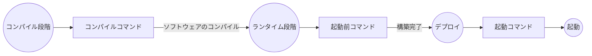

# Rust アプリケーションのデプロイ

Zeabur は原則としてすべての種類の Rust アプリケーションをサポートします。デフォルトでは実行ファイルを自動的に検索します。プロジェクトに複数の実行ファイルがある場合、「Service 名称」欄（または `ZBPACK_RUST_ENTRY` を使用）で実行するファイル名を指定できます。

プロジェクトが手元にない場合は、[zeabur/axum-template](https://github.com/zeabur/axum-template) リポジトリを GitHub アカウントにフォークして、Zeabur でデプロイを試すことができます。

## サポートされているプロジェクトタイプ

- 単一実行ファイルプロジェクト：`src/main.rs` だけがエントリーポイントの Rust プロジェクト。Zeabur は `cargo install` 後に生成された最初の実行ファイルを自動的に検索します。
- 複数実行ファイルプロジェクト：`src/main.rs` の他に `src/bin` にも実行ファイルがある場合は、「Service 名称」欄に最終的に実行する成果物の名称を記入するか、`zbpack.json` で設定を行います
  ```json
  {
    "rust": {
      "entry": "your-entry"
    }
  }
  ```
  環境変数 `ZBPACK_RUST_ENTRY` を使用して同じ効果を得ることもできます。
- Cargo Workspace モノレポ：プロジェクトが複数のクレートで構成されている場合は、「Service 名称」欄に最終的に実行する成果物の名称を記入します。デフォルトでは、ワークスペース下の **すべてのプロジェクト** を `cargo install` します。上記の `ZBPACK_RUST_ENTRY` 方法で実行ファイル名を指定する以外に、`zbpack.json` でこのアプリケーションワークスペースの位置を直接指定することもできます。アプリケーションがリポジトリのルートディレクトリの `rest-api` フォルダにある場合、次のように記入します：
  ```json
  {
    "rust": {
      "app_dir": "rest-api"
    }
  }
  ```
  環境変数 `ZBPACK_RUST_APP_DIR` を使用して同じ効果を得ることもできます。

指定された実行ファイルが存在しない場合は、自動検索モードに切り替わります。「自動検索」では、コンパイルされたすべての実行ファイルを検索し、最初に見つかったファイルを実行します。このモードは複数プロジェクトのシナリオでは間違えやすいため、複雑なプロジェクトシナリオ（複数実行ファイルプロジェクトなど）では、正しい「Service 名称」を記入することをお勧めします。

## 最終成果物の名前を探す

最終成果物はプロジェクトの `target/release` にあります。具体的な探し方：

1. プロジェクトをコンパイルするには Rust ツールチェーンが必要です。[Rust 公式サイト](https://www.rust-lang.org) からダウンロードできます。
2. デプロイするプロジェクトをクローンし、プロジェクトディレクトリに移動します。
3. `cargo build --release` を実行してプロジェクトをコンパイルします。

    ```bash
    $ cargo run --release
    Compiling zeabur v0.1.0 (/project)
      Finished release [optimized] target(s) in 0.65s
      Running `target/release/zeabur`
    ```

4. Running `target/release/zeabur` という行を見つけ、最後の実行ファイル名（zeabur）を抽出します。
5. Service 名称または `ZBPACK_RUST_ENTRY` に `zeabur` を記入します。

## 他のファイルのコピー

実行ファイル以外にもコードベースの他のファイルに依存している場合。例えば：

```plain
*
|`-- public  <-- プログラムはこのフォルダに依存しています
|`-- src
|  `-- main.rs
|`-- Cargo.toml
|`-- Cargo.lock
`--- config.toml   <-- プログラムはこのファイルに依存しています
```

`zbpack.json` に `rust.assets` を記入し、保持したいフォルダやファイルをリストします。フォルダは `/` で終わる必要があります。例：

```json
{
  "rust": {
    "assets": [
      "public/",
      "config.toml"
    ]
  }
}
```

## カスタムコンパイルと起動コマンド

Zeabur は Rust で「コンパイルコマンド」、「起動コマンド」、および「起動前コマンド」を提供しており、Rust プロジェクトの各構築段階で必要な依存関係を挿入したり、必要なファイルを書き込んだりすることができます。



### コンパイルコマンド

`ZBPACK_BUILD_COMMAND` を使用して **コンパイル前に実行するコマンド** を指定できます。例えば：

```
ZBPACK_BUILD_COMMAND=sudo apt install sqlite3
```

また、`zbpack.json` を使用して指定することもできます：

```json
{
  "build_command": "sudo apt install sqlite3"
}
```

### 起動コマンド

`ZBPACK_START_COMMAND` を使用して、Zeabur がデフォルトで指定する起動コマンドを上書きできます。例えば：

```
ZBPACK_START_COMMAND="/app/server --debug"
```

また、`zbpack.json` を使用して指定することもできます：

```json
{
  "start_command": "/app/server --debug"
}
```

### 起動前コマンド

起動前に依存関係をインストールする必要がある場合、`ZBPACK_PRE_START_COMMAND` を使用して起動前に実行するコマンドを指定できます：

```
ZBPACK_PRE_START_COMMAND="sudo apt install sqlite3"
```

また、`zbpack.json` を使用して指定することもできます：

```json
{
  "pre_start_command": "sudo apt install sqlite3"
}
```

`ZBPACK_START_COMMAND` と比べて、これは持続的に実行され、再起動時に再実行されないため、速度が向上します。

### 自動依存関係インストール

プロジェクトが OpenSSL に依存しており、`Cargo.toml` に明示的に依存関係が記載されている場合（または `Cargo.lock` で間接的に依存している場合）、Zeabur は `openssl` ランタイムライブラリを自動的にインストールします。

## 実行環境

Zeabur は現在 [`rust:1-silm`](https://hub.docker.com/_/rust) を実行イメージとして使用しています。実行ファイルは `/app` ディレクトリに配置され、作業ディレクトリは `/`（ルートディレクトリ）です。

`rust.assets` 内のファイルは、実行ファイルと同じディレクトリである `/app` ディレクトリに配置されます。アセットを読み取る必要がある場合、実務上は通常、**実行ファイルのパスに対して相対的なパス** からファイルを読み取ります。以下の例では、`images` アセットの場所を取得します。

```rust
use std::env;
use std::path::Path;

fn main() {
    let exe_path = env::current_exe().expect("Failed to get current executable path");
    let exe_dir = exe_path.parent().expect("Failed to get executable directory");
    let relative_path = exe_dir.join("images");

    println!("config.toml path: {:?}", relative_path);
}
```

注意点として、設定ファイルの場合、**実務上は通常、実行ディレクトリから取得します**。実行ディレクトリがルートディレクトリであることを考慮し、Config Editor を使用して設定ファイルを追加する際には、`/config.toml`（`/app/config.toml` ではなく）を指定し、実行ディレクトリからファイルを読み取ってください。

```rust
use std::env;
use std::fs::File;
use std::io::{self, Read};
use std::path::PathBuf;

fn main() -> io::Result<()> {
    let current_dir = env::current_dir()?;
    let config_path: PathBuf = current_dir.join("config.toml");

    // デシリアライズには serde の使用が推奨されます。ここではデモのため read_to_string を使用します。
    let mut file = File::open(config_path)?;
    let mut contents = String::new();
    file.read_to_string(&mut contents)?;

    println!("Config file contents:\n{}", contents);

    Ok(())
}
```

## サーバーレスデプロイ

他の PaaS プラットフォームが Rust アプリケーションを直接 Docker コンテナ内で実行するのとは異なり、Zeabur は [サーバーレスデプロイ](/deploy/serverless) 方法を使用して Rust アプリケーションをデプロイすることもサポートしています。これにより、Rust アプリケーションはリクエストを受信したときにのみ起動し、コンテナのように常時実行するのではなく、リソースを節約できます。

サーバーレスデプロイを使用して Rust アプリケーションをデプロイするには、環境変数に `ZBPACK_SERVERLESS=1` を追加します。
