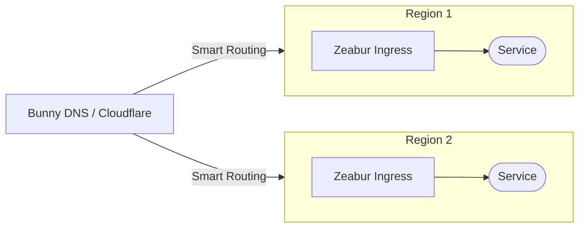
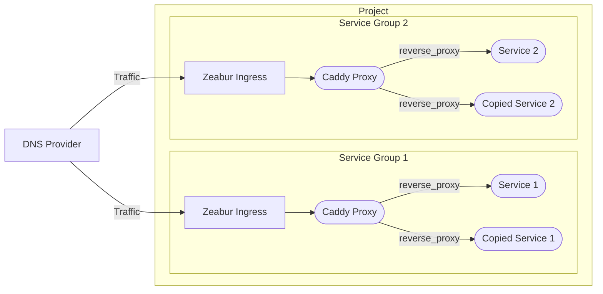
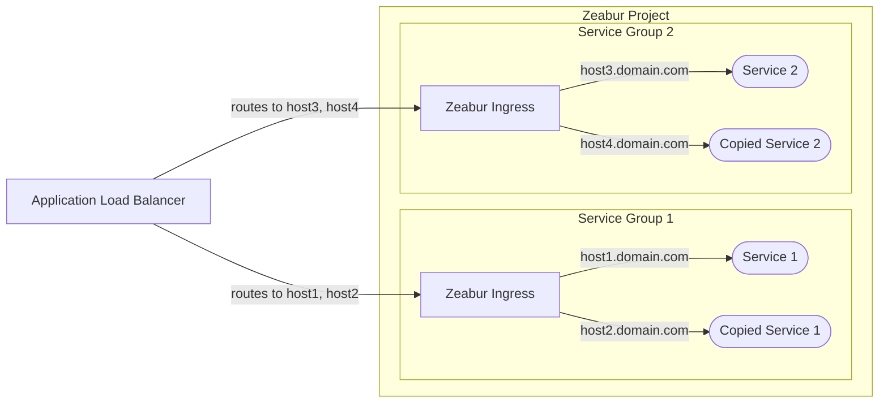

# 高可用性アーキテクチャ

このドキュメントでは、Zeabur にデプロイされたサービスの高可用性を実現するための推奨アーキテクチャについて説明します。

これは上級者向けのトピックです。通常、スタートアップのサービスには高可用性（HA）は必要ありません。最もシンプルな方法として、サービスを1つのプロジェクトに配置し、[プライベートネットワーク](/deploy/private-networking)で通信します。[パブリックネットワーク](/deploy/public-networking)を使用してサービスをインターネットに公開します。垂直スケーリングは自動的に処理されます。共有クラスタでは、ノードがダウンした場合、サービスは自動的に別のノードに移行されます。

## DNS ロードバランサー（推奨）

主な推奨アプローチは、[**DNS ロードバランサー**](https://www.cloudflare.com/learning/performance/what-is-dns-load-balancing/)を使用することです。この方法は一般的にコスト効率が高く、Zeabur のネイティブファイアウォールやレート制限機能に干渉しません。

[Cloudflare](https://developers.cloudflare.com/load-balancing/understand-basics/proxy-modes/) や [Bunny DNS](https://support.bunny.net/hc/en-us/articles/7247569381906-Understanding-Bunny-DNS-Load-Balancing) などのサービスが、堅牢な DNS ロードバランシング機能を提供しています。詳細なセットアップ手順については、各公式ドキュメントを参照してください。

基本的なフローは以下の通りです：

## サービスレプリカの設定

Zeabur は現在、自動水平スケーリングをサポートしていません。冗長インスタンスを作成するには、サービスのコピーを手動で作成する必要があります。サービスレプリカを用意したら、以下の2つの方法のいずれかでトラフィックを分散できます。

### オプション1：内部リバースプロキシ（最も推奨）

最初のオプションは、[Caddy](https://zeabur.com/templates/FFDLWU) や [NGINX](https://zeabur.com/templates/YIUNMF) などの内部リバースプロキシを使用して、サービスレプリカにリクエストを転送することです。

このセットアップでは、サービスコピーの内部ホスト名（例：`service-1-replica-1.zeabur.internal` と `service-1-replica-2.zeabur.internal`）間でトラフィックをバランスするようにリバースプロキシを設定します。

この方法の大きなメリットは、Zeabur の Ingress コントローラーとシームレスに連携できることです。標準の `X-Forwarded-For` ヘッダーを使用して、アプリケーションのロジックを変更せずにクライアントの実際の IP アドレスを取得できます。

### オプション2：外部 L7 プロキシ

2つ目のオプションは、クラウドプロバイダーの[アプリケーションロードバランサー](https://developers.cloudflare.com/load-balancing/understand-basics/proxy-modes/)（ALB）などの外部レイヤー7プロキシを使用することです。

この方法は内部 Caddy サービスを管理する必要がないため一見シンプルに見えますが、いくつかの制限があります：

- **実際の IP ヘッダー**：ALB がクライアントの実際の IP をカスタムヘッダー（例：`X-LoadBalancer-IP`）で渡すように設定し、アプリケーションがこのヘッダーを信頼して読み取るように変更する必要があります。
- **セキュリティリスク**：ALB の IP アドレスからのトラフィックのみを許可するように Zeabur のファイアウォールを設定する必要があります。設定しないと、悪意のあるユーザーが ALB をバイパスして偽造された `X-LoadBalancer-IP` ヘッダーをアプリケーションに直接送信できてしまいます。
- **レート制限**：すべてのリクエストが ALB の IP アドレスから発信されるため、Zeabur のレート制限が予期せずトリガーされ、正当なトラフィックがブロックされる可能性があります。

将来的にこれらの問題を解決するため、外部プロキシ方式のサポートを改善する予定です。現時点では、**内部リバースプロキシ（オプション1）が Zeabur で使用する最も信頼性が高く推奨される方法**です。
