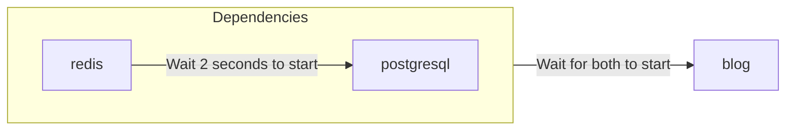

# テンプレート形式

`zeabur` CLI を使用して、[Docker Compose](https://docs.docker.com/compose/) や [Kubernetes Object](https://kubernetes.io/docs/concepts/overview/working-with-objects/) に似た YAML 形式でテンプレートをデプロイ、作成、管理できます。

## YAML（リソース）形式

Zeabur は単一の YAML ファイルでテンプレートリソースを記述します。これを**テンプレートリソース**と呼びます。

```yaml
apiVersion: zeabur.com/v1
kind: Template
metadata:
    name: RSSHub
spec:
    description: Everything is RSSible
    icon: https://docs.rsshub.app/logo.png
    coverImage: https://zeabur.com/docs/_next/image?url=%2Fdocs%2F_next%2Fstatic%2Fmedia%2Fintro.5b73c4f8.png&w=3840&q=75
    variables:
        - key: PUBLIC_DOMAIN
          type: DOMAIN
          name: Domain
          description: What is the domain you want for your RSSHub?
    tags:
        - Tool
    readme: |-
        # RSSHub
        RSSHub is an open source, easy to use, and extensible RSS feed aggregator, it's capable of generating RSS feeds from pretty much everything.

        RSSHub delivers millions of contents aggregated from all kinds of sources, our vibrant open source community is ensuring the deliver of RSSHub's new routes, new features and bug fixes.
    services:
        - name: Redis
          icon: https://raw.githubusercontent.com/zeabur/service-icons/main/marketplace/redis.svg
          template: PREBUILT
          spec:
            source:
                image: redis/redis-stack-server:latest
            ports:
                - id: database
                  port: 6379
                  type: TCP
            volumes:
                - id: data
                  dir: /data
            instructions:
                - type: TEXT
                  title: Command to connect to your Redis
                  content: redis-cli -h ${PORT_FORWARDED_HOSTNAME} -p ${DATABASE_PORT_FORWARDED_PORT} -a ${REDIS_PASSWORD}
                - type: TEXT
                  title: Redis Connection String
                  content: redis://:${REDIS_PASSWORD}@${PORT_FORWARDED_HOSTNAME}:${DATABASE_PORT_FORWARDED_PORT}
                - type: PASSWORD
                  title: Redis password
                  content: ${REDIS_PASSWORD}
                  category: Credentials
                - type: TEXT
                  title: Redis host
                  content: ${PORT_FORWARDED_HOSTNAME}
                  category: Hostname & Port
                - type: TEXT
                  title: Redis port
                  content: ${DATABASE_PORT_FORWARDED_PORT}
                  category: Hostname & Port
            env:
                REDIS_ARGS:
                    default: --requirepass ${REDIS_PASSWORD}
                REDIS_CONNECTION_STRING:
                    default: redis://:${REDIS_PASSWORD}@${REDIS_HOST}:${REDIS_PORT}
                    expose: true
                    readonly: true
                REDIS_HOST:
                    default: ${CONTAINER_HOSTNAME}
                    expose: true
                    readonly: true
                REDIS_PASSWORD:
                    default: ${PASSWORD}
                    expose: true
                REDIS_PORT:
                    default: ${DATABASE_PORT}
                    expose: true
                    readonly: true
                REDIS_URI:
                    default: ${REDIS_CONNECTION_STRING}
                    expose: true
                    readonly: true
        - name: RSSHub
          icon: https://docs.rsshub.app/logo.png
          template: PREBUILT
          domainKey: PUBLIC_DOMAIN
          spec:
            source:
                image: diygod/rsshub
            ports:
                - id: web
                  port: 1200
                  type: HTTP
            env:
                CACHE_TYPE:
                    default: ${REDIS_URI}
                REDIS_URL:
                    default: ${REDIS_URI}

localization:
  zh-TW:
    description: LobeChat は一個開源的高效能聊天機器人框架。
    variables:
      - key: PUBLIC_DOMAIN
        type: DOMAIN
        name: 網域
        description: 你想將 RSSHub 綁在哪個網域上？
    readme: |-
        # RSSHub
        RSSHub 是一個開源、易於使用且可擴展的 RSS 資訊聚合器，能夠從幾乎所有來源生成 RSS 資訊。

        RSSHub 提供來自各種來源的數百萬內容，我們充滿活力的開源社群確保提供 RSSHub 的新路線、新功能和錯誤修復。
```

**テンプレート**は大きく「テンプレート情報」「サービス仕様」「ローカライゼーション」の 3 つのセクションに分けられます。完全な形式は [Zeabur Schema リポジトリ](https://json-schema.app/view/%23?url=https%3A%2F%2Fschema.zeabur.app%2Ftemplate.json)で確認できます。以下では、各フィールドの目的と Zeabur テンプレートページでの表示について簡単に説明します。

### テンプレート定義


`apiVersion` と `kind` は常に `zeabur.com/v1` と `Template` です。

`metadata` の `name` は任意のテンプレート名です。例えば `RSSHub`、`Lobe-Chat`、`ChatGPT API` などです。これは上の画像の `WeWe RSS` ブロックに表示されます。

`spec` の `description` はテンプレートの簡単な説明で、テンプレートタイトルの下に表示されます。`icon` はテンプレートのアイコンで、画像を指す URL であり、テンプレートタイトルの横に表示されます。`tags` はテンプレートのラベルで、参考カテゴリは[テンプレート一覧ページの左側の `Tags` セクション](https://zeabur.com/templates)で確認できます。適切なタグを設定すると、ユーザーがテンプレートを見つけやすくなるだけでなく、SEO の最適化にもつながります。

`readme` はテンプレートのドキュメントで、Markdown 形式で記述し、テンプレートページの下部に表示されます。`coverImage` はドキュメントの上に表示される画像で、こちらも画像を指す URL です。空白のままでも構いません。

`variables` はデプロイ時にユーザーが設定できる変数です。`type` は `STRING`（通常の変数文字列）または `DOMAIN`（Zeabur がドメイン設定をガイド）のいずれかです。`key` はサービスの環境変数に対応し、Zeabur は指定どおりにすべてのサービスに環境変数を自動的に作成します。`name` と `description` は、以下に示すようにテンプレートデプロイ時の変数名と説明に対応します。


### サービス仕様


`services` はテンプレートのサービス仕様です。Zeabur はデプロイ時に指定されたサービスをプロジェクトにデプロイします。サービスの `name` はその名前、`icon` はそのアイコンです。`template` はサービスが Docker イメージ（`PREBUILT`）か Git からデプロイされたサービス（`GIT`）かを宣言します。

`dependencies` はこのサービスが依存するサービスを宣言します。Zeabur は指定されたサービスが起動してからあなたのサービスを起動するため、サービスの繰り返し再起動の手間を避けられます。例えば、あなたのサービス `blog` が `redis` と `postgresql` に依存している場合、以下のように指定できます。なお、`redis` と `postgresql` もテンプレートで定義されているサービスである必要があります。

```yaml
dependencies:
    - redis
    - postgresql
```

起動関係は以下のとおりです：



`domainKey` は、テンプレート定義のドメイン（タイプ `DOMAIN`）変数をどのサービスにバインドするかを示します。上記の例では、`spec.variables` にタイプ `DOMAIN` の変数 `PUBLIC_DOMAIN` があり、RSSHub のサービス仕様には `PUBLIC_DOMAIN` を指す `domainKey` があります。デプロイ時に、`PUBLIC_DOMAIN` で設定されたドメインが RSSHub サービスにバインドされます。

`spec` はサービス仕様です。各フィールドの詳細は[テンプレートサービス仕様ドキュメント](https://json-schema.app/view/%23/%23%2Fproperties%2Fspec/%23%2Fproperties%2Fspec%2Fproperties%2Fservices%2Fitems/%23%2Fproperties%2Fspec%2Fproperties%2Fservices%2Fitems%2Fproperties%2Fspec?url=https%3A%2F%2Fschema.zeabur.app%2Ftemplate.json)で確認できます。以下では、サービス仕様の重要なポイントを簡単に説明します。

`PREBUILT` サービスの場合、Docker イメージ（`image`）を指定する必要があり、任意で実行コマンドとパラメータ（`command` と `args`）を指定できます。イメージがプライベートレジストリに保存されている場合は、プルするための `username` と `password` を指定できます。さらに、コンテナを非 root モードで実行するためのユーザー ID（`runAsUserID`）を指定できます。`GIT` サービスの場合は、Git リポジトリのタイプ（現在は `GITHUB` のみ）、リポジトリ ID（現在は GitHub の [`repoID`](https://stackoverflow.com/a/47223479) のみ）、および任意でブランチ（`branch`）を指定する必要があります。

`ports` はプロジェクトや外部に公開するサービスのポートを指定します。HTTP サービスはドメイン名（例：`https://my-service.zeabur.app`）を使用して接続でき、TCP および UDP サービスは Zeabur の転送リンク `xxx.clusters.zeabur.com:12345` を使用できます。例えば、`type` が `HTTP` で `port` が `12345` の場合、他のユーザーは `https://my-service.zeabur.app` を通じて `12345` ポートでリッスンしているあなたのサービスに接続できます。

`volumes` はサービスの永続ストレージパスを指定します。原則として、Zeabur は再デプロイまたは再起動のたびにサービスの状態を初期状態（ステートレス）に復元しますが、データを永続化する必要がある場合は `volumes` で永続ストレージパスを指定できます。例えば、`dir` が `/data` の場合、サービスが削除されるまで `/data` パス配下のデータを永続化できます。

`instructions` は他のユーザーにサービスの使用方法を伝えます。例えば `Redis Connection String` の例では、クライアントを使用して Redis に接続する方法を提供しています。`type` は `DOMAIN`（クリックすると指定された URL に遷移するボタン）、`TEXT`（テキスト）、`PASSWORD`（パスワード、デフォルトで非表示）のいずれかで、`category` はカスタマイズ可能な分類ですが、現在フロントエンドには表示されません。

`env` はサービスの環境変数です。`default` は環境変数のデフォルト値、`expose` は他のプロジェクトがこの変数を直接使用したり `${VARIABLE}` 構文で参照したりできるかどうかを示し、`readonly` は読み取り専用（サービス作成後に変更不可）かどうかを示します。例えば、`REDIS_CONNECTION_STRING` の `expose` が `true` の場合、他のサービスは `REDIS_CONNECTION_STRING` 環境変数を通じて Redis に接続でき、他の環境変数で `${REDIS_CONNECTION_STRING}` を使用してこの接続文字列を参照することもできます。

`configs` はサービスのファイルベースの設定です。`path` と `template` を使用してデフォルトの設定ファイルを指定でき、ユーザーが簡単に変更できるようになります。`envsubst` を使用すると、テンプレート内の変数参照を対応する値に置換できます。例えば、`envsubst` が有効で変数 `MONGO_URI=mongodb://mongo.zeabur.internal:27017` が設定されている場合：

```yaml {6}
configs:
    - path: /config.yaml
      template: |
        mongo:
            uri: ${MONGO_URI}
      envsubst: true
```

サービスインスタンスの `/config.yml` ファイルには以下の内容が設定されます：

```yaml filename="/config.yaml"
mongo:
    uri: mongodb://mongo.zeabur.internal:27017
```

設定ファイルの `permission` を指定することもできます。`permission` は 8 進数の [UNIX ファイルパーミッション](https://mason.gmu.edu/~montecin/UNIXpermiss.htm)から変換した 10 進数である必要があります。一般的なパーミッションの対応表は以下のとおりです：

| `permission` の値 | 8 進数の値 | 読み取り | 書き込み | 実行 | 用途 |
| ------------------ | --------------- | ---- | ----- | ------- | ------------ |
| 256                | 0400            | O    | X     | X       | 機密ファイル（例：パスワード） |
| 420                | 0644            | O    | O     | X       | 通常の読み書き可能なファイル。デフォルトのパーミッション |
| 493                | 0755            | O    | O     | O       | 実行可能ファイル（例：bash スクリプト） |

ここでの「読み取り」「書き込み」「実行」はコンテナユーザーのパーミッションを指します。詳細（グループ、全ユーザーなど）については、上記の URL を参照してください。

`gpu` はサービスに必要な GPU リソースを指定します。現在、これらのリソースは有効または無効にすることのみ可能です。GPU リソースを使用するには、`gpu.enabled` を `true` に設定します：

```yaml
gpu:
    enabled: true
```

### ローカライゼーション

テンプレート定義の `description`、`coverImage`、`variables` のタイトルと説明、および `readme` をローカライズできます。Zeabur は訪問者の言語に基づいて対応するローカライズされたコンテンツを表示します。


コンテンツは `zh-TW`、`zh-CN`、`ja-JP`、`es-ES` にローカライズできます。`en-US` はテンプレートのデフォルト言語であり、テンプレート定義に直接記述する必要があります。`description`、`readme`、`coverImage` の形式はテンプレート定義と同じです。`variables` の `name` と `description` フィールドを翻訳できますが、その他の部分（`type` と `key`）はテンプレート定義のフィールドと同じでなければなりません。

フィールドを空白のままにする（または省略する）と、テンプレート定義のデフォルトコンテンツが自動的に使用されます。上記の例では、`coverImage` が省略されているため、Zeabur はテンプレート定義の `coverImage` を使用します。

## 次のステップ

- CLI を使用してテンプレートを**テスト・デプロイ**する — CLI の使い方については[テンプレートのメンテナンスと更新](/ja-JP/template/maintain-template)をご覧ください。
- テンプレートをマーケットプレイスに**公開**して、他のユーザーに利用してもらいましょう。
