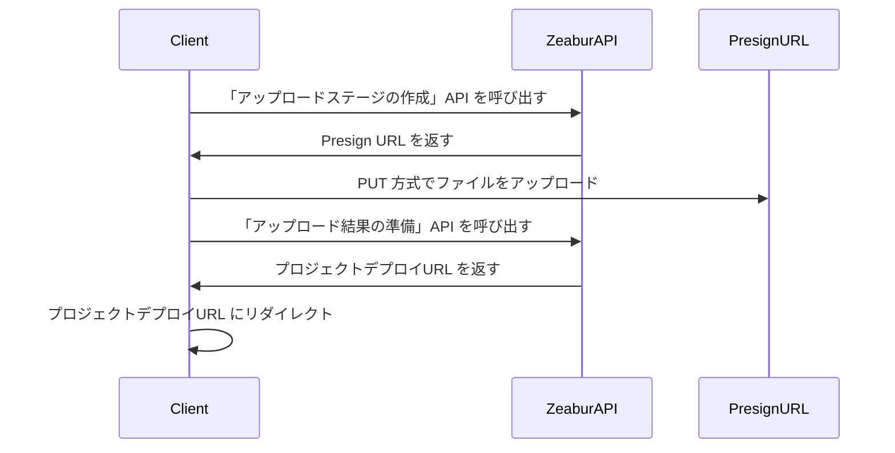

import { Callout } from 'nextra/components';

# オープン API

Zeabur の API は主に GraphQL で構築されており、Zeabur Dashboard、Zeabur CLI などの一連の Zeabur 製品の基盤となっています。私たちはオープン API を提供しており、コードを通じて Zeabur を制御することができます。
また、Zeabur は [Schema Repository](https://schema.zeabur.app/) に GraphQL API 以外の JSON schema と OpenAPI specification の一部を配置しています。

## 認証

Zeabur API を使用するには、`Authorization` に [API キー](./use-api-key) を含める必要があります。API キーの生成方法については、[こちらのドキュメント](./use-api-key) をお読みください。

入力例は以下の通りです：

```bash
curl --request POST \
  --url https://api.zeabur.com/graphql \
  --header 'Authorization: Bearer {YOUR_API_TOKEN}' \
  --header 'Content-Type: application/json' \
  --data '{"query":"query { me { username } }"}'
```

## GraphQL API

[Apollo Explorer](https://studio.apollographql.com/public/zeabur/variant/main/explorer) にアクセスして、利用可能なすべての Zeabur API GraphQL メソッドを確認し、テストしたり、cURL コマンドにコピーしたりすることができます。

IDE で GraphQL を記述することを好む場合や、型のヒントが必要な場合は、Explorer の「Schema」→「SDL」に移動して、Zeabur API の完全な Schema をダウンロードすることができます。

必要な API がこの Schema に含まれていない場合は、[Discord](https://zeabur.com/dc) で私たちにお知らせください。

## ローカルプロジェクトのアップロード API

ローカルプロジェクト API の説明については、[Upload API ドキュメント](https://schema.zeabur.app/upload-api/index.html) を参照してください。

フローは以下の通りです：



## テンプレートデプロイ API

[テンプレート仕様 YAML ファイル](https://schema.zeabur.app/template.json) がある場合、以下の GraphQL mutation を使用して指定したプロジェクトにデプロイできます：

```graphql
mutation DeployTemplate($rawSpecYaml: String, $projectId: ObjectID) {
  deployTemplate(rawSpecYaml: $rawSpecYaml, projectID: $projectId) {
    _id  # String!
  }
}
```

この API は大量デプロイに適しています。

## コンテナ操作 API

ここでの API を使用すると、Zeabur の指定されたサービスにファイルをアップロードしたり、ダウンロードしたり、指定されたサービスにコマンドを送信したりできます。

### ファイルのアップロード

<Callout>
現在、アップロードには 100MB のファイルサイズ制限があります。
</Callout>

```http
POST https://api.zeabur.com/projects/project-id/services/service-id/files
Content-Type: multipart/form-data
Authorization: Bearer <YOUR_API_TOKEN>
```

- Payload（フォーム内容）
    - file (Blob)：ファイル内容
    - path (string)：ファイルパス
    - environment (string)：environment ID のこと、Dashboard の URL の `envID` から取得可能
- Response
    - 200 OK
    - 500 Internal Server Error、例： `{"code": "INTERNAL_SERVER_ERROR", "error": "failed to upload file"}` 


### ファイルのダウンロード

```http
GET https://api.zeabur.com/projects/project-id/services/service-id/files?path=[PATH]&environment=[ENVIRONMENT]
Authorization: Bearer <YOUR_API_TOKEN>
```

- Query
    - path (string)：ファイルパス
    - environment (string)：environment ID のこと、Dashboard の URL の `envID` から取得可能
- Response
    - 200 OK, `application/octet-stream` 
    - 500 Internal Server Error、例： `{"code": "INTERNAL_SERVER_ERROR", "error": "failed to download file"}` 

### ファイルの一覧表示

「単一コマンドの実行」API を使用して実行してください：

```shell
$ ls -A -a -F -1 /
```

### ファイルの削除

「単一コマンドの実行」API を使用して実行してください：

```shell
$ rm -r FILENAME
```

### 単一コマンドの実行

GraphQL API を使用して実行：

```graphql
mutation ExecuteCommand($serviceId: ObjectID!, $environmentId: ObjectID!, $command: [String!]!) {
  executeCommand(serviceID: $serviceId, environmentID: $environmentId, command: $command) {
    exitCode  # Int!
    output    # String!
  }
}
```

### WebSocket を使用したサービスターミナルの取得

- WebSocket endpoint: `wss://api.zeabur.com/exec/<service-id>` 
- WebSocket に書き込まれた内容が実際の入力となります
- Resize Control Controls：`[RESIZE_CONTROL, COLS_LSB, COLS_MSB, ROWS_LSB, ROWS_MSB]` 
  ```
  const buffer = new Uint8Array([
    RESIZE_CONTROL,
    dims.cols & 0xFF,
    dims.cols >> 8,
    dims.rows & 0xFF,
    dims.rows >> 8
  ]);
  ```

### ビルド時ログの取得

GraphQL API を使用して実行：

```graphql
query BuildLogs($projectId: ObjectID!, $deploymentId: ObjectID!, $timestampCursor: Time) {
  buildLogs(projectID: $projectId, deploymentID: $deploymentId, timestampCursor: $timestampCursor) {
    message    # String!
    timestamp  # Time!
  }
}
```

### ランタイムログの取得

GraphQL API を使用して実行：

```graphql
query RuntimeLogs($projectId: ObjectID!, $serviceId: ObjectID!, $environmentId: ObjectID!, $timestampCursor: Time) {
  runtimeLogs(projectID: $projectId, serviceID: $serviceId, environmentID: $environmentId, timestampCursor: $timestampCursor) {
    message    # String!
    timestamp  # Time!
  }
}
```

### ビルド時ログのサブスクリプション

GraphQL API を使用して実行：

```graphql
subscription BuildLogReceived($projectId: ObjectID!, $deploymentId: ObjectID!) {
  buildLogReceived(projectID: $projectId, deploymentID: $deploymentId) {
    message    # String!
    timestamp  # Time!
  }
}
```

### ランタイムログのサブスクリプション

GraphQL API を使用して実行：

```graphql
subscription RuntimeLogReceived($projectId: ObjectID!, $serviceId: ObjectID!, $environmentId: ObjectID!) {
  runtimeLogReceived(projectID: $projectId, serviceID: $serviceId, environmentID: $environmentId) {
    message    # String!
    timestamp  # Time!
  }
}
```