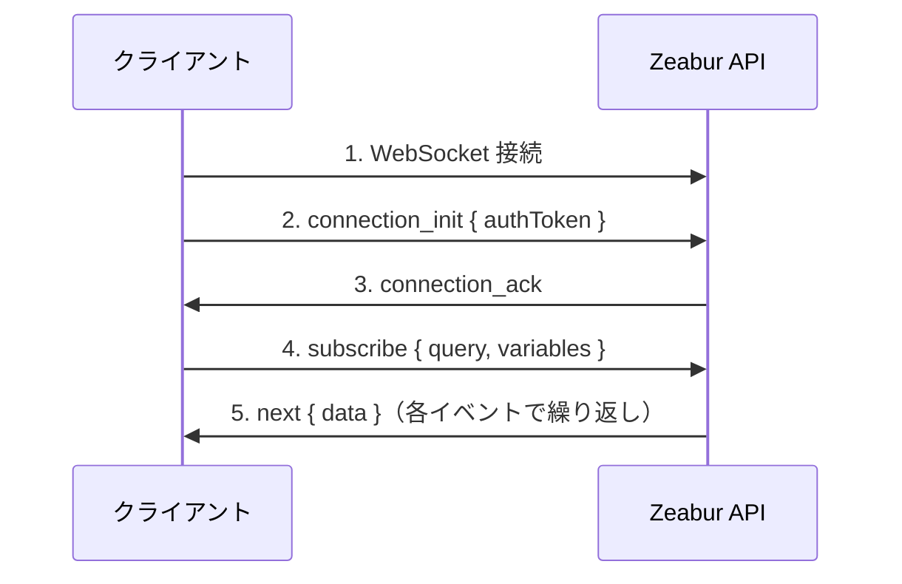

import { Callout } from 'nextra/components';

# WebSocket 接続ガイド

このガイドでは、リアルタイムサブスクリプション（ログ、プロジェクトアクティビティなど）のために Zeabur GraphQL API への認証済み WebSocket 接続を確立する方法について説明します。

## 概要

Zeabur は WebSocket 経由の GraphQL サブスクリプションに [graphql-ws](https://github.com/enisdenjo/graphql-ws) プロトコルを使用しています。接続には `connection_init` ペイロードでトークンを渡して認証する必要があります。

## 接続エンドポイント

| 環境 | WebSocket URL |
|------|---------------|
| グローバル | `wss://api.zeabur.com/graphql` |
| 中国 | `wss://api.zeabur.cn/graphql` |

## 認証

WebSocket 接続は、接続初期化フェーズ中に `connectionParams` で `authToken` を渡すことで認証されます。

### トークンの取得方法

認証トークンは2つの方法で取得できます：

1. **Cookie から取得** - Zeabur ダッシュボードを使用する場合、トークンは `token` という名前の cookie に保存されます：

```javascript
// cookie からトークンを抽出
const token = document.cookie
  .split('; ')
  .find(row => row.startsWith('token='))
  ?.split('=')[1];
```

2. **API キーを使用** - プログラムからのアクセスには、[API キー](./use-api-key) を認証トークンとして使用できます。

## 接続フロー



## 実装方法

### Apollo Client を使用（推奨）

これは React アプリケーションに推奨されるアプローチです：

```typescript
import { GraphQLWsLink } from '@apollo/client/link/subscriptions';
import { createClient } from 'graphql-ws';

const wsLink = new GraphQLWsLink(createClient({ 
  url: 'wss://api.zeabur.com/graphql',
  connectionParams: () => {
    // cookie から認証トークンを取得
    const token = document.cookie
      .split('; ')
      .find(row => row.startsWith('token='))
      ?.split('=')[1];
    
    return {
      authToken: token,
    };
  },
}));
```

### graphql-ws クライアントを直接使用

Apollo 以外の実装の場合：

```typescript
import { createClient } from 'graphql-ws';

const client = createClient({
  url: 'wss://api.zeabur.com/graphql',
  connectionParams: {
    authToken: 'YOUR_API_TOKEN',
  },
});

// ランタイムログをサブスクライブ
const unsubscribe = client.subscribe(
  {
    query: `
      subscription SubscribeRuntimeLog(
        $projectID: ObjectID!
        $serviceID: ObjectID!
        $environmentID: ObjectID!
      ) {
        runtimeLogReceived(
          projectID: $projectID
          serviceID: $serviceID
          environmentID: $environmentID
        ) {
          timestamp
          message
        }
      }
    `,
    variables: {
      projectID: 'your-project-id',
      serviceID: 'your-service-id',
      environmentID: 'your-environment-id',
    },
  },
  {
    next: (data) => console.log('受信:', data),
    error: (err) => console.error('エラー:', err),
    complete: () => console.log('完了'),
  }
);
```

### ネイティブ WebSocket API を使用

テストや低レベル実装の場合：

```javascript
const API_URL = 'wss://api.zeabur.com/graphql';

// 1. graphql-ws サブプロトコルで WebSocket 接続を作成
const ws = new WebSocket(API_URL, 'graphql-transport-ws');

ws.onopen = () => {
  // 2. 認証トークン付きの connection_init を送信
  ws.send(JSON.stringify({
    type: 'connection_init',
    payload: {
      authToken: 'YOUR_AUTH_TOKEN'
    }
  }));
};

ws.onmessage = (event) => {
  const message = JSON.parse(event.data);
  
  switch (message.type) {
    case 'connection_ack':
      // 3. 接続が認証されました、サブスクライブを開始
      ws.send(JSON.stringify({
        id: '1',
        type: 'subscribe',
        payload: {
          query: `
            subscription SubscribeRuntimeLog(
              $projectID: ObjectID!
              $serviceID: ObjectID!
              $environmentID: ObjectID!
            ) {
              runtimeLogReceived(
                projectID: $projectID
                serviceID: $serviceID
                environmentID: $environmentID
              ) {
                timestamp
                message
              }
            }
          `,
          variables: {
            projectID: 'your-project-id',
            serviceID: 'your-service-id',
            environmentID: 'your-environment-id'
          }
        }
      }));
      break;
      
    case 'next':
      // 4. サブスクリプションデータを受信
      console.log('データ:', message.payload.data);
      break;
      
    case 'error':
      console.error('サブスクリプションエラー:', message.payload);
      break;
      
    case 'complete':
      console.log('サブスクリプション完了');
      break;
  }
};

ws.onerror = (error) => console.error('WebSocket エラー:', error);
ws.onclose = (event) => console.log('WebSocket クローズ:', event.code);
```

## メッセージタイプ（graphql-ws プロトコル）

### クライアント → サーバー

| タイプ | 説明 |
|--------|------|
| `connection_init` | 認証ペイロードで接続を初期化 |
| `subscribe` | サブスクリプションを開始 |
| `complete` | サブスクリプションを停止 |
| `ping` | キープアライブ ping |

### サーバー → クライアント

| タイプ | 説明 |
|--------|------|
| `connection_ack` | 接続が受け入れられた |
| `next` | サブスクリプションデータ |
| `error` | サブスクリプションエラー |
| `complete` | サブスクリプション終了 |
| `pong` | キープアライブ応答 |

## 利用可能なサブスクリプション

### ランタイムログ

サービスのリアルタイムランタイムログをサブスクライブ：

```graphql
subscription SubscribeRuntimeLog(
  $projectID: ObjectID!
  $serviceID: ObjectID!
  $environmentID: ObjectID!
) {
  runtimeLogReceived(
    projectID: $projectID
    serviceID: $serviceID
    environmentID: $environmentID
  ) {
    timestamp
    message
  }
}
```

### ランタイムログ（デプロイメントフィルター付き）

特定のデプロイメントのログをフィルタリング：

```graphql
subscription SubscribeRuntimeLogWithDeployment(
  $projectID: ObjectID!
  $serviceID: ObjectID!
  $environmentID: ObjectID!
  $deploymentID: ObjectID
) {
  runtimeLogReceived(
    projectID: $projectID
    serviceID: $serviceID
    environmentID: $environmentID
    deploymentID: $deploymentID
  ) {
    timestamp
    message
  }
}
```

### ビルドログ

デプロイメントのビルドログをサブスクライブ：

```graphql
subscription SubscribeBuildLog(
  $projectID: ObjectID!
  $deploymentID: ObjectID!
) {
  buildLogReceived(
    projectID: $projectID
    deploymentID: $deploymentID
  ) {
    timestamp
    message
  }
}
```

### プロジェクトアクティビティ

プロジェクト全体のイベント（ビルド、デプロイメント、サービスステータスの変更）をサブスクライブ：

```graphql
subscription SubscribeProjectActivity($projectID: ObjectID!) {
  projectActivityReceived(projectID: $projectID) {
    type
    payload
  }
}
```

## エラーハンドリング

### 認証エラー

トークンが欠落しているか無効な場合、サーバーは `connection_init` フェーズで接続を拒否します：

```json
{
  "type": "error",
  "payload": {
    "message": "Please establish websocket connection with a valid token"
  }
}
```

### 権限エラー

認証されているがリソースへのアクセス権がない場合：

```json
{
  "type": "next",
  "id": "1",
  "payload": {
    "errors": [{
      "message": "Permission denied",
      "path": ["runtimeLogReceived"],
      "extensions": {
        "code": "FORBIDDEN"
      }
    }],
    "data": null
  }
}
```

**一般的な原因：**

- プロジェクト/サービス/環境 ID が正しくない
- ユーザーがプロジェクトにアクセスできない
- ID が一致しない（例：サービスがプロジェクトに属していない）

## 接続テスト

### ブラウザ開発者ツール

1. ネットワークタブを開く
2. "WS" でフィルタリング
3. サブスクリプションのあるページに移動（例：デプロイメントログ）
4. WebSocket 接続をクリックしてフレームを検査

### スタンドアロンテストページ

この HTML ファイルを保存し、Zeabur にログインしたブラウザで開きます：

```html
<!DOCTYPE html>
<html>
<head>
  <title>Zeabur WebSocket テスト</title>
  <style>
    body { font-family: system-ui; padding: 20px; }
    input { margin: 5px; padding: 8px; }
    button { padding: 8px 16px; cursor: pointer; }
    pre { background: #f5f5f5; padding: 15px; overflow: auto; max-height: 400px; }
  </style>
</head>
<body>
  <h1>Zeabur WebSocket 接続テスト</h1>
  <div>
    <input id="projectId" placeholder="プロジェクト ID" />
    <input id="serviceId" placeholder="サービス ID" />
    <input id="envId" placeholder="環境 ID" />
    <button onclick="connect()">接続</button>
  </div>
  <pre id="logs"></pre>
  
  <script>
    function log(msg) {
      const el = document.getElementById('logs');
      el.textContent += new Date().toISOString() + ' | ' + msg + '\n';
      el.scrollTop = el.scrollHeight;
    }
    
    function connect() {
      const token = document.cookie.split('; ')
        .find(r => r.startsWith('token='))?.split('=')[1];
      
      if (!token) {
        log('エラー：cookie にトークンが見つかりません。Zeabur にログインしていることを確認してください。');
        return;
      }
      
      log('トークンが見つかりました、接続中...');
      const ws = new WebSocket('wss://api.zeabur.com/graphql', 'graphql-transport-ws');
      
      ws.onopen = () => {
        log('接続しました、認証を送信中...');
        ws.send(JSON.stringify({
          type: 'connection_init',
          payload: { authToken: token }
        }));
      };
      
      ws.onmessage = (e) => {
        const msg = JSON.parse(e.data);
        log('受信: ' + JSON.stringify(msg, null, 2));
        
        if (msg.type === 'connection_ack') {
          log('認証成功！サブスクリプションを開始中...');
          ws.send(JSON.stringify({
            id: '1',
            type: 'subscribe',
            payload: {
              query: `subscription($p:ObjectID!,$s:ObjectID!,$e:ObjectID!){
                runtimeLogReceived(projectID:$p,serviceID:$s,environmentID:$e){
                  timestamp message
                }
              }`,
              variables: {
                p: document.getElementById('projectId').value,
                s: document.getElementById('serviceId').value,
                e: document.getElementById('envId').value
              }
            }
          }));
        }
      };
      
      ws.onerror = (e) => log('WebSocket エラー: ' + JSON.stringify(e));
      ws.onclose = (e) => log('接続クローズ: code=' + e.code + ', reason=' + e.reason);
    }
  </script>
</body>
</html>
```

## セキュリティに関する考慮事項

<Callout type="warning">
`document.cookie` 経由でアクセスされる認証トークンは、非 HttpOnly cookie に保存されます。これは WebSocket が自動的に HttpOnly cookie を送信できないための必要なトレードオフです。
</Callout>

### 緩和策

1. **コンテンツセキュリティポリシー（CSP）** - トークンを盗む可能性のある XSS 攻撃を防止
2. **短いトークン有効期限** - トークンが侵害された場合の被害を制限
3. **SameSite cookie 属性** - CSRF 攻撃を防止
4. **サーバーサイドでは API キーを使用** - バックエンドアプリケーションでは、セッショントークンの代わりに [API キー](./use-api-key) を使用

## トラブルシューティング

| 問題 | 解決策 |
|------|--------|
| `connection_ack` を受信しない | トークンが有効で期限切れでないことを確認 |
| サブスクリプションで `Permission denied` | ID が正しく、ユーザーがアクセス権を持っていることを確認 |
| 接続がすぐに閉じる | WebSocket URL を確認し、サブプロトコルが `graphql-transport-ws` であることを確認 |
| データを受信しない | サービスが実行中でログを生成していることを確認 |
| `WebSocket connection failed` | ネットワーク接続とファイアウォール設定を確認 |

## 関連リソース

- [オープン API](./public-api) - すべての Zeabur API の概要
- [API キーの作成と使用](./use-api-key) - API トークンの生成方法
- [graphql-ws プロトコル](https://github.com/enisdenjo/graphql-ws/blob/master/PROTOCOL.md) - 公式プロトコル仕様
- [Apollo Explorer](https://studio.apollographql.com/public/zeabur/variant/main/explorer) - 利用可能な GraphQL 操作を探索

