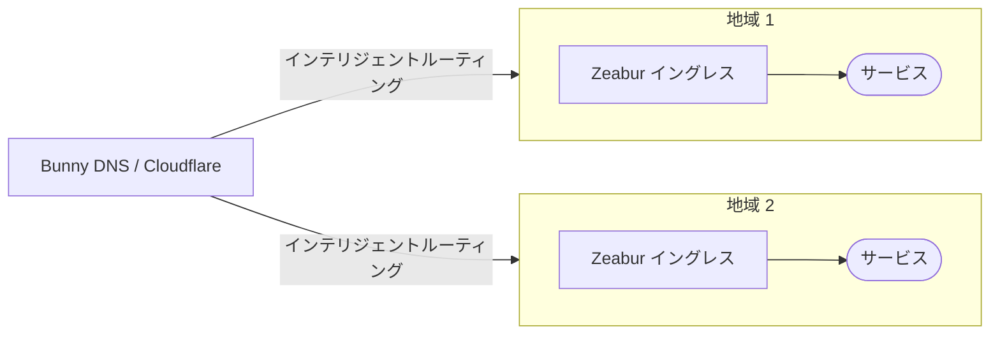
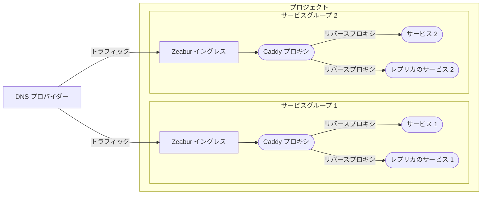
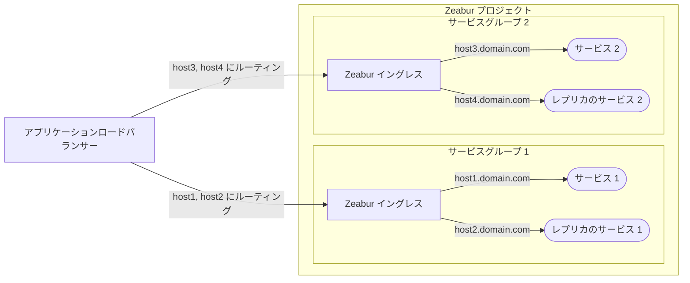

# 高可用性アーキテクチャ

このドキュメントでは、Zeaburでサービスを高可用性でデプロイするための推奨アーキテクチャの概要を説明します。

このトピックはやや高度であることに注意してください。新しいサービスの場合、通常、高可用性（HA）は必要ありません。最も簡単な解決策は、サービスを1つのプロジェクトに配置し、[プライベートネットワーク](/networking/private)を使用して通信することです。[パブリックネットワーク](/networking/public)を使用してインターネットにサービスを公開します。Zeaburは垂直スケーリングを処理でき、共有クラスターでは、ノードに障害が発生した場合でも、サービスを別のノードに自動的に移行できます。

## DNSロードバランサー（推奨）

Zeaburが主に推奨する方法は、[**DNSロードバランサー**](https://www.cloudflare.com/learning/performance/what-is-dns-load-balancing/)を使用することです。これは通常、より費用対効果が高く、Zeaburのネイティブなファイアウォールおよびレート制限機能に干渉しません。

[Cloudflare](https://developers.cloudflare.com/load-balancing/understand-basics/proxy-modes/)や[Bunny DNS](https://support.bunny.net/hc/en-us/articles/7247569381906-Understanding-Bunny-DNS-Load-Balancing)などのサービスは、堅牢なDNSロードバランシング機能を提供します。詳細な設定手順については、各サービスの公式ドキュメントを参照してください。

基本的なプロセスは次のとおりです。

## サービスレプリカの設定

Zeaburは現在、自動的な水平スケーリングをサポートしていません。冗長なインスタンスを作成するには、サービスレプリカを手動で作成する必要があります。サービスレプリカを作成したら、以下の2つの方法のいずれかを使用して、それらの間でトラフィックを分散できます。

### オプション1：内部リバースプロキシ（最も推奨）

最初のオプションは、[Caddy](https://zeabur.com/templates/FFDLWU)や[NGINX](https://zeabur.com/templates/YIUNMF)などの内部リバースプロキシを使用して、サービスレプリカにリクエストを転送することです。

ここでは、サービスのレプリカ（例: `service-1-replica-1.zeabur.internal` と `service-1-replica-2.zeabur.internal`）間の内部ホスト名をロードバランスするようにリバースプロキシを設定する必要があります。

この方法の最大の利点は、Zeaburのイングレスコントローラーとシームレスに連携することです。アプリケーションロジックを変更することなく、標準の `X-Forwarded-For` ヘッダーを使用してクライアントの実際のIPアドレスを取得できます。

### オプション2：外部L7プロキシ

2番目のオプションは、クラウドサービスプロバイダーの[アプリケーションロードバランサー](https://developers.cloudflare.com/load-balancing/understand-basics/proxy-modes/)（ALB）などの外部L7プロキシサーバーを使用することです。

この方法は、内部のCaddyサービスを管理する必要がないため、よりシンプルに見えるかもしれませんが、いくつかの制限があります。

- **実際のIPヘッダー**: クライアントの実際のIPをカスタムヘッダー（例: `X-LoadBalancer-IP`）で渡すようにALBを設定し、このカスタムヘッダーから読み取るようにアプリケーションを変更する必要があります。
- **セキュリティリスク**: Zeaburのファイアウォールを設定して、ALBのIPアドレスからのトラフィックのみを許可する必要があります。これを怠ると、悪意のあるアクターがALBを迂回し、偽造された `X-LoadBalancer-IP` ヘッダーをアプリケーションに直接送信する可能性があります。
- **レート制限**: すべてのリクエストがALBのIPアドレスから発信されるため、Zeaburのレート制限が意図せずトリガーされ、正当なトラフィックがブロックされる可能性があります。

Zeaburは将来、これらの問題に対処するために、外部プロキシ方法へのより良いサポートを提供する予定です。現時点では、**内部リバースプロキシ（オプション1）がZeaburで最も信頼性が高く推奨される方法です**。
