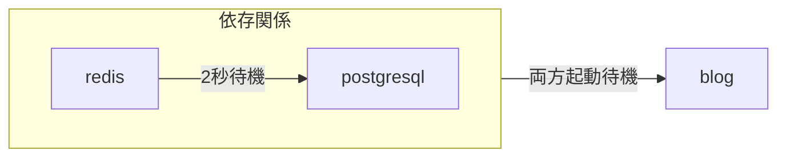

# YAMLからテンプレートを作成

`zeabur` CLIを使用して、[Docker Compose](https://docs.docker.com/compose/)や[Kubernetes Object](https://kubernetes.io/docs/concepts/overview/working-with-objects/)に似た形式のYAMLからテンプレートをデプロイ・作成・管理できます。

## YAML（リソース）形式

Zeaburは単一のYAMLファイル（**Template Resource**）でテンプレート全体を定義します。

```yaml
apiVersion: zeabur.com/v1
kind: Template
metadata:
    name: RSSHub
spec:
    description: Everything is RSSible
    icon: https://docs.rsshub.app/logo.png
    coverImage: https://zeabur.com/docs/_next/image?url=%2Fdocs%2F_next%2Fstatic%2Fmedia%2Fintro.5b73c4f8.png&w=3840&q=75
    variables:
        - key: PUBLIC_DOMAIN
          type: DOMAIN
          name: ドメイン
          description: RSSHubに使用したいドメインは何ですか？
    tags:
        - Tool
    readme: |-
        # RSSHub
        RSSHubはオープンソースで使いやすく拡張可能なRSSフィードアグリゲーターで、ほぼすべてのソースからRSSフィードを生成できます。

        RSSHubはさまざまなソースから集約された数百万のコンテンツを提供し、活発なオープンソースコミュニティが新しいルート・機能・バグ修正を確実に届けます。
    services:
        - name: Redis
          icon: https://raw.githubusercontent.com/zeabur/service-icons/main/marketplace/redis.svg
          template: PREBUILT
          spec:
            source:
                image: redis/redis-stack-server:latest
            ports:
                - id: database
                  port: 6379
                  type: TCP
            volumes:
                - id: data
                  dir: /data
            instructions:
                - type: TEXT
                  title: Redisへの接続コマンド
                  content: redis-cli -h ${PORT_FORWARDED_HOSTNAME} -p ${DATABASE_PORT_FORWARDED_PORT} -a ${REDIS_PASSWORD}
                - type: TEXT
                  title: Redis接続文字列
                  content: redis://:${REDIS_PASSWORD}@${PORT_FORWARDED_HOSTNAME}:${DATABASE_PORT_FORWARDED_PORT}
                - type: PASSWORD
                  title: Redisパスワード
                  content: ${REDIS_PASSWORD}
                  category: 認証情報
                - type: TEXT
                  title: Redisホスト
                  content: ${PORT_FORWARDED_HOSTNAME}
                  category: ホスト名とポート
                - type: TEXT
                  title: Redisポート
                  content: ${DATABASE_PORT_FORWARDED_PORT}
                  category: ホスト名とポート
            env:
                REDIS_ARGS:
                    default: --requirepass ${REDIS_PASSWORD}
                REDIS_CONNECTION_STRING:
                    default: redis://:${REDIS_PASSWORD}@${REDIS_HOST}:${REDIS_PORT}
                    expose: true
                    readonly: true
                REDIS_HOST:
                    default: ${CONTAINER_HOSTNAME}
                    expose: true
                    readonly: true
                REDIS_PASSWORD:
                    default: ${PASSWORD}
                    expose: true
                REDIS_PORT:
                    default: ${DATABASE_PORT}
                    expose: true
                    readonly: true
                REDIS_URI:
                    default: ${REDIS_CONNECTION_STRING}
                    expose: true
                    readonly: true
        - name: RSSHub
          icon: https://docs.rsshub.app/logo.png
          template: PREBUILT
          domainKey: PUBLIC_DOMAIN
          spec:
            source:
                image: diygod/rsshub
            ports:
                - id: web
                  port: 1200
                  type: HTTP
            env:
                CACHE_TYPE:
                    default: ${REDIS_URI}
                REDIS_URL:
                    default: ${REDIS_URI}

localization:
  zh-TW:
    description: LobeChat 是一個開源的高效能聊天機器人框架。
    variables:
      - key: PUBLIC_DOMAIN
        type: DOMAIN
        name: 網域
        description: 你想將 RSSHub 綁在哪個網域上？
    readme: |-
        # RSSHub
        RSSHub 是一個開源、易於使用且可擴展的 RSS 資訊聚合器，能夠從幾乎所有來源生成 RSS 資訊。

        RSSHub 提供來自各種來源的數百萬內容，我們充滿活力的開源社群確保提供 RSSHub 的新路線、新功能和錯誤修復。
```

**Template**は主に3つのセクションに分かれます：「テンプレート情報」「サービス仕様」「ローカライズ」。完全なスキーマは[Zeabur Schema Repository](https://json-schema.app/view/%23?url=https%3A%2F%2Fschema.zeabur.app%2Ftemplate.json)で確認できます。

### テンプレート定義


`apiVersion` と `kind` は常に `zeabur.com/v1` と `Template`。

`metadata.name`：任意のテンプレート名（例：`RSSHub`、`Lobe-Chat`）。

`spec.description`：タイトル下に表示される簡単な説明。  
`spec.icon`：テンプレートアイコン（画像URL）。  
`spec.tags`：分類タグ（https://zeabur.com/templates の左側「Tags」参照）。適切なタグで検索性・SEO向上。  
`spec.readme`：Markdown形式のドキュメント（ページ下部）。  
`spec.coverImage`：ドキュメント上部のバナー画像（任意）。  
`spec.variables`：デプロイ時にユーザーが設定可能な変数。  
  - `type`: `STRING` または `DOMAIN`  
  - `key`: サービス内の環境変数キー  
  - `name` / `description`: デプロイフォームに表示


### サービス仕様


`services`：プロジェクトに作成されるサービス一覧。

- `name` / `icon`：サービス名とアイコン  
- `template`：`PREBUILT`（Dockerイメージ）または `GIT`（GitHub）  
- `dependencies`：依存サービス（Zeaburが順番に起動を待つ）

```yaml
dependencies:
    - redis
    - postgresql
```



`domainKey`：`DOMAIN`型変数をどのサービスにバインドするか。

`spec`：サービス詳細仕様。詳細は[Template Service Specificationsドキュメント](https://json-schema.app/view/%23/%23%2Fproperties%2Fspec/%23%2Fproperties%2Fspec%2Fproperties%2Fservices%2Fitems/%23%2Fproperties%2Fspec%2Fproperties%2Fservices%2Fitems%2Fproperties%2Fspec?url=https%3A%2F%2Fschema.zeabur.app%2Ftemplate.json)を参照。

主なポイント：
- `PREBUILT`：`image`必須、`command`/`args`任意、私有レジストリなら`username`/`password`、`runAsUserID`（non-root）。
- `GIT`：`GITHUB`、`repoID`、ブランチ任意。
- `ports`：公開ポート（`HTTP`→ドメイン、`TCP`/`UDP`→Zeabur転送URL）。
- `volumes`：永続ストレージパス。
- `instructions`：ユーザー向けガイド（`TEXT`、`PASSWORD`、`DOMAIN`）。
- `env`：環境変数（`default`、`expose`、`readonly`）。
- `configs`：ファイル設定（`path`、`template`、`envsubst`、`permission`は10進数）。
- `gpu`：`enabled: true`でGPUリクエスト。

### ローカライズ

`description`、`coverImage`、`variables`の名前/説明、`readme`をローカライズ可能。訪問者の言語に応じて表示。


対応言語：`zh-TW`、`zh-CN`、`ja-JP`、`es-ES`。`en-US`はデフォルト（直接specに記述）。省略フィールドはデフォルト値を使用。

## `zeabur` CLIでテンプレートをデプロイ

```bash
$ cat wp.yaml | head -n 10
apiVersion: zeabur.com/v1
kind: Template
metadata:
    name: WordPress
spec:
    description: A content management system (CMS) that allows you to host and build websites.
    coverImage: https://kinsta.com/wp-content/uploads/2018/02/what-is-wordpress.png
    icon: https://raw.githubusercontent.com/zeabur/service-icons/main/marketplace/wordpress.png
    variables:
        - key: WORDPRESS_DOMAIN

$ npx zeabur@latest template deploy -f wp.yaml
```

CLIがプロジェクト選択・地域選択・変数入力を促します。

## テンプレートの公開

```bash
$ npx zeabur@latest template create -f wp.yaml
INFO	Template "WordPress" (https://zeabur.com/templates/71HORL) created
```

生YAML確認：`https://zeabur.com/templates/71HORL.yaml`

## テンプレートの更新

```bash
$ npx zeabur@latest template update -c 71HORL -f wp.yaml
INFO	Template updated.
```

## テンプレートの削除

```bash
$ npx zeabur@latest template delete
? Enter template code: 71HORL
INFO	Template deleted successfully.
```

テンプレートはプラットフォームから完全に削除されます。
