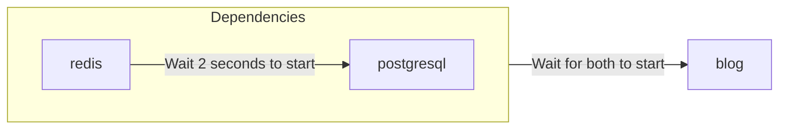

# 模板格式

你可以使用 `zeabur` CLI 来部署、创建和管理模板，其格式类似于 [Docker Compose](https://docs.docker.com/compose/) 或 [Kubernetes Object](https://kubernetes.io/docs/concepts/overview/working-with-objects/)，使用 YAML 编写。

## YAML（资源）格式

Zeabur 使用单个 YAML 文件来描述模板资源，称为 **Template Resource**。

```yaml
apiVersion: zeabur.com/v1
kind: Template
metadata:
    name: RSSHub
spec:
    description: Everything is RSSible
    icon: https://docs.rsshub.app/logo.png
    coverImage: https://zeabur.com/docs/_next/image?url=%2Fdocs%2F_next%2Fstatic%2Fmedia%2Fintro.5b73c4f8.png&w=3840&q=75
    variables:
        - key: PUBLIC_DOMAIN
          type: DOMAIN
          name: Domain
          description: What is the domain you want for your RSSHub?
    tags:
        - Tool
    readme: |-
        # RSSHub
        RSSHub is an open source, easy to use, and extensible RSS feed aggregator, it's capable of generating RSS feeds from pretty much everything.

        RSSHub delivers millions of contents aggregated from all kinds of sources, our vibrant open source community is ensuring the deliver of RSSHub's new routes, new features and bug fixes.
    services:
        - name: Redis
          icon: https://raw.githubusercontent.com/zeabur/service-icons/main/marketplace/redis.svg
          template: PREBUILT
          spec:
            source:
                image: redis/redis-stack-server:latest
            ports:
                - id: database
                  port: 6379
                  type: TCP
            volumes:
                - id: data
                  dir: /data
            instructions:
                - type: TEXT
                  title: Command to connect to your Redis
                  content: redis-cli -h ${PORT_FORWARDED_HOSTNAME} -p ${DATABASE_PORT_FORWARDED_PORT} -a ${REDIS_PASSWORD}
                - type: TEXT
                  title: Redis Connection String
                  content: redis://:${REDIS_PASSWORD}@${PORT_FORWARDED_HOSTNAME}:${DATABASE_PORT_FORWARDED_PORT}
                - type: PASSWORD
                  title: Redis password
                  content: ${REDIS_PASSWORD}
                  category: Credentials
                - type: TEXT
                  title: Redis host
                  content: ${PORT_FORWARDED_HOSTNAME}
                  category: Hostname & Port
                - type: TEXT
                  title: Redis port
                  content: ${DATABASE_PORT_FORWARDED_PORT}
                  category: Hostname & Port
            env:
                REDIS_ARGS:
                    default: --requirepass ${REDIS_PASSWORD}
                REDIS_CONNECTION_STRING:
                    default: redis://:${REDIS_PASSWORD}@${REDIS_HOST}:${REDIS_PORT}
                    expose: true
                    readonly: true
                REDIS_HOST:
                    default: ${CONTAINER_HOSTNAME}
                    expose: true
                    readonly: true
                REDIS_PASSWORD:
                    default: ${PASSWORD}
                    expose: true
                REDIS_PORT:
                    default: ${DATABASE_PORT}
                    expose: true
                    readonly: true
                REDIS_URI:
                    default: ${REDIS_CONNECTION_STRING}
                    expose: true
                    readonly: true
        - name: RSSHub
          icon: https://docs.rsshub.app/logo.png
          template: PREBUILT
          domainKey: PUBLIC_DOMAIN
          spec:
            source:
                image: diygod/rsshub
            ports:
                - id: web
                  port: 1200
                  type: HTTP
            env:
                CACHE_TYPE:
                    default: ${REDIS_URI}
                REDIS_URL:
                    default: ${REDIS_URI}

localization:
  zh-TW:
    description: LobeChat 是一個開源的高效能聊天機器人框架。
    variables:
      - key: PUBLIC_DOMAIN
        type: DOMAIN
        name: 網域
        description: 你想將 RSSHub 綁在哪個網域上？
    readme: |-
        # RSSHub
        RSSHub 是一個開源、易於使用且可擴展的 RSS 資訊聚合器，能夠從幾乎所有來源生成 RSS 資訊。

        RSSHub 提供來自各種來源的數百萬內容，我們充滿活力的開源社群確保提供 RSSHub 的新路線、新功能和錯誤修復。
```

一个 **Template** 可以分为三个主要部分：「模板信息」、「服务规格」和「本地化」。完整格式可以在 [Zeabur Schema 仓库](https://json-schema.app/view/%23?url=https%3A%2F%2Fschema.zeabur.app%2Ftemplate.json) 中查看。以下将简要介绍各字段的用途以及它们在 Zeabur 模板页面上的呈现方式。

### 模板定义


`apiVersion` 和 `kind` 始终为 `zeabur.com/v1` 和 `Template`。

在 `metadata` 中，`name` 是任意的模板名称，例如 `RSSHub`、`Lobe-Chat` 和 `ChatGPT API`。它会显示在上图中的 `WeWe RSS` 区块位置。

在 `spec` 中，`description` 是模板的简要描述，显示在模板标题下方。`icon` 是模板的图标，是一个指向图片的 URL，显示在模板标题旁边。`tags` 是模板的标签，参考分类可在 [模板浏览页面左侧的 `Tags` 区域](https://zeabur.com/templates) 查看。正确的标签不仅能帮助用户轻松找到模板，还能优化 SEO。

`readme` 是模板的文档，使用 Markdown 格式编写，显示在模板页面底部。`coverImage` 显示在文档上方，同样是指向图片的 URL；可以留空。

`variables` 是用户在部署时可以设置的变量。`type` 可以是 `STRING`（普通变量字符串）或 `DOMAIN`（Zeabur 引导域名设置）；`key` 对应服务的变量，Zeabur 会按照指定在所有服务中自动创建变量。`name` 和 `description` 对应模板部署时的变量名称和描述，如下图所示。


### 服务规格


`services` 是模板的服务规格。Zeabur 会在部署时将指定的服务部署到项目中。服务的 `name` 是其名称，`icon` 是其图标。`template` 声明该服务是 Docker 镜像（`PREBUILT`）还是从 Git 部署的服务（`GIT`）。

`dependencies` 声明此服务所依赖的服务。Zeabur 可以等待指定的服务启动后再启动你的服务，避免反复重启服务的麻烦。例如，如果你的服务 `blog` 依赖 `redis` 和 `postgresql`，可以按如下方式指定。注意 `redis` 和 `postgresql` 也必须是模板中定义的服务。

```yaml
dependencies:
    - redis
    - postgresql
```

启动关系如下：



`domainKey` 指示模板定义中的域名（类型为 `DOMAIN`）变量应绑定到哪个服务。在上面的示例中，`spec.variables` 中有一个类型为 `DOMAIN` 的变量 `PUBLIC_DOMAIN`，而 RSSHub 服务规格中的 `domainKey` 指向 `PUBLIC_DOMAIN`。部署时，`PUBLIC_DOMAIN` 中设置的域名将绑定到 RSSHub 服务。

`spec` 是服务规格。各字段的详细信息可以在 [模板服务规格文档](https://json-schema.app/view/%23/%23%2Fproperties%2Fspec/%23%2Fproperties%2Fspec%2Fproperties%2Fservices%2Fitems/%23%2Fproperties%2Fspec%2Fproperties%2Fservices%2Fitems%2Fproperties%2Fspec?url=https%3A%2F%2Fschema.zeabur.app%2Ftemplate.json) 中找到。以下是服务规格中关键要点的简要说明：

对于 `PREBUILT` 服务，你需要指定 Docker 镜像（`image`），以及可选的执行命令和参数（`command` 和 `args`）。如果你的镜像存储在私有仓库中，你可能需要指定 `username` 和 `password` 来拉取。此外，你还可以指定用户 ID（`runAsUserID`）来以非 root 模式运行容器。对于 `GIT` 服务，你需要指定 Git 仓库类型（目前仅支持 `GITHUB`）、仓库 ID（目前仅支持 GitHub 的 [`repoID`](https://stackoverflow.com/a/47223479)），以及可选的分支（`branch`）。

`ports` 指定要暴露给项目甚至外部的服务端口。HTTP 服务可以使用域名连接（例如 `https://my-service.zeabur.app`），而 TCP 和 UDP 服务可以使用 Zeabur 的转发链接 `xxx.clusters.zeabur.com:12345`。例如，如果 `type` 是 `HTTP` 且 `port` 是 `12345`，其他人可以通过 `https://my-service.zeabur.app` 连接到你监听在 `12345` 端口的服务。

`volumes` 指定服务的持久存储空间路径。原则上，Zeabur 在每次重新部署或重启后会将服务状态恢复到初始状态（无状态），但如果你需要持久化某些数据，可以使用 `volumes` 指定持久存储空间路径。例如，如果 `dir` 是 `/data`，意味着你的服务可以在 `/data` 路径下持久化数据，直到服务被删除。

`instructions` 告诉其他用户如何使用你的服务，例如示例中的 `Redis Connection String`，提供了其他人如何使用客户端连接 Redis 的方法。`type` 可以是 `DOMAIN`（点击后跳转到指定 URL 的按钮）、`TEXT`（文本）、`PASSWORD`（密码，默认隐藏），`category` 是可自定义的分类，目前前端不显示。

`env` 是服务的变量。`default` 是变量的默认值，`expose` 表示其他项目是否可以直接使用该变量或使用 `${VARIABLE}` 语法引用该变量，`readonly` 表示是否为只读（服务创建后不可修改）。例如，如果 `REDIS_CONNECTION_STRING` 的 `expose` 为 `true`，其他服务可以通过 `REDIS_CONNECTION_STRING` 变量连接到 Redis，也可以在其他变量中使用 `${REDIS_CONNECTION_STRING}` 引用此连接字符串。

`configs` 是服务的基于文件的配置。你可以使用 `path` 和 `template` 来指定默认配置文件，方便用户修改。使用 `envsubst` 将模板中的变量引用替换为对应的值。例如，当启用 `envsubst` 且设置了变量 `MONGO_URI=mongodb://mongo.zeabur.internal:27017` 时：

```yaml {6}
configs:
    - path: /config.yaml
      template: |
        mongo:
            uri: ${MONGO_URI}
      envsubst: true
```

服务实例中的 `/config.yml` 文件将填充以下内容：

```yaml filename="/config.yaml"
mongo:
    uri: mongodb://mongo.zeabur.internal:27017
```

你还可以指定配置文件的 `permission`。注意 `permission` 必须是十进制数字，由八进制的 [UNIX 文件权限](https://mason.gmu.edu/~montecin/UNIXpermiss.htm) 转换而来。以下是一些常见的权限映射：

| `permission` 值 | 原始八进制值 | 读取 | 写入 | 执行 | 适用于 |
| ---------------- | ------------ | ---- | ---- | ---- | ------ |
| 256              | 0400         | O    | X    | X    | 机密文件（如密码） |
| 420              | 0644         | O    | O    | X    | 普通可读写文件。默认权限 |
| 493              | 0755         | O    | O    | O    | 可执行文件（如 bash 脚本） |

这里的「读取」、「写入」和「执行」指的是容器用户的权限。有关详细信息（群组、所有人等），请参阅上方链接。

`gpu` 指定服务所需的 GPU 资源。目前只能启用或禁用这些资源。要使用 GPU 资源，请将 `gpu.enabled` 设置为 `true`：

```yaml
gpu:
    enabled: true
```

### 本地化

你可以对模板定义中的 `description`、`coverImage`、`variables` 的标题和描述以及 `readme` 进行本地化。Zeabur 会根据访问者的语言显示相应的本地化内容。


你可以将内容本地化为 `zh-TW`、`zh-CN`、`ja-JP` 和 `es-ES`。注意 `en-US` 是模板的默认语言，你应该直接在模板定义中编写。`description`、`readme` 和 `coverImage` 的格式与模板定义中的相同。你可以翻译 `variables` 中的 `name` 和 `description` 字段；但其他部分（`type` 和 `key`）必须与模板定义中的字段保持一致。

留空字段（或省略它们）将自动使用模板定义中的默认内容。在上面的示例中，`coverImage` 被省略了，因此 Zeabur 会使用模板定义中的 `coverImage`。

## 后续步骤

- 使用 CLI **测试和部署**你的模板——参阅 [维护与更新模板](/zh-CN/template/maintain-template) 了解 CLI 用法。
- 将你的模板**发布**到市场，供其他人使用。
