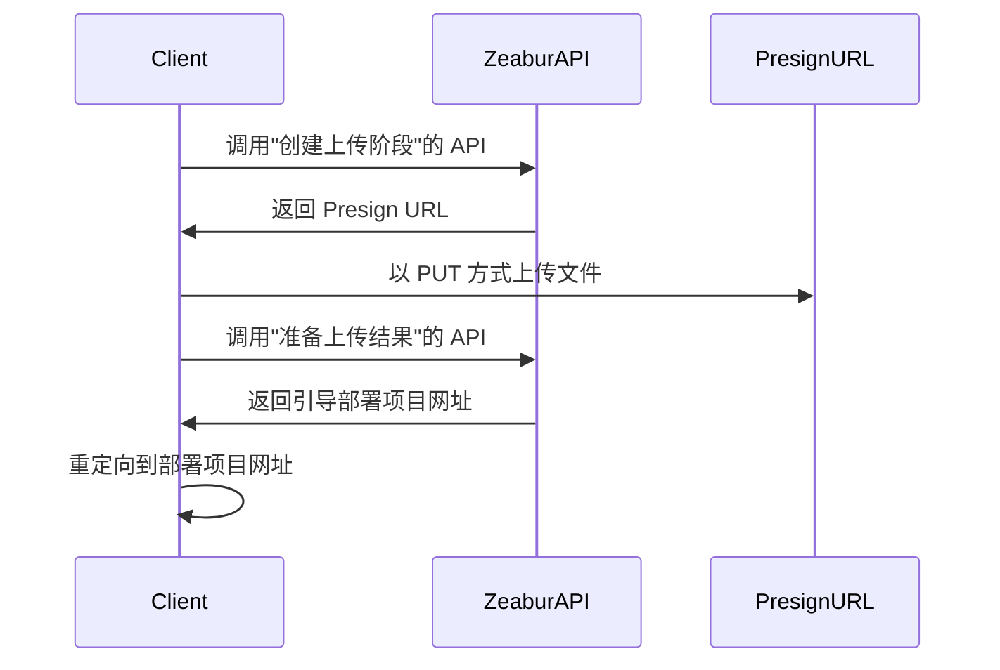

import { Callout } from 'nextra/components';

# 开放 API

Zeabur 的 API 主要使用 GraphQL 构建，同时作为 Zeabur Dashboard、Zeabur CLI 等一系列 Zeabur 产品的基础。我们提供开放 API，让您能够通过代码来控制 Zeabur。
另外，Zeabur 在 [Schema Repository](https://schema.zeabur.app/) 中放置了一部分非 GraphQL API 的 JSON schema 和 OpenAPI specification。

## 认证

您需要在 `Authorization` 中传入 [API 密钥](./use-api-key)，才能使用您的身份使用 Zeabur API。生成 API 密钥的说明，请阅读 [这篇文档](./use-api-key)。

传入示例如下：

```bash
curl --request POST \
  --url https://api.zeabur.com/graphql \
  --header 'Authorization: Bearer {YOUR_API_TOKEN}' \
  --header 'Content-Type: application/json' \
  --data '{"query":"query { me { username } }"}'
```

## GraphQL API

您可以访问我们的 [Apollo Explorer](https://studio.apollographql.com/public/zeabur/variant/main/explorer) 查看所有可以使用的 Zeabur API GraphQL 方法、进行测试并且复制成 cURL 命令。

如果您习惯在 IDE 上编写 GraphQL，或者需要获取类型提示，可以到 Explorer 中的"Schema"→"SDL"来下载 Zeabur API 的完整 Schema。

若您发现您需要的 API 不在这个 Schema 中，请到我们的 [Discord](https://zeabur.com/dc) 和我们告知。

## 本地项目上传 API

本地项目 API 的说明请参考 [Upload API 文档](https://schema.zeabur.app/upload-api/index.html)。

流程如下：



## 模板部署 API

如果您有一个 [模板规格 YAML 文件](https://schema.zeabur.app/template.json)，可以使用这个 GraphQL mutation 来部署到指定项目中：

```graphql
mutation DeployTemplate($rawSpecYaml: String, $projectId: ObjectID) {
  deployTemplate(rawSpecYaml: $rawSpecYaml, projectID: $projectId) {
    _id  # String!
  }
}
```

这个 API 适合用来批量部署。

## 容器操作 API

这里的 API 可以让您将文件上传到或下载自 Zeabur 的指定服务，也可以向 Zeabur 的指定服务发送命令。

### 上传文件

<Callout>
目前上传有 100MB 的文件大小限制。
</Callout>

```http
POST https://api.zeabur.com/projects/project-id/services/service-id/files
Content-Type: multipart/form-data
Authorization: Bearer <YOUR_API_TOKEN>
```

- Payload（表单内容）
    - file (Blob)：文件内容
    - path (string)：文件路径
    - environment (string)：即 environment ID，能从 Dashboard 网址中的 `envID` 获取
- Response
    - 200 OK
    - 500 Internal Server Error，如 `{"code": "INTERNAL_SERVER_ERROR", "error": "failed to upload file"}` 


### 下载文件

```http
GET https://api.zeabur.com/projects/project-id/services/service-id/files?path=[PATH]&environment=[ENVIRONMENT]
Authorization: Bearer <YOUR_API_TOKEN>
```

- Query
    - path (string)：文件路径
    - environment (string)：即 environment ID，能从 Dashboard 网址中的 `envID` 获取
- Response
    - 200 OK, `application/octet-stream` 
    - 500 Internal Server Error，如 `{"code": "INTERNAL_SERVER_ERROR", "error": "failed to download file"}` 

### 列举文件

请使用"执行单个命令"的 API 执行：

```shell
$ ls -A -a -F -1 /
```

### 删除文件

请使用"执行单个命令"的 API 执行：

```shell
$ rm -r FILENAME
```

### 执行单个命令

使用 GraphQL API 执行：

```graphql
mutation ExecuteCommand($serviceId: ObjectID!, $environmentId: ObjectID!, $command: [String!]!) {
  executeCommand(serviceID: $serviceId, environmentID: $environmentId, command: $command) {
    exitCode  # Int!
    output    # String!
  }
}
```

### 使用 WebSocket 获取服务终端

- WebSocket endpoint: `wss://api.zeabur.com/exec/<service-id>` 
- 往 WebSocket 写入内容即实际输入
- Resize Control Controls：`[RESIZE_CONTROL, COLS_LSB, COLS_MSB, ROWS_LSB, ROWS_MSB]` 
  ```
  const buffer = new Uint8Array([
    RESIZE_CONTROL,
    dims.cols & 0xFF,
    dims.cols >> 8,
    dims.rows & 0xFF,
    dims.rows >> 8
  ]);
  ```

### 获取编译期日志

使用 GraphQL API 执行：

```graphql
query BuildLogs($projectId: ObjectID!, $deploymentId: ObjectID!, $timestampCursor: Time) {
  buildLogs(projectID: $projectId, deploymentID: $deploymentId, timestampCursor: $timestampCursor) {
    message    # String!
    timestamp  # Time!
  }
}
```

### 获取运行期日志

使用 GraphQL API 执行：

```graphql
query RuntimeLogs($projectId: ObjectID!, $serviceId: ObjectID!, $environmentId: ObjectID!, $timestampCursor: Time) {
  runtimeLogs(projectID: $projectId, serviceID: $serviceId, environmentID: $environmentId, timestampCursor: $timestampCursor) {
    message    # String!
    timestamp  # Time!
  }
}
```

### 订阅编译期日志

使用 GraphQL API 执行：

```graphql
subscription BuildLogReceived($projectId: ObjectID!, $deploymentId: ObjectID!) {
  buildLogReceived(projectID: $projectId, deploymentID: $deploymentId) {
    message    # String!
    timestamp  # Time!
  }
}
```

### 订阅运行期日志

使用 GraphQL API 执行：

```graphql
subscription RuntimeLogReceived($projectId: ObjectID!, $serviceId: ObjectID!, $environmentId: ObjectID!) {
  runtimeLogReceived(projectID: $projectId, serviceID: $serviceId, environmentID: $environmentId) {
    message    # String!
    timestamp  # Time!
  }
}
```