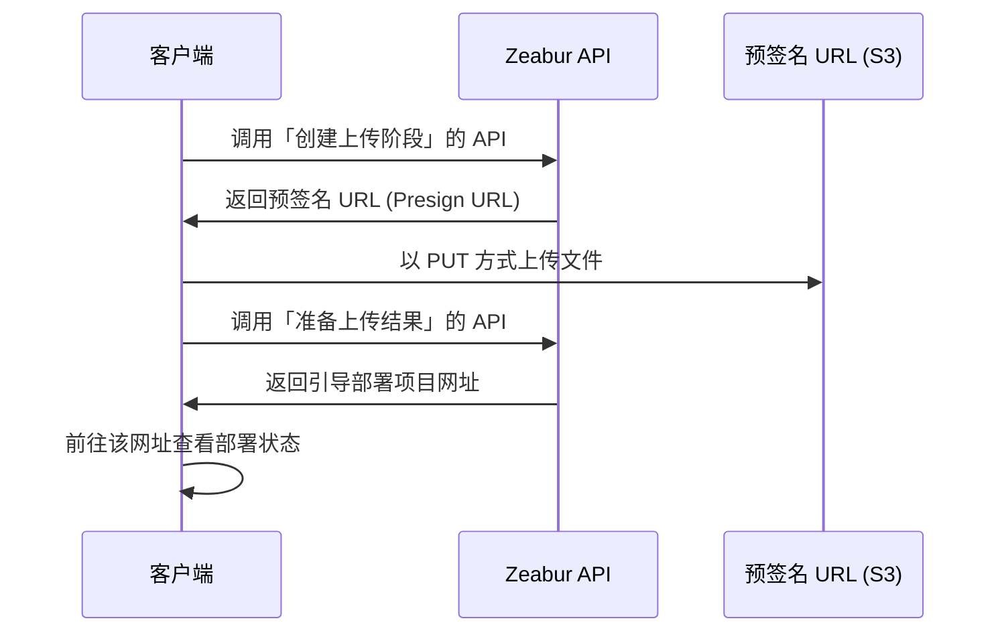

import { Callout } from 'nextra/components';

# 开放 API

Zeabur 的 API 主要使用 GraphQL 构建，同时作为 Zeabur Dashboard、Zeabur CLI 等一系列 Zeabur 产品的基础。我们提供开放 API，让您能够通过代码来控制 Zeabur。
另外，Zeabur 在 [Schema Repository](https://schema.zeabur.app/) 中放置了一部分非 GraphQL API 的 JSON schema 和 OpenAPI specification。

## 认证

您需要在 `Authorization` 中传入 [API 密钥](./use-api-key)，才能使用您的身份使用 Zeabur API。生成 API 密钥的说明，请阅读 [这篇文档](./use-api-key)。

传入示例如下：

```bash
curl --request POST \
  --url https://api.zeabur.com/graphql \
  --header 'Authorization: Bearer {YOUR_API_TOKEN}' \
  --header 'Content-Type: application/json' \
  --data '{"query":"query { me { username } }"}'
```

## GraphQL API

您可以访问我们的 [Apollo Explorer](https://studio.apollographql.com/public/zeabur/variant/main/explorer) 查看所有可以使用的 Zeabur API GraphQL 方法、进行测试并且复制成 cURL 命令。

如果您习惯在 IDE 上编写 GraphQL，或者需要获取类型提示，可以到 Explorer 中的"Schema"→"SDL"来下载 Zeabur API 的完整 Schema。

若您发现您需要的 API 不在这个 Schema 中，请到我们的 [Discord](https://zeabur.com/dc) 和我们告知。

## 本地项目上传 API

虽然从 Git Repository 部署是主流方式，但有时您会需要直接部署一个预先打包好的应用程序。常见的情境包括：

- 您的 CI/CD 流程会产出一个构建好的制品 (artifact)，例如一个 .zip 文件。
- 您想手动上传一个项目，但不想将其与 Git Repository 关联。

Zeabur Upload API 因此提供了一个 API，让您可以直接上传 ZIP，而 Zeabur 会自动将 ZIP 解压缩并且部署到您的项目中。

### 核心概念：使用预签名 URL (Pre-signed URL) 实现安全上传

Zeabur Upload API 会签发给您一个预签名 URL (Pre-signed URL)，这个 URL 是一个临时性、安全的链接，它授予您一次性的权限，让您可以将文件直接上传到 Zeabur 的代码暂存空间。

整个工作流程可以用以下序列图来表示：



### 上传流程

在开始上传之前，您需要获取关于文件的两项信息：

- `content_length`：文件的大小，单位为字节 (bytes)。
- `content_hash`：文件内容的 SHA256 哈希值，并进行 Base64 编码。

接着就可以创建上传阶段了。首先，您需要告知 Zeabur 您准备要上传一个文件。

```http
POST /v2/upload
Content-Type: application/json

{
  "content_hash": "您计算出的 BASE64 编码 SHA256 哈希值",
  "content_hash_algorithm": "sha256",
  "content_length": 12345678
}
```

如果成功 (201 Created)，Zeabur 会返回预签名 URL 的详细信息，以及一个用于追踪此上传阶段的 `upload_id`。

```json
{
    "presign_header": { "Content-Type": "application/zip" },
    "presign_method": "PUT",
    "presign_url": "https://zeabur-uploads.s3.ap-east-1.amazonaws.com/...",
    "upload_id": "一个唯一的 UPLOAD_ID"
}
```

接着，使用上一步获取的信息来上传您的文件。请注意，这个请求是发送到 `presign_url`，而不是 Zeabur API。

- Method: PUT (或上一步 presign_method 返回的方法)
- URL: 上一步响应中的 presign_url。
- Headers: 您必须包含 presign_header 中返回的标头 (例如 Content-Type: application/zip)。
- Body: 您 zip 文件的原始二进制数据。

当这个请求获得 200 OK 的响应时，代表您的文件已经安全地存储完毕。最后，您需要告诉 Zeabur 文件已经就绪，以及要如何处理它。使用稍早获取的 `upload_id` 调用 `POST /v2/upload/{upload_id}/prepare` 端点。

```http
POST /v2/upload/{upload_id}/prepare
Content-Type: application/json
Authorization: Bearer {YOUR_API_TOKEN}
```

根据您的目标，Request Body 有两种选择。如果您要上传到一个现有的项目中，您需要提供 `service_id` 和 `environment_id`。这个 type 会返回一个指向进行中部署的 `url`，您可以将用户重新导向到这个 URL，让用户可以查看部署状态。

```json
{
  "upload_type": "existing_service",
  "service_id": "您现有服务的 ID",
  "environment_id": "您服务环境的 ID"
}
```

如果您想要引导用户创建项目，则只需要传入 `new_project` 的 `upload_type` 即可。这个 type 会返回一个可以引导用户创建项目的 `url`，您可以将用户重新导向到这个 URL，让用户可以创建项目。

```json
{
  "upload_type": "new_project"
}
```

### 文档和 schema

完整的文档和 OpenAPI schema 可以参考 [Upload API 文档](https://schema.zeabur.app/upload-api/index.html)。

## 模板部署 API

如果您有一个 [模板规格 YAML 文件](https://schema.zeabur.app/template.json)，可以使用这个 GraphQL mutation 来部署到指定项目中：

```graphql
mutation DeployTemplate($rawSpecYaml: String, $projectId: ObjectID) {
  deployTemplate(rawSpecYaml: $rawSpecYaml, projectID: $projectId) {
    _id  # String!
  }
}
```

这个 API 适合用来批量部署。

## 容器操作 API

这里的 API 可以让您将文件上传到或下载自 Zeabur 的指定服务，也可以向 Zeabur 的指定服务发送命令。

### 上传文件

<Callout>
目前上传有 100MB 的文件大小限制。
</Callout>

```http
POST https://api.zeabur.com/projects/project-id/services/service-id/files
Content-Type: multipart/form-data
Authorization: Bearer <YOUR_API_TOKEN>
```

- Payload（表单内容）
    - file (Blob)：文件内容
    - path (string)：文件路径
    - environment (string)：即 environment ID，能从 Dashboard 网址中的 `envID` 获取
- Response
    - 200 OK
    - 500 Internal Server Error，如 `{"code": "INTERNAL_SERVER_ERROR", "error": "failed to upload file"}` 


### 下载文件

```http
GET https://api.zeabur.com/projects/project-id/services/service-id/files?path=[PATH]&environment=[ENVIRONMENT]
Authorization: Bearer <YOUR_API_TOKEN>
```

- Query
    - path (string)：文件路径
    - environment (string)：即 environment ID，能从 Dashboard 网址中的 `envID` 获取
- Response
    - 200 OK, `application/octet-stream` 
    - 500 Internal Server Error，如 `{"code": "INTERNAL_SERVER_ERROR", "error": "failed to download file"}` 

### 列举文件

请使用"执行单个命令"的 API 执行：

```shell
$ ls -A -a -F -1 /
```

### 删除文件

请使用"执行单个命令"的 API 执行：

```shell
$ rm -r FILENAME
```

### 执行单个命令

使用 GraphQL API 执行：

```graphql
mutation ExecuteCommand($serviceId: ObjectID!, $environmentId: ObjectID!, $command: [String!]!) {
  executeCommand(serviceID: $serviceId, environmentID: $environmentId, command: $command) {
    exitCode  # Int!
    output    # String!
  }
}
```

### 使用 WebSocket 获取服务终端

- WebSocket endpoint: `wss://api.zeabur.com/exec/<service-id>` 
- 往 WebSocket 写入内容即实际输入
- Resize Control Controls：`[RESIZE_CONTROL, COLS_LSB, COLS_MSB, ROWS_LSB, ROWS_MSB]` 
  ```
  const buffer = new Uint8Array([
    RESIZE_CONTROL,
    dims.cols & 0xFF,
    dims.cols >> 8,
    dims.rows & 0xFF,
    dims.rows >> 8
  ]);
  ```

<Callout>
对于通过 WebSocket 进行实时 GraphQL 订阅（日志、项目活动等），请参阅详细的 [WebSocket 连接指南](./websocket-guide)。
</Callout>

### 获取编译期日志

使用 GraphQL API 执行：

```graphql
query BuildLogs($projectId: ObjectID!, $deploymentId: ObjectID!, $timestampCursor: Time) {
  buildLogs(projectID: $projectId, deploymentID: $deploymentId, timestampCursor: $timestampCursor) {
    message    # String!
    timestamp  # Time!
  }
}
```

### 获取运行期日志

使用 GraphQL API 执行：

```graphql
query RuntimeLogs($projectId: ObjectID!, $serviceId: ObjectID!, $environmentId: ObjectID!, $timestampCursor: Time) {
  runtimeLogs(projectID: $projectId, serviceID: $serviceId, environmentID: $environmentId, timestampCursor: $timestampCursor) {
    message    # String!
    timestamp  # Time!
  }
}
```

### 订阅编译期日志

使用 GraphQL API 执行：

```graphql
subscription BuildLogReceived($projectId: ObjectID!, $deploymentId: ObjectID!) {
  buildLogReceived(projectID: $projectId, deploymentID: $deploymentId) {
    message    # String!
    timestamp  # Time!
  }
}
```

### 订阅运行期日志

使用 GraphQL API 执行：

```graphql
subscription RuntimeLogReceived($projectId: ObjectID!, $serviceId: ObjectID!, $environmentId: ObjectID!) {
  runtimeLogReceived(projectID: $projectId, serviceID: $serviceId, environmentID: $environmentId) {
    message    # String!
    timestamp  # Time!
  }
}
```