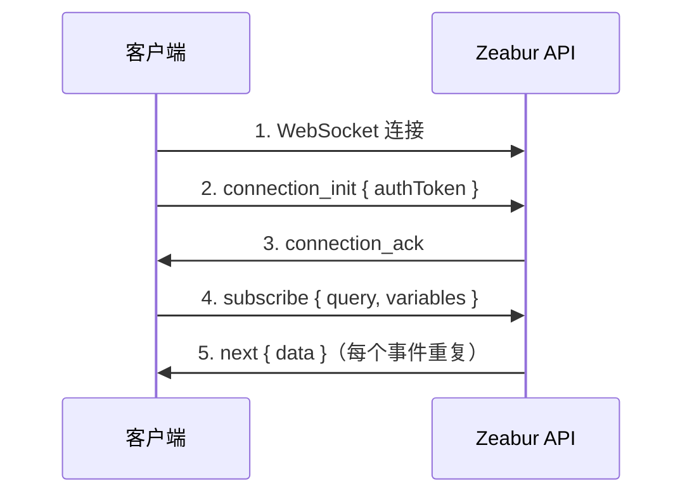

import { Callout } from 'nextra/components';

# WebSocket 连接指南

本指南说明如何建立经过身份验证的 WebSocket 连接到 Zeabur GraphQL API，以便进行实时订阅（日志、项目活动等）。

## 概述

Zeabur 使用 [graphql-ws](https://github.com/enisdenjo/graphql-ws) 协议通过 WebSocket 进行 GraphQL 订阅。连接需要在 `connection_init` 负载中传递令牌进行身份验证。

## 连接端点

| 环境 | WebSocket URL |
|------|---------------|
| 全球 | `wss://api.zeabur.com/graphql` |
| 中国 | `wss://api.zeabur.cn/graphql` |

## 身份验证

WebSocket 连接在连接初始化阶段通过在 `connectionParams` 中传递 `authToken` 进行身份验证。

### 令牌来源

身份验证令牌可以通过两种方式获取：

1. **从 Cookie 获取** - 使用 Zeabur 控制面板时，令牌存储在名为 `token` 的 cookie 中：

```javascript
// 从 cookie 中提取令牌
const token = document.cookie
  .split('; ')
  .find(row => row.startsWith('token='))
  ?.split('=')[1];
```

2. **使用 API 密钥** - 对于程序化访问，你可以使用 [API 密钥](./use-api-key) 作为身份验证令牌。

## 连接流程



## 实现方式

### 使用 Apollo Client（推荐）

这是 React 应用程序的推荐方式：

```typescript
import { GraphQLWsLink } from '@apollo/client/link/subscriptions';
import { createClient } from 'graphql-ws';

const wsLink = new GraphQLWsLink(createClient({ 
  url: 'wss://api.zeabur.com/graphql',
  connectionParams: () => {
    // 从 cookie 获取身份验证令牌
    const token = document.cookie
      .split('; ')
      .find(row => row.startsWith('token='))
      ?.split('=')[1];
    
    return {
      authToken: token,
    };
  },
}));
```

### 直接使用 graphql-ws 客户端

对于非 Apollo 实现：

```typescript
import { createClient } from 'graphql-ws';

const client = createClient({
  url: 'wss://api.zeabur.com/graphql',
  connectionParams: {
    authToken: 'YOUR_API_TOKEN',
  },
});

// 订阅运行时日志
const unsubscribe = client.subscribe(
  {
    query: `
      subscription SubscribeRuntimeLog(
        $projectID: ObjectID!
        $serviceID: ObjectID!
        $environmentID: ObjectID!
      ) {
        runtimeLogReceived(
          projectID: $projectID
          serviceID: $serviceID
          environmentID: $environmentID
        ) {
          timestamp
          message
        }
      }
    `,
    variables: {
      projectID: 'your-project-id',
      serviceID: 'your-service-id',
      environmentID: 'your-environment-id',
    },
  },
  {
    next: (data) => console.log('收到:', data),
    error: (err) => console.error('错误:', err),
    complete: () => console.log('完成'),
  }
);
```

### 使用原生 WebSocket API

用于测试或底层实现：

```javascript
const API_URL = 'wss://api.zeabur.com/graphql';

// 1. 创建带有 graphql-ws 子协议的 WebSocket 连接
const ws = new WebSocket(API_URL, 'graphql-transport-ws');

ws.onopen = () => {
  // 2. 发送带有身份验证令牌的 connection_init
  ws.send(JSON.stringify({
    type: 'connection_init',
    payload: {
      authToken: 'YOUR_AUTH_TOKEN'
    }
  }));
};

ws.onmessage = (event) => {
  const message = JSON.parse(event.data);
  
  switch (message.type) {
    case 'connection_ack':
      // 3. 连接已验证，现在订阅
      ws.send(JSON.stringify({
        id: '1',
        type: 'subscribe',
        payload: {
          query: `
            subscription SubscribeRuntimeLog(
              $projectID: ObjectID!
              $serviceID: ObjectID!
              $environmentID: ObjectID!
            ) {
              runtimeLogReceived(
                projectID: $projectID
                serviceID: $serviceID
                environmentID: $environmentID
              ) {
                timestamp
                message
              }
            }
          `,
          variables: {
            projectID: 'your-project-id',
            serviceID: 'your-service-id',
            environmentID: 'your-environment-id'
          }
        }
      }));
      break;
      
    case 'next':
      // 4. 收到订阅数据
      console.log('数据:', message.payload.data);
      break;
      
    case 'error':
      console.error('订阅错误:', message.payload);
      break;
      
    case 'complete':
      console.log('订阅完成');
      break;
  }
};

ws.onerror = (error) => console.error('WebSocket 错误:', error);
ws.onclose = (event) => console.log('WebSocket 关闭:', event.code);
```

## 消息类型（graphql-ws 协议）

### 客户端 → 服务器

| 类型 | 描述 |
|------|------|
| `connection_init` | 使用身份验证负载初始化连接 |
| `subscribe` | 开始订阅 |
| `complete` | 停止订阅 |
| `ping` | 保持连接的心跳 |

### 服务器 → 客户端

| 类型 | 描述 |
|------|------|
| `connection_ack` | 连接已接受 |
| `next` | 订阅数据 |
| `error` | 订阅错误 |
| `complete` | 订阅结束 |
| `pong` | 心跳响应 |

## 可用订阅

### 运行时日志

订阅服务的实时运行日志：

```graphql
subscription SubscribeRuntimeLog(
  $projectID: ObjectID!
  $serviceID: ObjectID!
  $environmentID: ObjectID!
) {
  runtimeLogReceived(
    projectID: $projectID
    serviceID: $serviceID
    environmentID: $environmentID
  ) {
    timestamp
    message
  }
}
```

### 运行时日志（带部署过滤器）

过滤特定部署的日志：

```graphql
subscription SubscribeRuntimeLogWithDeployment(
  $projectID: ObjectID!
  $serviceID: ObjectID!
  $environmentID: ObjectID!
  $deploymentID: ObjectID
) {
  runtimeLogReceived(
    projectID: $projectID
    serviceID: $serviceID
    environmentID: $environmentID
    deploymentID: $deploymentID
  ) {
    timestamp
    message
  }
}
```

### 构建日志

订阅部署的构建日志：

```graphql
subscription SubscribeBuildLog(
  $projectID: ObjectID!
  $deploymentID: ObjectID!
) {
  buildLogReceived(
    projectID: $projectID
    deploymentID: $deploymentID
  ) {
    timestamp
    message
  }
}
```

### 项目活动

订阅项目范围的事件（构建、部署、服务状态变化）：

```graphql
subscription SubscribeProjectActivity($projectID: ObjectID!) {
  projectActivityReceived(projectID: $projectID) {
    type
    payload
  }
}
```

## 错误处理

### 身份验证错误

如果令牌缺失或无效，服务器将在 `connection_init` 阶段拒绝连接：

```json
{
  "type": "error",
  "payload": {
    "message": "Please establish websocket connection with a valid token"
  }
}
```

### 权限错误

如果已验证但缺少资源访问权限：

```json
{
  "type": "next",
  "id": "1",
  "payload": {
    "errors": [{
      "message": "Permission denied",
      "path": ["runtimeLogReceived"],
      "extensions": {
        "code": "FORBIDDEN"
      }
    }],
    "data": null
  }
}
```

**常见原因：**

- 项目/服务/环境 ID 不正确
- 用户无权访问该项目
- ID 不匹配（例如，服务不属于该项目）

## 测试连接

### 浏览器开发者工具

1. 打开网络标签页
2. 按 "WS" 过滤
3. 导航到有订阅的页面（例如，部署日志）
4. 点击 WebSocket 连接查看帧

### 独立测试页面

保存此 HTML 文件并在登录 Zeabur 的浏览器中打开：

```html
<!DOCTYPE html>
<html>
<head>
  <title>Zeabur WebSocket 测试</title>
  <style>
    body { font-family: system-ui; padding: 20px; }
    input { margin: 5px; padding: 8px; }
    button { padding: 8px 16px; cursor: pointer; }
    pre { background: #f5f5f5; padding: 15px; overflow: auto; max-height: 400px; }
  </style>
</head>
<body>
  <h1>Zeabur WebSocket 连接测试</h1>
  <div>
    <input id="projectId" placeholder="项目 ID" />
    <input id="serviceId" placeholder="服务 ID" />
    <input id="envId" placeholder="环境 ID" />
    <button onclick="connect()">连接</button>
  </div>
  <pre id="logs"></pre>
  
  <script>
    function log(msg) {
      const el = document.getElementById('logs');
      el.textContent += new Date().toISOString() + ' | ' + msg + '\n';
      el.scrollTop = el.scrollHeight;
    }
    
    function connect() {
      const token = document.cookie.split('; ')
        .find(r => r.startsWith('token='))?.split('=')[1];
      
      if (!token) {
        log('错误：未在 cookies 中找到令牌。请确保已登录 Zeabur。');
        return;
      }
      
      log('找到令牌，正在连接...');
      const ws = new WebSocket('wss://api.zeabur.com/graphql', 'graphql-transport-ws');
      
      ws.onopen = () => {
        log('已连接，正在发送身份验证...');
        ws.send(JSON.stringify({
          type: 'connection_init',
          payload: { authToken: token }
        }));
      };
      
      ws.onmessage = (e) => {
        const msg = JSON.parse(e.data);
        log('收到: ' + JSON.stringify(msg, null, 2));
        
        if (msg.type === 'connection_ack') {
          log('验证成功！正在启动订阅...');
          ws.send(JSON.stringify({
            id: '1',
            type: 'subscribe',
            payload: {
              query: `subscription($p:ObjectID!,$s:ObjectID!,$e:ObjectID!){
                runtimeLogReceived(projectID:$p,serviceID:$s,environmentID:$e){
                  timestamp message
                }
              }`,
              variables: {
                p: document.getElementById('projectId').value,
                s: document.getElementById('serviceId').value,
                e: document.getElementById('envId').value
              }
            }
          }));
        }
      };
      
      ws.onerror = (e) => log('WebSocket 错误: ' + JSON.stringify(e));
      ws.onclose = (e) => log('连接关闭: code=' + e.code + ', reason=' + e.reason);
    }
  </script>
</body>
</html>
```

## 安全注意事项

<Callout type="warning">
通过 `document.cookie` 访问的身份验证令牌存储在非 HttpOnly cookie 中。这是一个必要的权衡，因为 WebSocket 无法自动发送 HttpOnly cookies。
</Callout>

### 缓解措施

1. **内容安全策略 (CSP)** - 防止可能窃取令牌的 XSS 攻击
2. **短令牌过期时间** - 如果令牌泄露，限制损害
3. **SameSite cookie 属性** - 防止 CSRF 攻击
4. **服务器端使用 API 密钥** - 对于后端应用程序，使用 [API 密钥](./use-api-key) 而不是会话令牌

## 故障排除

| 问题 | 解决方案 |
|------|----------|
| 未收到 `connection_ack` | 检查令牌是否有效且未过期 |
| 订阅时出现 `Permission denied` | 验证 ID 是否正确以及用户是否有访问权限 |
| 连接立即关闭 | 检查 WebSocket URL 并确保子协议是 `graphql-transport-ws` |
| 未收到数据 | 验证服务是否正在运行并生成日志 |
| `WebSocket connection failed` | 检查网络连接和防火墙设置 |

## 相关资源

- [开放 API](./public-api) - 所有 Zeabur API 概述
- [创建和使用 API 密钥](./use-api-key) - 如何生成 API 令牌
- [graphql-ws 协议](https://github.com/enisdenjo/graphql-ws/blob/master/PROTOCOL.md) - 官方协议规范
- [Apollo Explorer](https://studio.apollographql.com/public/zeabur/variant/main/explorer) - 探索可用的 GraphQL 操作

