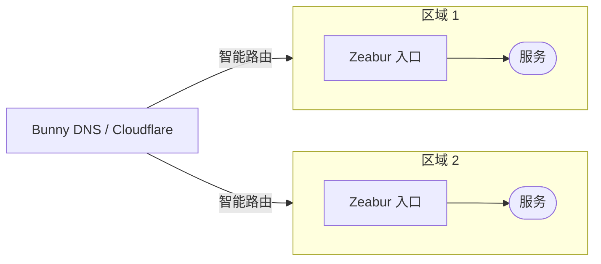
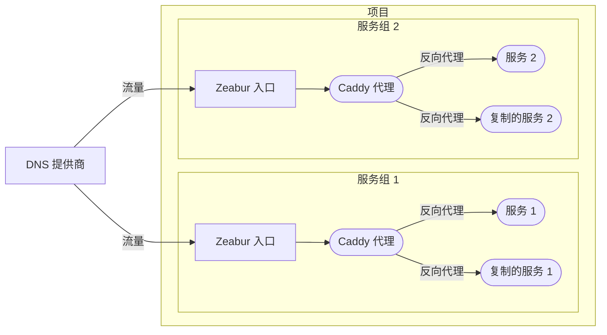
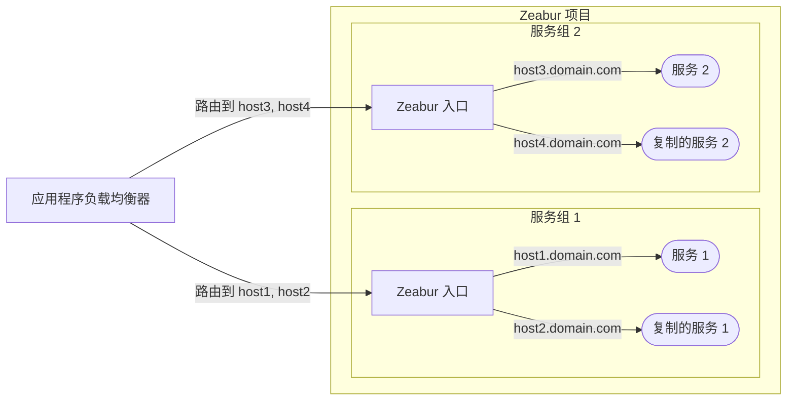

# 高可用性架构

本文档概述了在 Zeabur 上部署服务，以实现高可用性的推荐架构。

请注意，这个主题较为高级。对于您的新创服务，通常不需要高可用性（HA）。最简单的解决方案是将您的服务放在一个项目中，并使用[内网](/networking/private)进行通信；使用[公网](/networking/public)将您的服务暴露到互联网。我们可以为您处理垂直扩展，而在共享集群中，如果一个节点故障，我们可以自动将您的服务迁移到另一个节点。

## DNS 负载均衡器（推荐）

我们主要推荐的方法是使用[**DNS 负载均衡器**](https://www.cloudflare.com/learning/performance/what-is-dns-load-balancing/)，通常更具成本效益，并且不会干扰 Zeabur 原生的防火墙和速率限制功能。

诸如 [Cloudflare](https://developers.cloudflare.com/load-balancing/understand-basics/proxy-modes/) 和 [Bunny DNS](https://support.bunny.net/hc/en-us/articles/7247569381906-Understanding-Bunny-DNS-Load-Balancing) 等服务提供了强大的 DNS 负载均衡功能。有关详细的设置说明，请参阅其官方文档。

基本流程如下：

## 设置服务副本

Zeabur 目前不支持自动水平扩展。要创建冗余实例，您必须手动创建服务副本。一旦您有了服务副本，您可以使用以下两种方法之一来分配它们之间的流量。

### 选项 1：内部反向代理（最推荐）

第一个选项是使用内部反向代理，例如 [Caddy](https://zeabur.com/templates/FFDLWU) 或 [NGINX](https://zeabur.com/templates/YIUNMF)，将请求转发到您的服务副本。

这里您需要设置反向代理，以平衡您服务副本间内部主机名之间的流量（例如，`service-1-replica-1.zeabur.internal` 和 `service-1-replica-2.zeabur.internal`）。

这种方法的一个最大优势，是它与 Zeabur 的入口控制器无缝协作。您可以使用标准的 `X-Forwarded-For` 标头获取客户端的真实 IP 地址，而无需修改您的应用程序逻辑。

### 选项 2：外部 L7 代理

第二个选项是使用外部 L7 代理服务器，例如云服务提供商的[应用程序负载均衡器](https://developers.cloudflare.com/load-balancing/understand-basics/proxy-modes/)（ALB）。

虽然这种方法可能看起来更简单，因为您不需要管理内部 Caddy 服务，但它伴随着几个限制：

- **真实 IP 标头**：您必须配置您的 ALB 以在自定义标头中传递客户端的真实 IP（例如，`X-LoadBalancer-IP`），并修改您的应用程序来从这个自定义标头读取。
- **安全风险**：您需要设置 Zeabur 的防火墙，仅允许来自 ALB 的 IP 地址的流量。如果您不这样做，恶意行为者可能会绕过您的 ALB 并将伪造的 `X-LoadBalancer-IP` 标头直接发送到您的应用程序。
- **速率限制**：因为所有请求都源自 ALB 的 IP 地址，Zeabur 的速率限制可能会意外触发，可能会阻断合法流量。

我们计划在未来提供对外部代理方法更好的支持来解决这些问题。目前，**内部反向代理（选项 1）是在 Zeabur 上使用最可靠且推荐的方法**。
