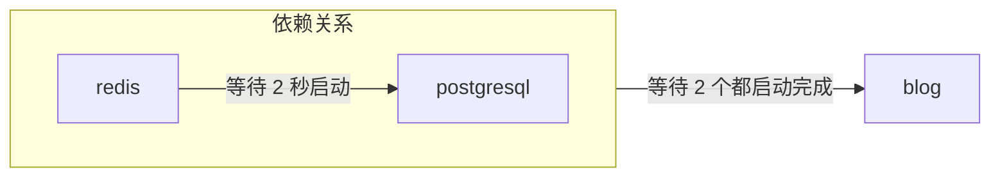

# 从 YAML 创建模板

你可以用与 [Docker Compose](https://docs.docker.com/compose/) 或 [Kubernetes Object](https://kubernetes.io/docs/concepts/overview/working-with-objects/) 相似的形式，使用 `zeabur` CLI 从 YAML 部署、创建和管理模板。

## YAML (Resource) 的形式

Zeabur 使用单个 YAML 文件来描述模板的资源 (Resource)，下称这种 YAML 格式为 **Template Resource**。

```yaml
apiVersion: zeabur.com/v1
kind: Template
metadata:
    name: RSSHub
spec:
    description: Everything is RSSible
    icon: https://docs.rsshub.app/logo.png
    coverImage: https://zeabur.com/docs/_next/image?url=%2Fdocs%2F_next%2Fstatic%2Fmedia%2Fintro.5b73c4f8.png&w=3840&q=75
    variables:
        - key: PUBLIC_DOMAIN
          type: DOMAIN
          name: Domain
          description: What is the domain you want for your RSSHub?
    tags:
        - Tool
    readme: |-
        # RSSHub
        RSSHub is an open source, easy to use, and extensible RSS feed aggregator, it's capable of generating RSS feeds from pretty much everything.

        RSSHub delivers millions of contents aggregated from all kinds of sources, our vibrant open source community is ensuring the deliver of RSSHub's new routes, new features and bug fixes.
    services:
        - name: Redis
          icon: https://raw.githubusercontent.com/zeabur/service-icons/main/marketplace/redis.svg
          template: PREBUILT
          spec:
            source:
                image: redis/redis-stack-server:latest
            ports:
                - id: database
                  port: 6379
                  type: TCP
            volumes:
                - id: data
                  dir: /data
            instructions:
                - type: TEXT
                  title: Command to connect to your Redis
                  content: redis-cli -h ${PORT_FORWARDED_HOSTNAME} -p ${DATABASE_PORT_FORWARDED_PORT} -a ${REDIS_PASSWORD}
                - type: TEXT
                  title: Redis Connection String
                  content: redis://:${REDIS_PASSWORD}@${PORT_FORWARDED_HOSTNAME}:${DATABASE_PORT_FORWARDED_PORT}
                - type: PASSWORD
                  title: Redis password
                  content: ${REDIS_PASSWORD}
                  category: Credentials
                - type: TEXT
                  title: Redis host
                  content: ${PORT_FORWARDED_HOSTNAME}
                  category: Hostname & Port
                - type: TEXT
                  title: Redis port
                  content: ${DATABASE_PORT_FORWARDED_PORT}
                  category: Hostname & Port
            env:
                REDIS_ARGS:
                    default: --requirepass ${REDIS_PASSWORD}
                REDIS_CONNECTION_STRING:
                    default: redis://:${REDIS_PASSWORD}@${REDIS_HOST}:${REDIS_PORT}
                    expose: true
                    readonly: true
                REDIS_HOST:
                    default: ${CONTAINER_HOSTNAME}
                    expose: true
                    readonly: true
                REDIS_PASSWORD:
                    default: ${PASSWORD}
                    expose: true
                REDIS_PORT:
                    default: ${DATABASE_PORT}
                    expose: true
                    readonly: true
                REDIS_URI:
                    default: ${REDIS_CONNECTION_STRING}
                    expose: true
                    readonly: true
        - name: RSSHub
          icon: https://docs.rsshub.app/logo.png
          template: PREBUILT
          domainKey: PUBLIC_DOMAIN
          spec:
            source:
                image: diygod/rsshub
            ports:
                - id: web
                  port: 1200
                  type: HTTP
            env:
                CACHE_TYPE:
                    default: ${REDIS_URI}
                REDIS_URL:
                    default: ${REDIS_URI}

localization:
  zh-CN:
    description: LobeChat 是一个开源的高性能聊天机器人框架。
    variables:
      - key: PUBLIC_DOMAIN
        type: DOMAIN
        name: 域名
        description: 你想将 RSSHub 绑定在哪个域名上？
    readme: |-
        # RSSHub
        RSSHub 是一个开源、易于使用且可扩展的 RSS 信息聚合器，能够从几乎所有来源生成 RSS 信息。

        RSSHub 提供来自各种来源的数百万内容，我们充满活力的开源社区确保提供 RSSHub 的新路线、新功能和错误修复。
```

一个 **Template** 可以分成“模板信息”、“服务规格”和“本地化翻译”这三大块。完整格式可以在 [Zeabur 的 Schema 存储库](https://json-schema.app/view/%23?url=https%3A%2F%2Fschema.zeabur.app%2Ftemplate.json) 浏览，下面会简述每个字段的用途和其在 Zeabur 模板页面的呈现。

### 模板定义


`apiVersion` 和 `kind` 固定都是 `zeabur.com/v1` 和 `Template`。

`metadata` 中的 `name` 是模板的名称，没有格式限制，比如 `RSSHub`, `Lobe-Chat`, `ChatGPT API` 这些都是可以接受的。实际会呈现在上图中 `WeWe RSS` 的块中。

`spec` 的 `description` 是模板可以用一句话简述的文字，会显示在模板页面的标题下方。`icon` 是模板的图标，是一个指向图片的 URL，会显示在模板标题的旁边。`tags` 是模板的标签，已有分类可以参考[模板浏览页面的左侧 `Tags` 区块](https://zeabur.com/templates)。正确的标签除了让用户容易找到外，也有益于 SEO 优化。

`readme` 是模板的说明文件，使用 Markdown 格式编写，会显示在模板页面的下方。`coverImage` 则会呈现在说明文件上方，同样也是指向图片的 URL，可以不填。

`variables` 是模板可以让用户在部署阶段设置的变量。其中 `type` 可以是 `STRING`（普通的变量字符串）或 `DOMAIN`（Zeabur 引导设置域名）；`key` 对应到服务的环境变量，Zeabur 会自动在所有服务中建立一个这里指定的环境变量。`name` 和 `description` 分别对应到部署模板时的变量名称和描述，如下图。


### 服务规格


`services` 是模板的服务规格，用户部署时会将规格内指定的服务都部署到 Zeabur 里面。服务的 `name` 是服务的名称。`icon` 是服务的图标。`template` 声明这个服务是 Docker image（`PREBUILT`）或者是从 Git 部署的服务 (`GIT`)。

`dependencies` 声明这个服务的依赖服务。Zeabur 可以在等待指定服务启动完成后，再启动你的服务，避免重复重启服务的麻烦。比如说你的服务 `blog` 依赖于 `redis` 和 `postgresql`，你可以按下面的形式进行指定，这样 `blog` 就会等待 `redis` 和 `postgresql` 启动完成后再启动。注意 `redis` 和 `postgresql` 必须也是定义在模板中的服务。

```yaml
dependencies:
    - redis
    - postgresql
```

其启动关系为：



`domainKey` 表示模板定义中的域（类型为 `DOMAIN`）变量应该绑定到哪个服务。在上述示例中，`spec.variables` 有一个类型为 `DOMAIN` 的变量 `PUBLIC_DOMAIN`，而 RSSHub 服务的设置中有一个 `domainKey` 指向 `PUBLIC_DOMAIN`。在部署时，`PUBLIC_DOMAIN` 中设置的域将会绑定到 RSSHub 服务。

`spec` 则是服务的服务规格（Service Specification），每个字段的详细信息可以参考 [Template 服务规格](https://json-schema.app/view/%23/%23%2Fproperties%2Fspec/%23%2Fproperties%2Fspec%2Fproperties%2Fservices%2Fitems/%23%2Fproperties%2Fspec%2Fproperties%2Fservices%2Fitems%2Fproperties%2Fspec?url=https%3A%2F%2Fschema.zeabur.app%2Ftemplate.json) 的说明文件。下面简要说明服务规格的重点：

如果是 `PREBUILT` 服务，则需要指定 Docker image (`image`)，以及可选的运行命令和运行参数 (`command` 和 `args`)，如果 image 存在于私有镜像仓库中，还可以指定仓库的用户名与密码 (`username` 和 `password`)，另外如果 image 需要以无 root 权限运行，也可以指定模拟的用户 ID (`runAsUserID`)；如果是 `GIT` 服务，则需要指定 Git 仓库的类型（目前只支持 `GITHUB`）、仓库的代号（目前只支持 GitHub 的 [`repoID`](https://stackoverflow.com/a/47223479)），也可以选择性填写分支 (`branch`)。

`ports` 指定要对项目甚至外网公开的服务 Port。HTTP 服务可以用域名连接（如 `https://my-service.zeabur.app`），而 TCP 及 UDP 服务则可以使用 Zeabur 提供的转发链接 `xxx.clusters.zeabur.com:12345` 连接。比如 `type` 是 `HTTP`，`port` 是 `12345` 的 Port，代表着其他人可以通过 `https://my-service.zeabur.app` 连接到你监听在 `12345` port 的服务。

`volumes` 指定服务的持久存储路径。原则上 Zeabur 在每次 Redeploy 或 Restart 都会将服务的状态恢复到初始状态 (Stateless)，但如果你需要持久存储一些数据，可以使用 `volumes` 指定持久存储路径。比如 `dir` 是 `/data` 的 Volume，代表着你的服务可以在 `/data` 这个路径下持久存储数据，直到服务删除前数据永远都会在 `/data` 下。

`instructions` 告诉其他用户如何使用你的服务，比如示例的 `Redis Connection String` 就提供了外网其他人可以用 Client 连接 Redis 的方式。`type` 可以是 `DOMAIN`（一个按钮，点击后会导向到指定的 URL）、`TEXT`（文字）、`PASSWORD`（密码，默认隐藏显示），`category` 则是你可以自定义的分类方式，目前前端不会呈现。

`env` 则是服务的环境变量。`default` 是环境变量的默认值，`expose` 表示其他项目是否可以直接使用这个变量或使用 `${VARIABLE}` 语法取用这个变量，`readonly` 表示是否只读（服务建立后不能修改）。比如 `REDIS_CONNECTION_STRING` 的 `expose` 是 `true`，代表着其他服务可以通过 `REDIS_CONNECTION_STRING` 这个环境变量连接到 Redis，也可以使用 `${REDIS_CONNECTION_STRING}` 在其他环境变量引用这个连接字符串。

`configs` 是服务的基于文件的配置。你可以使用 `path` 和 `template` 指定默认的配置文件，以便用户进一步修改。通过使用 `envsubst`，可以将模板中的变量引用替换为对应的值。例如，当启用 `envsubst` 并设置变量 `MONGO_URI=mongodb://mongo.zeabur.internal:27017` 时：

```yaml {6}
configs:
    - path: /config.yaml
      template: |
        mongo:
            uri: ${MONGO_URI}
      envsubst: true
```

服务实例中的 `/config.yml` 文件将会填入以下内容：

```yaml filename="/config.yaml"
mongo:
    uri: mongodb://mongo.zeabur.internal:27017
```

你还可以指定配置文件的权限（`permission`）。请注意，`permission` 必须是十进制数字，该数字是从八进制的 [UNIX 文件权限](https://mason.gmu.edu/~montecin/UNIXpermiss.htm) 转换而来的。以下是一些常见的权限对照：

| `permission` 值 | 权限原始值 | 读  | 写  | 运行 | 适用场景                     |
| --------------- | ---------- | --- | --- | ---- | ---------------------------- |
| 256             | 0400       | O   | X   | X    | 机密文件（如密码）           |
| 420             | 0644       | O   | O   | X    | 普通可读写文件，为默认权限   |
| 493             | 0755       | O   | O   | O    | 可执行文件（如 bash 脚本）   |

“读”、“写”和“运行”在这里指的是容器用户的权限。如需更多详细信息（组、所有用户等），请参考上方链接。

`gpu` 用于指定服务所需的 GPU 资源。目前，你只能选择启用或禁用 GPU 资源。若要使用 GPU 资源，请将 `gpu.enabled` 设置为 `true`：

```yaml
gpu:
    enabled: true
```

### 本地化翻译

你可以在模板定义中本地化 `description`、`coverImage`、`variables` 的标题和描述以及 `readme` 等栏位。Zeabur 会根据访客的语言显示对应的本地化内容。


当前支持的语言代码包括 `zh-TW`、`zh-CN`、`ja-JP` 和 `es-ES`。`en-US` 是模板的默认语言，直接写在模板定义中即可。`description`、`readme`、`coverImage` 的格式与模板定义相同；`variables` 则对应到模板定义中的 `variables`，可以对变量的 `name` 和 `description` 进行本地化，其他部分必须与模板定义中的栏位相同。

留空栏位（或者是不写）则会自动使用模板定义中的默认内容，如 `coverImage` 在上面的示例没写，则会使用模板定义中的 `coverImage`。

## 使用 `zeabur` CLI 部署模板

假如你已经编写好了 Template Resource YAML，想要测试部署效果，可以使用 `zeabur` CLI 来部署模板。

```
$ cat wp.yaml | head -n 10
apiVersion: zeabur.com/v1
kind: Template
metadata:
    name: WordPress
spec:
    description: A content management system (CMS) that allows you to host and build websites.
    coverImage: https://kinsta.com/wp-content/uploads/2018/02/what-is-wordpress.png
    icon: https://raw.githubusercontent.com/zeabur/service-icons/main/marketplace/wordpress.png
    variables:
        - key: WORDPRESS_DOMAIN

$ npx zeabur@latest template deploy -f wp.yaml
```

首先 `zeabur` CLI 会先询问你要部署在哪个项目上，接着会根据服务的 `variables` 询问你要填入哪些变量，最后会部署模板到你指定的项目上。

```
$ npx zeabur@latest template deploy -f wp.yaml
? Select project  [Use arrows to move, type to filter]
  your-project
> Create a new project
? Select project region  [Use arrows to move, type to filter]
 DigitalOcean - sgp1 (Singapore)
  HuaWei Cloud - cn-east-3 (Shanghai, China)
  Vultr - ewr1 (New Jersey, United States)
  Google Cloud Platform - asia-east1 (Taipei, Taiwan)
> Amazon Web Services - ap-east-1 (Hong Kong)
  Amazon Web Services - ap-northeast-1 (Tokyo, Japan)
  Amazon Web Services - us-west-1 (California, United States)
? What is the domain of your WordPress website? (For example, if you enter "myapp", the domain will be "myapp.zeabur.app") mywordpressdemo7c918e14
INFO	Domain mywordpressdemo7c918e14.zeabur.app is available!
m
INFO	Template successfully deployed into project "aphylac" (https://dash.zeabur.com/projects/your-project-id).
```

## 使用 `zeabur` CLI 上架模板

假如测试上没有问题，你可以使用 `npx zeabur@latest template create` 命令将模板公开给其他人使用。同样以上文的 `wp.yaml` 为例：

```
$ npx zeabur@latest template create -f wp.yaml
INFO	Template "WordPress" (https://zeabur.com/templates/71HORL) created
```

基本上是一键完成的，可以点开链接查看部署完成的模板：


也可以在链接后加上 `.yaml` 查看模板的 Resource YAML 形式：`https://zeabur.com/templates/71HORL.yaml`。

## 使用 `zeabur` CLI 更新模板

如果你需要修改模板的内容，比如改名、更新 Image 版本，你可以在修改完成 Resource YAML 后，使用 `npx zeabur@latest template update` 命令更新：

```
$ npx zeabur@latest template update -c 71HORL -f wp.yaml
INFO	Template updated.
```

## 使用 `zeabur` CLI 删除模板

如果你有重复的模板或不再需要某个模板，可以使用 `npx zeabur@latest template delete` 命令删除它：

```
$ npx zeabur@latest template delete
? Enter template code: 71HORL
INFO	Template deleted successfully.
```

只需运行命令并在提示时输入模板代码。模板将从平台中永久删除。
