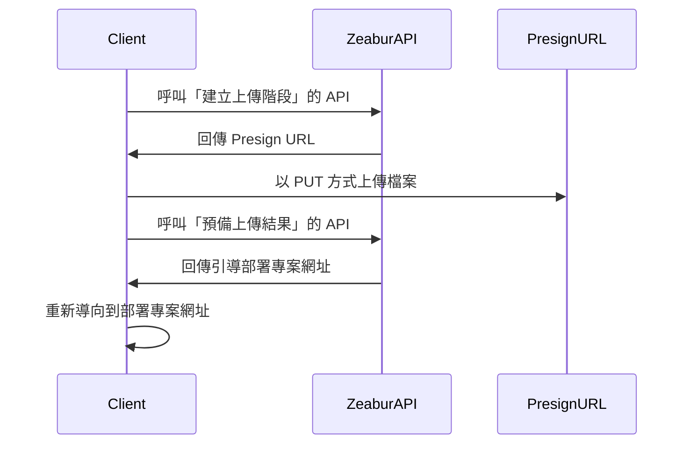

import { Callout } from 'nextra/components';

# 開放 API

Zeabur 的 API 主要使用 GraphQL 建置，同時提供為 Zeabur Dashboard、Zeabur CLI 等一系列 Zeabur 產品的基礎。我們提供開放 API，讓您能夠透過程式碼來控制 Zeabur。
另 Zeabur 在 [Schema Repository](https://schema.zeabur.app/) 中有放置一部分非 GraphQL API 的 JSON schema 和 OpenAPI specification。

## 認證

您需要在 `Authorization` 中傳入 [API 金鑰](./use-api-key)，才能使用您的身分使用 Zeabur API。產生 API 金鑰的說明，請閱讀 [這篇文件](./use-api-key)。

傳入範例如下：

```bash
curl --request POST \
  --url https://api.zeabur.com/graphql \
  --header 'Authorization: Bearer {YOUR_API_TOKEN}' \
  --header 'Content-Type: application/json' \
  --data '{"query":"query { me { username } }"}'
```

## GraphQL API

您可以造訪我們的 [Apollo Explorer](https://studio.apollographql.com/public/zeabur/variant/main/explorer) 檢視所有可以使用的 Zeabur API GraphQL 方法、進行測試並且複製成 cURL 指令。

如果您習慣在 IDE 上編寫 GraphQL，或者需要取得類型提示，可以到 Explorer 中的「Schema」→「SDL」來下載 Zeabur API 的完整 Schema。

若您發現您需要的 API 不在這個 Schema 中，請到我們的 [Discord](https://zeabur.com/dc) 和我們告知。

## 本機專案上傳 API

本機專案 API 的說明請參考 [Upload API 文件](https://schema.zeabur.app/upload-api/index.html)。

流程如下：



## 模板部署 API

如果您有一個 [模板規格 YAML 檔案](https://schema.zeabur.app/template.json)，可以使用這個 GraphQL mutation 來部署到指定專案中：

```graphql
mutation DeployTemplate($rawSpecYaml: String, $projectId: ObjectID) {
  deployTemplate(rawSpecYaml: $rawSpecYaml, projectID: $projectId) {
    _id  # String!
  }
}
```

這個 API 適合用來大量部署。

## 容器操作 API

這裡的 API 可以讓您將檔案上傳到或下載自 Zeabur 的指定服務，也可以向 Zeabur 的指定服務傳送指令。

### 上傳檔案

<Callout>
目前上傳有 100MB 的檔案大小限制。
</Callout>

```http
POST https://api.zeabur.com/projects/project-id/services/service-id/files
Content-Type: multipart/form-data
Authorization: Bearer <YOUR_API_TOKEN>
```

- Payload（表單內容）
    - file (Blob)：檔案內容
    - path (string)：檔案路徑
    - environment (string)：即 environment ID，能從 Dashboard 網址中的 `envID` 取得
- Response
    - 200 OK
    - 500 Internal Server Error，如 `{"code": "INTERNAL_SERVER_ERROR", "error": "failed to upload file"}` 


### 下載檔案

```http
GET https://api.zeabur.com/projects/project-id/services/service-id/files?path=[PATH]&environment=[ENVIRONMENT]
Authorization: Bearer <YOUR_API_TOKEN>
```

- Query
    - path (string)：檔案路徑
    - environment (string)：即 environment ID，能從 Dashboard 網址中的 `envID` 取得
- Response
    - 200 OK, `application/octet-stream` 
    - 500 Internal Server Error，如 `{"code": "INTERNAL_SERVER_ERROR", "error": "failed to download file"}` 

### 列舉檔案

請使用「執行單個指令」的 API 執行：

```shell
$ ls -A -a -F -1 /
```

### 刪除檔案

請使用「執行單個指令」的 API 執行：

```shell
$ rm -r FILENAME
```

### 執行單個指令

使用 GraphQL API 執行：

```graphql
mutation ExecuteCommand($serviceId: ObjectID!, $environmentId: ObjectID!, $command: [String!]!) {
  executeCommand(serviceID: $serviceId, environmentID: $environmentId, command: $command) {
    exitCode  # Int!
    output    # String!
  }
}
```

### 使用 WebSocket 取得服務終端機

- WebSocket endpoint: `wss://api.zeabur.com/exec/<service-id>` 
- 往 WebSocket 寫入內容即實際輸入
- Resize Control Controls：`[RESIZE_CONTROL, COLS_LSB, COLS_MSB, ROWS_LSB, ROWS_MSB]` 
  ```
  const buffer = new Uint8Array([
    RESIZE_CONTROL,
    dims.cols & 0xFF,
    dims.cols >> 8,
    dims.rows & 0xFF,
    dims.rows >> 8
  ]);
  ```

### 取回編譯期日誌

使用 GraphQL API 執行：

```graphql
query BuildLogs($projectId: ObjectID!, $deploymentId: ObjectID!, $timestampCursor: Time) {
  buildLogs(projectID: $projectId, deploymentID: $deploymentId, timestampCursor: $timestampCursor) {
    message    # String!
    timestamp  # Time!
  }
}
```

### 取回執行期日誌

使用 GraphQL API 執行：

```graphql
query RuntimeLogs($projectId: ObjectID!, $serviceId: ObjectID!, $environmentId: ObjectID!, $timestampCursor: Time) {
  runtimeLogs(projectID: $projectId, serviceID: $serviceId, environmentID: $environmentId, timestampCursor: $timestampCursor) {
    message    # String!
    timestamp  # Time!
  }
}
```

### 訂閱編譯期日誌

使用 GraphQL API 執行：

```graphql
subscription BuildLogReceived($projectId: ObjectID!, $deploymentId: ObjectID!) {
  buildLogReceived(projectID: $projectId, deploymentID: $deploymentId) {
    message    # String!
    timestamp  # Time!
  }
}
```

### 訂閱執行期日誌

使用 GraphQL API 執行：

```graphql
subscription RuntimeLogReceived($projectId: ObjectID!, $serviceId: ObjectID!, $environmentId: ObjectID!) {
  runtimeLogReceived(projectID: $projectId, serviceID: $serviceId, environmentID: $environmentId) {
    message    # String!
    timestamp  # Time!
  }
}
```