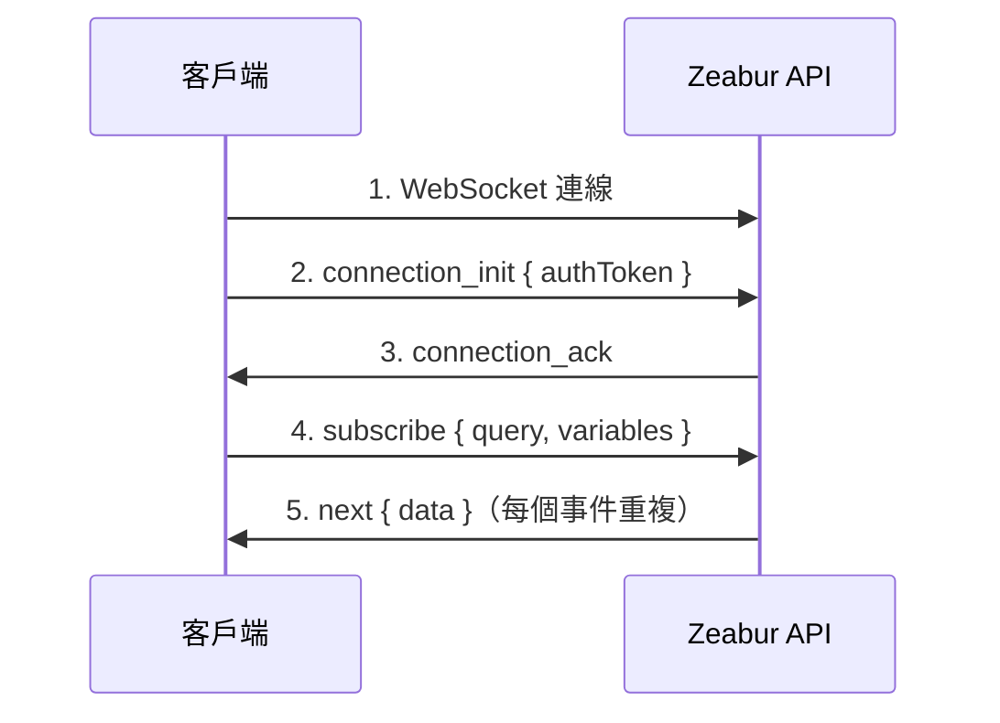

import { Callout } from 'nextra/components';

# WebSocket 連線指南

本指南說明如何建立經過身份驗證的 WebSocket 連線到 Zeabur GraphQL API，以便進行即時訂閱（日誌、專案活動等）。

## 概述

Zeabur 使用 [graphql-ws](https://github.com/enisdenjo/graphql-ws) 協議透過 WebSocket 進行 GraphQL 訂閱。連線需要在 `connection_init` 負載中傳遞令牌進行身份驗證。

## 連線端點

| 環境 | WebSocket URL |
|------|---------------|
| 全球 | `wss://api.zeabur.com/graphql` |
| 中國 | `wss://api.zeabur.cn/graphql` |

## 身份驗證

WebSocket 連線在連線初始化階段透過在 `connectionParams` 中傳遞 `authToken` 進行身份驗證。

### 令牌來源

身份驗證令牌可以透過兩種方式取得：

1. **從 Cookie 取得** - 使用 Zeabur 控制面板時，令牌儲存在名為 `token` 的 cookie 中：

```javascript
// 從 cookie 中提取令牌
const token = document.cookie
  .split('; ')
  .find(row => row.startsWith('token='))
  ?.split('=')[1];
```

2. **使用 API 金鑰** - 對於程式化存取，你可以使用 [API 金鑰](./use-api-key) 作為身份驗證令牌。

## 連線流程



## 實作方式

### 使用 Apollo Client（推薦）

這是 React 應用程式的推薦方式：

```typescript
import { GraphQLWsLink } from '@apollo/client/link/subscriptions';
import { createClient } from 'graphql-ws';

const wsLink = new GraphQLWsLink(createClient({ 
  url: 'wss://api.zeabur.com/graphql',
  connectionParams: () => {
    // 從 cookie 取得身份驗證令牌
    const token = document.cookie
      .split('; ')
      .find(row => row.startsWith('token='))
      ?.split('=')[1];
    
    return {
      authToken: token,
    };
  },
}));
```

### 直接使用 graphql-ws 客戶端

對於非 Apollo 實作：

```typescript
import { createClient } from 'graphql-ws';

const client = createClient({
  url: 'wss://api.zeabur.com/graphql',
  connectionParams: {
    authToken: 'YOUR_API_TOKEN',
  },
});

// 訂閱執行時日誌
const unsubscribe = client.subscribe(
  {
    query: `
      subscription SubscribeRuntimeLog(
        $projectID: ObjectID!
        $serviceID: ObjectID!
        $environmentID: ObjectID!
      ) {
        runtimeLogReceived(
          projectID: $projectID
          serviceID: $serviceID
          environmentID: $environmentID
        ) {
          timestamp
          message
        }
      }
    `,
    variables: {
      projectID: 'your-project-id',
      serviceID: 'your-service-id',
      environmentID: 'your-environment-id',
    },
  },
  {
    next: (data) => console.log('收到:', data),
    error: (err) => console.error('錯誤:', err),
    complete: () => console.log('完成'),
  }
);
```

### 使用原生 WebSocket API

用於測試或底層實作：

```javascript
const API_URL = 'wss://api.zeabur.com/graphql';

// 1. 建立帶有 graphql-ws 子協議的 WebSocket 連線
const ws = new WebSocket(API_URL, 'graphql-transport-ws');

ws.onopen = () => {
  // 2. 發送帶有身份驗證令牌的 connection_init
  ws.send(JSON.stringify({
    type: 'connection_init',
    payload: {
      authToken: 'YOUR_AUTH_TOKEN'
    }
  }));
};

ws.onmessage = (event) => {
  const message = JSON.parse(event.data);
  
  switch (message.type) {
    case 'connection_ack':
      // 3. 連線已驗證，現在訂閱
      ws.send(JSON.stringify({
        id: '1',
        type: 'subscribe',
        payload: {
          query: `
            subscription SubscribeRuntimeLog(
              $projectID: ObjectID!
              $serviceID: ObjectID!
              $environmentID: ObjectID!
            ) {
              runtimeLogReceived(
                projectID: $projectID
                serviceID: $serviceID
                environmentID: $environmentID
              ) {
                timestamp
                message
              }
            }
          `,
          variables: {
            projectID: 'your-project-id',
            serviceID: 'your-service-id',
            environmentID: 'your-environment-id'
          }
        }
      }));
      break;
      
    case 'next':
      // 4. 收到訂閱資料
      console.log('資料:', message.payload.data);
      break;
      
    case 'error':
      console.error('訂閱錯誤:', message.payload);
      break;
      
    case 'complete':
      console.log('訂閱完成');
      break;
  }
};

ws.onerror = (error) => console.error('WebSocket 錯誤:', error);
ws.onclose = (event) => console.log('WebSocket 關閉:', event.code);
```

## 訊息類型（graphql-ws 協議）

### 客戶端 → 伺服器

| 類型 | 描述 |
|------|------|
| `connection_init` | 使用身份驗證負載初始化連線 |
| `subscribe` | 開始訂閱 |
| `complete` | 停止訂閱 |
| `ping` | 保持連線的心跳 |

### 伺服器 → 客戶端

| 類型 | 描述 |
|------|------|
| `connection_ack` | 連線已接受 |
| `next` | 訂閱資料 |
| `error` | 訂閱錯誤 |
| `complete` | 訂閱結束 |
| `pong` | 心跳回應 |

## 可用訂閱

### 執行時日誌

訂閱服務的即時執行日誌：

```graphql
subscription SubscribeRuntimeLog(
  $projectID: ObjectID!
  $serviceID: ObjectID!
  $environmentID: ObjectID!
) {
  runtimeLogReceived(
    projectID: $projectID
    serviceID: $serviceID
    environmentID: $environmentID
  ) {
    timestamp
    message
  }
}
```

### 執行時日誌（帶部署過濾器）

過濾特定部署的日誌：

```graphql
subscription SubscribeRuntimeLogWithDeployment(
  $projectID: ObjectID!
  $serviceID: ObjectID!
  $environmentID: ObjectID!
  $deploymentID: ObjectID
) {
  runtimeLogReceived(
    projectID: $projectID
    serviceID: $serviceID
    environmentID: $environmentID
    deploymentID: $deploymentID
  ) {
    timestamp
    message
  }
}
```

### 建置日誌

訂閱部署的建置日誌：

```graphql
subscription SubscribeBuildLog(
  $projectID: ObjectID!
  $deploymentID: ObjectID!
) {
  buildLogReceived(
    projectID: $projectID
    deploymentID: $deploymentID
  ) {
    timestamp
    message
  }
}
```

### 專案活動

訂閱專案範圍的事件（建置、部署、服務狀態變化）：

```graphql
subscription SubscribeProjectActivity($projectID: ObjectID!) {
  projectActivityReceived(projectID: $projectID) {
    type
    payload
  }
}
```

## 錯誤處理

### 身份驗證錯誤

如果令牌缺失或無效，伺服器將在 `connection_init` 階段拒絕連線：

```json
{
  "type": "error",
  "payload": {
    "message": "Please establish websocket connection with a valid token"
  }
}
```

### 權限錯誤

如果已驗證但缺少資源存取權限：

```json
{
  "type": "next",
  "id": "1",
  "payload": {
    "errors": [{
      "message": "Permission denied",
      "path": ["runtimeLogReceived"],
      "extensions": {
        "code": "FORBIDDEN"
      }
    }],
    "data": null
  }
}
```

**常見原因：**

- 專案/服務/環境 ID 不正確
- 使用者無權存取該專案
- ID 不匹配（例如，服務不屬於該專案）

## 測試連線

### 瀏覽器開發者工具

1. 開啟網路標籤頁
2. 按 "WS" 過濾
3. 導航到有訂閱的頁面（例如，部署日誌）
4. 點擊 WebSocket 連線檢視框架

### 獨立測試頁面

儲存此 HTML 檔案並在登入 Zeabur 的瀏覽器中開啟：

```html
<!DOCTYPE html>
<html>
<head>
  <title>Zeabur WebSocket 測試</title>
  <style>
    body { font-family: system-ui; padding: 20px; }
    input { margin: 5px; padding: 8px; }
    button { padding: 8px 16px; cursor: pointer; }
    pre { background: #f5f5f5; padding: 15px; overflow: auto; max-height: 400px; }
  </style>
</head>
<body>
  <h1>Zeabur WebSocket 連線測試</h1>
  <div>
    <input id="projectId" placeholder="專案 ID" />
    <input id="serviceId" placeholder="服務 ID" />
    <input id="envId" placeholder="環境 ID" />
    <button onclick="connect()">連線</button>
  </div>
  <pre id="logs"></pre>
  
  <script>
    function log(msg) {
      const el = document.getElementById('logs');
      el.textContent += new Date().toISOString() + ' | ' + msg + '\n';
      el.scrollTop = el.scrollHeight;
    }
    
    function connect() {
      const token = document.cookie.split('; ')
        .find(r => r.startsWith('token='))?.split('=')[1];
      
      if (!token) {
        log('錯誤：未在 cookies 中找到令牌。請確保已登入 Zeabur。');
        return;
      }
      
      log('找到令牌，正在連線...');
      const ws = new WebSocket('wss://api.zeabur.com/graphql', 'graphql-transport-ws');
      
      ws.onopen = () => {
        log('已連線，正在發送身份驗證...');
        ws.send(JSON.stringify({
          type: 'connection_init',
          payload: { authToken: token }
        }));
      };
      
      ws.onmessage = (e) => {
        const msg = JSON.parse(e.data);
        log('收到: ' + JSON.stringify(msg, null, 2));
        
        if (msg.type === 'connection_ack') {
          log('驗證成功！正在啟動訂閱...');
          ws.send(JSON.stringify({
            id: '1',
            type: 'subscribe',
            payload: {
              query: `subscription($p:ObjectID!,$s:ObjectID!,$e:ObjectID!){
                runtimeLogReceived(projectID:$p,serviceID:$s,environmentID:$e){
                  timestamp message
                }
              }`,
              variables: {
                p: document.getElementById('projectId').value,
                s: document.getElementById('serviceId').value,
                e: document.getElementById('envId').value
              }
            }
          }));
        }
      };
      
      ws.onerror = (e) => log('WebSocket 錯誤: ' + JSON.stringify(e));
      ws.onclose = (e) => log('連線關閉: code=' + e.code + ', reason=' + e.reason);
    }
  </script>
</body>
</html>
```

## 安全注意事項

<Callout type="warning">
透過 `document.cookie` 存取的身份驗證令牌儲存在非 HttpOnly cookie 中。這是一個必要的權衡，因為 WebSocket 無法自動發送 HttpOnly cookies。
</Callout>

### 緩解措施

1. **內容安全政策 (CSP)** - 防止可能竊取令牌的 XSS 攻擊
2. **短令牌過期時間** - 如果令牌洩露，限制損害
3. **SameSite cookie 屬性** - 防止 CSRF 攻擊
4. **伺服器端使用 API 金鑰** - 對於後端應用程式，使用 [API 金鑰](./use-api-key) 而不是會話令牌

## 故障排除

| 問題 | 解決方案 |
|------|----------|
| 未收到 `connection_ack` | 檢查令牌是否有效且未過期 |
| 訂閱時出現 `Permission denied` | 驗證 ID 是否正確以及使用者是否有存取權限 |
| 連線立即關閉 | 檢查 WebSocket URL 並確保子協議是 `graphql-transport-ws` |
| 未收到資料 | 驗證服務是否正在執行並產生日誌 |
| `WebSocket connection failed` | 檢查網路連線和防火牆設定 |

## 相關資源

- [開放 API](./public-api) - 所有 Zeabur API 概述
- [建立和使用 API 金鑰](./use-api-key) - 如何產生 API 令牌
- [graphql-ws 協議](https://github.com/enisdenjo/graphql-ws/blob/master/PROTOCOL.md) - 官方協議規範
- [Apollo Explorer](https://studio.apollographql.com/public/zeabur/variant/main/explorer) - 探索可用的 GraphQL 操作

