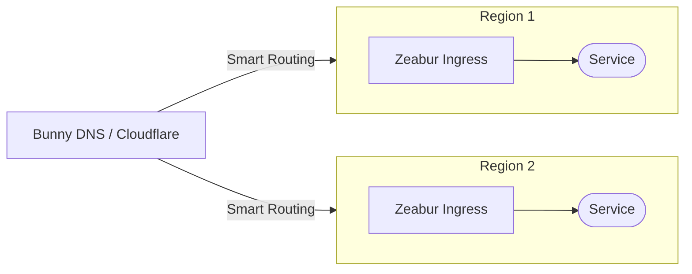
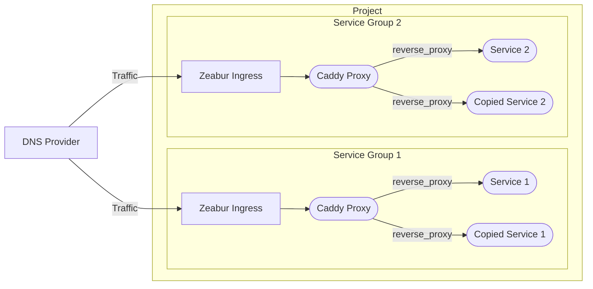
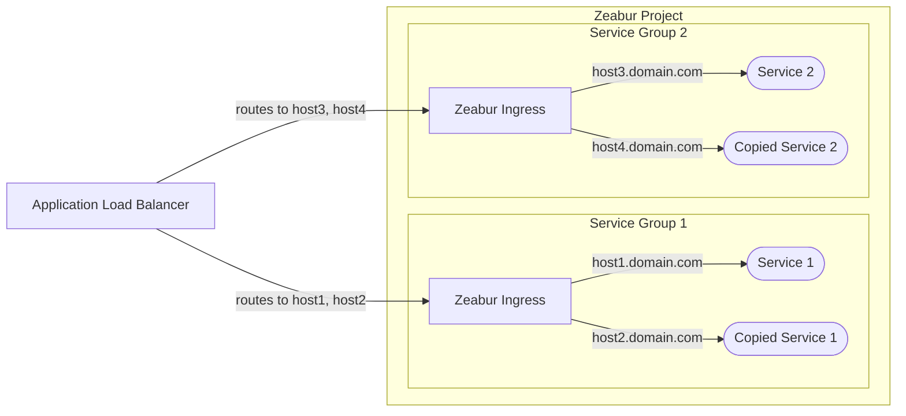

# 高可用性架構

本文件概述了在 Zeabur 上部署服務，來實作高可用性所推薦的架構。

請注意，這個主題較為進階。對於您的新創服務，通常不需要高可用性 (HA)。最簡單的解決方案是將您的服務放在一個專案中，並使用 [內網](/networking/private) 進行通訊；使用 [公網](/networking/public) 將您的服務暴露到網際網路。我們可以為您處理垂直擴縮，而在共享叢集中，如果一個節點故障，我們可以自動將您的服務遷移到另一個節點。

## DNS 負載平衡器 (推薦)

我們主要推薦的方法是使用 [**DNS 負載平衡器**](https://www.cloudflare.com/learning/performance/what-is-dns-load-balancing/)，通常更具成本效益，並且不會干擾 Zeabur 原生的防火牆和速率限制功能。

諸如 [Cloudflare](https://developers.cloudflare.com/load-balancing/understand-basics/proxy-modes/) 和 [Bunny DNS](https://support.bunny.net/hc/en-us/articles/7247569381906-Understanding-Bunny-DNS-Load-Balancing) 等服務提供了強大的 DNS 負載平衡功能。有關詳細的設定說明，請參閱其官方文件。

基本流程如下：

## 設定服務副本

Zeabur 目前不支援自動水平擴縮。要建立冗餘實例，您必須手動建立服務副本。一旦您有了服務副本，您可以使用以下兩種方法之一來分配它們之間的流量。

### 選項 1：內部反向代理（最建議） 

第一個選項是使用內部反向代理，例如 [Caddy](https://zeabur.com/templates/FFDLWU) 或 [NGINX](https://zeabur.com/templates/YIUNMF)，將請求轉發到您的服務副本。

這裡您會需要設定反向代理，來平衡您服務副本間內部主機名稱之間的流量（例如，`service-1-replica-1.zeabur.internal` 和 `service-1-replica-2.zeabur.internal`）。

這種方法的一個最大優勢，是它與 Zeabur 的 ingress controller 無縫協作。您可以使用標準的 `X-Forwarded-For` 標頭取回用戶端的真實 IP 位址，而無需修改您的應用程式邏輯。

### 選項 2：外部 L7 代理

第二個選項是使用外部 L7 代理伺服器，例如雲端供應商的 [應用程式負載平衡器](https://developers.cloudflare.com/load-balancing/understand-basics/proxy-modes/) (ALB)。

雖然這種方法可能看起來更簡單，因為您不需要管理內部 Caddy 服務，但它伴隨著幾個限制：

- **真實 IP 標頭**：您必須配置您的 ALB 以在自訂標頭中傳遞用戶端的真實 IP（例如，`X-LoadBalancer-IP`），並修改您的應用程式來從這個自訂標頭讀取。
- **安全風險**：您需要設定 Zeabur 的防火牆，僅允許來自 ALB 的 IP 位址的流量。如果您不這樣做，惡意行為者可能會繞過您的 ALB 並將偽造的 `X-LoadBalancer-IP` 標頭直接傳送到您的應用程式。
- **速率限制**：因為所有請求都源自 ALB 的 IP 位址，Zeabur 的速率限制可能會意外觸發，可能會阻擋合法流量。

我們有計劃在未來提供對外部代理方法更好的支援來解決這些問題。目前，**內部反向代理（選項 1）是在 Zeabur 上使用最可靠且建議的方法**。
